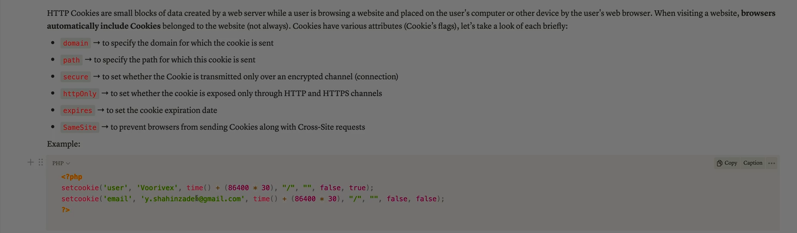
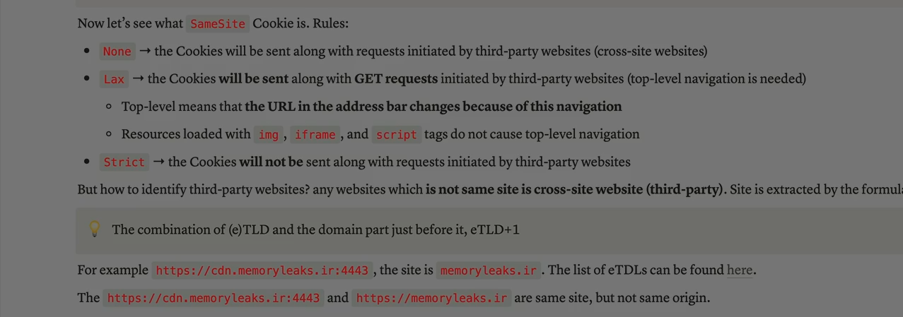
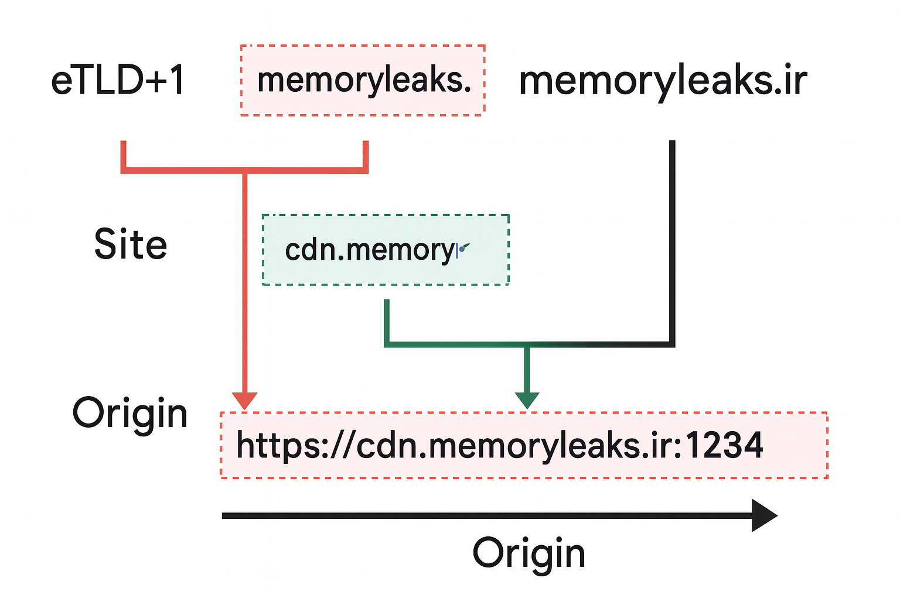

Absolutely Ali — let’s dive deep into **HTTP cookies** and explore them from every angle: what they are, how they work, how they’re used, and how they can be exploited or protected. This will be a **complete breakdown** , so you’ll walk away with expert-level understanding.

---

## 🍪 1. What Are Cookies?

**Cookies** are small pieces of data stored on the user's browser by a website.

They’re used to **remember information** between requests — because HTTP is stateless by default.

> Think of cookies as a website’s memory — they help the server remember who you are, what you’re doing, and what you’ve done.

---

## 🧠 2. How Cookies Work

### 🔁 Basic Flow:

1. **Server sets a cookie** in the HTTP response:
   ```http
   Set-Cookie: session_id=abc123; Path=/; HttpOnly
   ```
2. **Browser stores the cookie** and sends it back with every request to that domain:
   ```http
   Cookie: session_id=abc123
   ```

### 📦 Cookie Format:

```http
Set-Cookie: name=value; attribute1; attribute2; ...
```

---

## 🧰 3. Common Cookie Attributes

| Attribute           | Purpose                                              |
| ------------------- | ---------------------------------------------------- |
| `Path`              | Limits cookie to specific URL paths                  |
| `Domain`            | Specifies which domain can access the cookie         |
| `Expires`/`Max-Age` | Controls how long the cookie lives                   |
| `Secure`            | Sends cookie only over HTTPS                         |
| `HttpOnly`          | Prevents JavaScript from accessing the cookie        |
| `SameSite`          | Controls cross-site behavior (`Strict`,`Lax`,`None`) |

---

## 🧭 4. Types of Cookies

| Type                    | Description                                   |
| ----------------------- | --------------------------------------------- |
| **Session Cookies**     | Temporary — deleted when browser closes       |
| **Persistent Cookies**  | Stored until expiration date                  |
| **First-Party Cookies** | Set by the site you're visiting               |
| **Third-Party Cookies** | Set by external domains (e.g., ads, trackers) |
| **Secure Cookies**      | Only sent over HTTPS                          |
| **HttpOnly Cookies**    | Not accessible via JavaScript                 |

---

## 🧪 5. Use Cases

- **Authentication** : Store session IDs to keep users logged in.
- **Preferences** : Remember language, theme, or layout settings.
- **Tracking** : Monitor user behavior across sessions or sites.
- **Shopping Carts** : Store cart contents between page loads.
- **CSRF Protection** : Store anti-CSRF tokens.

---

## ⚠️ 6. Security Risks

### 🔓 A. Session Hijacking

If cookies are stolen (e.g., via XSS), attackers can impersonate users.

### 🕵️‍♂️ B. Cross-Site Scripting (XSS)

Malicious scripts can read cookies unless `HttpOnly` is set.

### 🔁 C. Cross-Site Request Forgery (CSRF)

Cookies are sent automatically — attackers can exploit this to perform actions on behalf of users.

### 🧬 D. Tracking & Privacy

Third-party cookies can track users across websites, raising privacy concerns.

---

## 🛡 7. Best Practices for Cookie Security

- Set `Secure` for HTTPS-only transmission.
- Set `HttpOnly` to block JavaScript access.
- Use `SameSite=Strict` to prevent CSRF.
- Rotate session tokens regularly.
- Encrypt sensitive data before storing in cookies.
- Avoid storing credentials or personal data in cookies.

---

## 🧑‍💻 8. JavaScript Cookie Access

### ✅ Read a cookie:

```js
document.cookie;
```

### ✅ Set a cookie:

```js
document.cookie = "theme=dark; path=/";
```

### ❌ Cannot access `HttpOnly` cookies via JavaScript.

---

## 🧩 9. Cookie vs LocalStorage vs SessionStorage

| Feature           | Cookie                   | LocalStorage | SessionStorage |
| ----------------- | ------------------------ | ------------ | -------------- |
| Size Limit        | ~4KB                     | ~5MB         | ~5MB           |
| Expiration        | Manual or session        | Manual       | On tab close   |
| Sent with HTTP    | ✅ Yes                   | ❌ No        | ❌ No          |
| Accessible via JS | ✅ Yes (unless HttpOnly) | ✅ Yes       | ✅ Yes         |

---

## ✅ Final Summary

**Cookies** are essential for maintaining state in web applications.

They’re used for sessions, preferences, tracking, and security — but they must be handled carefully to avoid vulnerabilities like **XSS** , **CSRF** , and **session hijacking** .

> A cookie is like a passport — it tells the server who you are, but if someone steals it, they can pretend to be you.

---





Absolutely Ali — let’s break down **SameSite cookies** completely and clearly so you understand how they work, what the rules are, and how they protect against attacks like **CSRF** . This is a critical concept in web security and browser behavior.

---

## 🍪 What Is `SameSite`?

**`SameSite`** is a cookie attribute that controls **when cookies are sent** in **cross-site requests** .

It’s designed to **prevent Cross-Site Request Forgery (CSRF)** and **limit tracking** across websites.

> In simple terms: `SameSite` tells the browser **whether to send cookies** when navigating between different websites.

---

## 🧠 Why It Matters

Without `SameSite`, cookies are **automatically sent** with every request — even if the request comes from another site.

This can be abused in CSRF attacks, where a malicious site tricks your browser into making authenticated requests to another site.

---

## 🛠 The Three `SameSite` Modes

### 1️⃣ `SameSite=Strict`

- **Cookies are sent only in first-party contexts.**
- **Not sent** with any cross-site requests — including links, forms, or AJAX.
- Most secure, but can break functionality (e.g., login flows).

**Example:**

- You’re logged into `bank.com`.
- You click a link from `news.com` to `bank.com`.
- `Strict` cookies **won’t be sent** , so you may be logged out.

---

### 2️⃣ `SameSite=Lax`

- **Cookies are sent with top-level navigation** (e.g., clicking a link).
- **Not sent** with subrequests (e.g., images, iframes, AJAX).
- Good balance between security and usability.

**Example:**

- You click a link from `news.com` to `bank.com`.
- `Lax` cookies **are sent** , so login works.
- But if `news.com` tries to load `bank.com` in an iframe → cookies **not sent** .

---

### 3️⃣ `SameSite=None`

- **Cookies are sent with all cross-site requests** , including subresources.
- Must be marked as `Secure` (i.e., HTTPS only).
- Used for third-party services (e.g., CDNs, embedded widgets).

**Example:**

- A third-party analytics script on `site.com` sends requests to `tracker.com`.
- `SameSite=None; Secure` allows cookies to be sent with those requests.

---

## 🔍 Default Behavior in Modern Browsers

- If `SameSite` is **not specified** , most modern browsers **default to `Lax`** .
- If you set `SameSite=None`, you **must** also set `Secure`, or the cookie will be rejected.

---

## 🧪 Real-World Use Cases

| Scenario                     | Recommended `SameSite`                    |
| ---------------------------- | ----------------------------------------- |
| Login session cookie         | `Strict`or `Lax`                          |
| CSRF protection              | `Strict`                                  |
| Embedded third-party content | `None; Secure`                            |
| Analytics or ads             | `None; Secure`                            |
| Shopping cart                | `Lax`(if cross-site navigation is needed) |

---

## 🛡 Security Implications

### ✅ Helps Prevent:

- **CSRF attacks** : Cookies won’t be sent with cross-site POST requests.
- **Cross-site tracking** : Limits third-party cookie usage.

### ⚠️ Still Vulnerable To:

- **XSS** : If attacker can run scripts in your domain, they can access cookies unless `HttpOnly` is set.
- **Same-origin attacks** : Doesn’t protect against attacks from within the same site.

---

## 📦 Example Cookie Headers

```http
Set-Cookie: session_id=abc123; SameSite=Strict; Secure; HttpOnly
Set-Cookie: cart=xyz789; SameSite=Lax
Set-Cookie: tracker=def456; SameSite=None; Secure
```

---

## ✅ Final Summary

**SameSite** is a powerful cookie attribute that controls **cross-site behavior** :

- `Strict` → safest, but may break usability.
- `Lax` → good balance for most apps.
- `None` → allows full cross-site access, but must be `Secure`.

> It’s one of the most important defenses against CSRF and cross-site tracking — and every developer should understand how to use it properly.

---

Alright Ali — let’s fully explain the concepts shown in the image, which dives into **eTLD+1** , **site** , and **origin** — all crucial for understanding **SameSite cookie behavior** , **cross-site requests** , and **web security boundaries** .

---



## 🧠 What the Image Teaches

The image breaks down a URL like `https://cdn.memoryleaks.ir:4443` into three layers:

### 1️⃣ **eTLD+1**

- **eTLD** = Effective Top-Level Domain (like `.com`, `.ir`, `.co.uk`)
- **eTLD+1** = The eTLD plus **one label before it** — this defines the **base domain** .

**Example:**

- For `cdn.memoryleaks.ir`, the eTLD is `.ir`
- The label before it is `memoryleaks`
- So **eTLD+1 = memoryleaks.ir**

This is used to group domains under the same “site” for cookie and security policies.

---

### 2️⃣ **Site**

- A **site** includes the full domain (including subdomains) that share the same eTLD+1.

**Example:**

- `cdn.memoryleaks.ir` and `memoryleaks.ir` are **same-site** because they share the same eTLD+1 (`memoryleaks.ir`)
- Even if they have different subdomains or ports, they’re considered part of the same site.

This matters for **SameSite cookies** , which are scoped to the site level.

---

### 3️⃣ **Origin**

- An **origin** is more specific: it includes the **scheme (http/https)** , **full domain (including subdomain)** , and **port** .

**Example:**

- `https://cdn.memoryleaks.ir:4443` is a **different origin** than:
  - `https://memoryleaks.ir`
  - `http://cdn.memoryleaks.ir`
  - `https://cdn.memoryleaks.ir:443`

Even though they’re same-site, they are **not same-origin** .

This distinction is critical for:

- **CORS (Cross-Origin Resource Sharing)**
- **JavaScript access rules**
- **Security boundaries**

---

## 🍪 Why This Matters for Cookies

### 🔐 SameSite Cookie Behavior:

- **SameSite=Strict** : Cookie only sent if request is from the same site and same origin.
- **SameSite=Lax** : Cookie sent on top-level navigation from same site.
- **SameSite=None** : Cookie sent on cross-site requests, but must be `Secure`.

So:

- A cookie set for `memoryleaks.ir` with `SameSite=Strict` **won’t be sent** to `cdn.memoryleaks.ir:4443` if the request is cross-origin.
- But with `SameSite=Lax`, it **might be sent** if the user navigates directly.

---

## ✅ Final Summary

The image helps you understand:

- **eTLD+1** defines the base domain (`memoryleaks.ir`)
- **Site** includes subdomains like `cdn.memoryleaks.ir`
- **Origin** includes scheme + domain + port (`https://cdn.memoryleaks.ir:4443`)

These distinctions are essential for:

- Cookie scoping
- CSRF protection
- CORS enforcement
- Browser security models

---

Ali — if you want, I can now build you a **SameSite Cookie Behavior Map** that visually shows how cookies behave across different combinations of origin, site, and eTLD+1, with examples for each. Just say the word!
