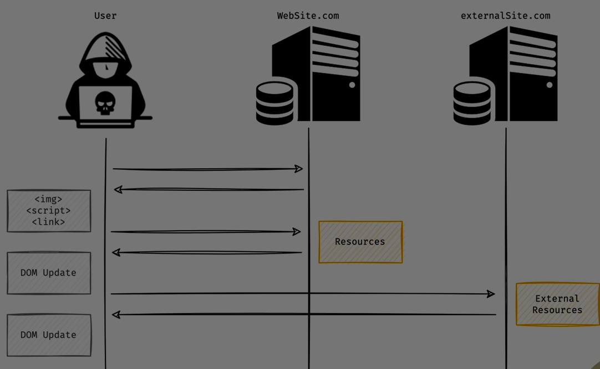
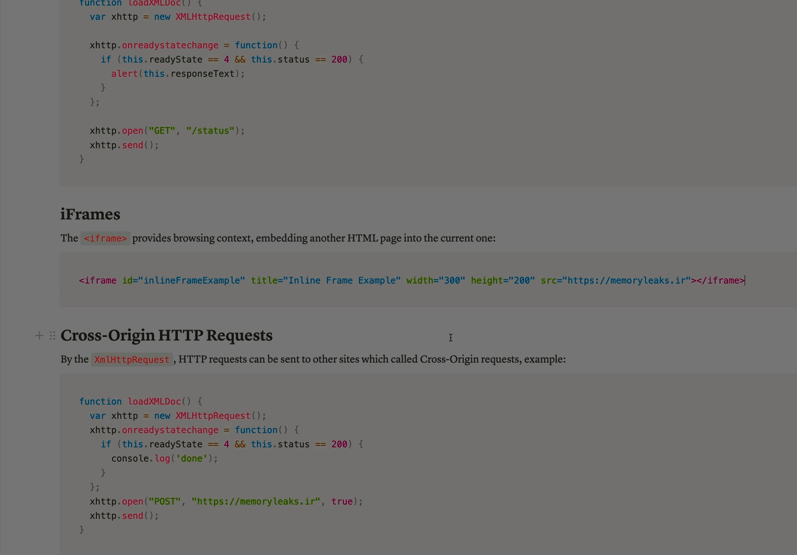

Absolutely Ali — let’s break down **DOM** and **BOM** clearly and completely so you understand what they are, how they differ, and how they’re used in web development.

---

## 🧱 1️⃣ DOM — Document Object Model

### 📌 What is DOM?

The **DOM (Document Object Model)** is a **programming interface** for HTML and XML documents.

It represents the **structure of a web page** as a **tree of objects** , where each element (like `<div>`, `<p>`, ``) is a **node** that can be accessed and manipulated using JavaScript.

### 🧠 Think of it like:

> The DOM is the **blueprint** of the webpage — it tells the browser what to render and lets developers change it dynamically.

### 🔍 Example:

HTML:

```html
<p id="greeting">Hello, Ali!</p>
```

JavaScript:

```js
document.getElementById("greeting").innerText = "Welcome!";
```

This changes the text inside the `<p>` tag using the DOM.

### 🛠 Key Features:

- **Tree structure** : Root → `<html>` → `<head>` and `<body>` → child elements.
- **Live representation** : Changes to the DOM reflect instantly on the page.
- **Manipulable** : You can add, remove, or modify elements and attributes.

### 🧰 Common DOM Methods:

| Method             | Purpose                            |
| ------------------ | ---------------------------------- |
| `getElementById()` | Selects an element by ID           |
| `querySelector()`  | Selects the first matching element |
| `createElement()`  | Creates a new HTML element         |
| `appendChild()`    | Adds a child node                  |
| `removeChild()`    | Removes a child node               |

---

## 🌐 2️⃣ BOM — Browser Object Model

### 📌 What is BOM?

The **BOM (Browser Object Model)** is a **programming interface** for interacting with the **browser itself** , not the webpage content.

It gives access to browser features like **window size** , **navigation history** , **alerts** , and **location bar** .

### 🧠 Think of it like:

> The BOM is the **control panel** for the browser — it lets you interact with the browser environment around the webpage.

### 🔍 Example:

```js
alert("Welcome to my site!");
console.log(window.location.href);
```

These use BOM features to show a popup and log the current URL.

### 🛠 Key BOM Objects:

| Object      | Description                                       |
| ----------- | ------------------------------------------------- |
| `window`    | The global object representing the browser window |
| `navigator` | Info about the browser (user agent, platform)     |
| `screen`    | Info about screen resolution                      |
| `location`  | URL of the current page                           |
| `history`   | Browser history stack                             |

---

## ⚖️ DOM vs BOM — Key Differences

| Feature  | DOM                         | BOM                      |
| -------- | --------------------------- | ------------------------ |
| Scope    | Webpage content             | Browser environment      |
| Accesses | HTML elements               | Browser features         |
| Example  | `document.getElementById()` | `window.alert()`         |
| Purpose  | Manipulate page             | Control browser behavior |

---

## ✅ Final Summary

- **DOM** is about the **structure and content** of the webpage — it lets you change what the user sees.
- **BOM** is about the **browser itself** — it lets you interact with things like alerts, history, and location.
- Both are part of the **JavaScript runtime environment** in the browser, and they often work together.

---



this should be execute in browser console lab :


