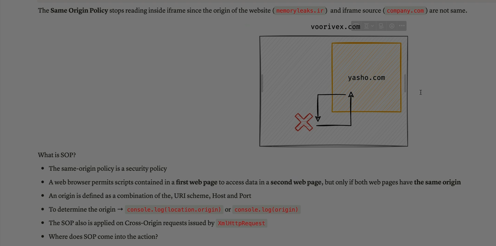
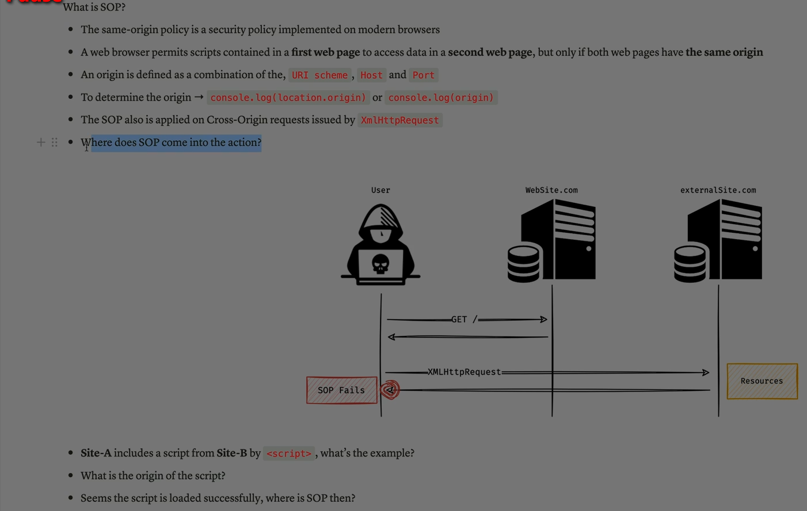

Absolutely Ali — let’s dive deep into the **Same-Origin Policy (SOP)** , one of the most important security mechanisms in web browsers. It’s the foundation for protecting user data and preventing malicious websites from interfering with each other.

---

## 🧠 What Is the Same-Origin Policy?

The **Same-Origin Policy** is a browser-enforced rule that **restricts how documents or scripts from one origin can interact with resources from another origin** .

> In simple terms: **a website can only access data from its own origin** , not from other websites — unless explicitly allowed.

---

## 🔍 What Defines an “Origin”?

An **origin** is made up of three components:

1. **Scheme** (protocol): `http://` or `https://`
2. **Host** (domain): e.g., `example.com`
3. **Port** : e.g., `:80`, `:443`, `:3000`

Two URLs are considered the **same origin** only if **all three match exactly** .

### ✅ Same Origin:

- `https://example.com:443/page1`
- `https://example.com:443/page2`

### ❌ Different Origin:

- `http://example.com` vs `https://example.com` → different scheme
- `https://example.com` vs `https://sub.example.com` → different host
- `https://example.com:443` vs `https://example.com:8443` → different port

---

## 🛡 Why SOP Exists — Security Goals

The Same-Origin Policy protects against:

- **Cross-Site Scripting (XSS)** : Prevents malicious scripts from reading sensitive data from other origins.
- **Cross-Site Request Forgery (CSRF)** : Prevents unauthorized actions on authenticated sessions.
- **Data theft** : Stops one site from stealing cookies, localStorage, or sessionStorage from another.

---

## 🧪 What SOP Restricts

| Action                                 | Allowed Across Origins?                                |
| -------------------------------------- | ------------------------------------------------------ |
| **Read/write DOM**                     | ❌ No                                                  |
| **Access cookies**                     | ❌ No                                                  |
| **Read localStorage/sessionStorage**   | ❌ No                                                  |
| **Make HTTP requests (e.g., fetch)**   | ✅ Yes, but can't read response unless CORS is enabled |
| **Embed images, scripts, styles**      | ✅ Yes                                                 |
| **Use `postMessage`for communication** | ✅ Yes (explicitly allowed)                            |

---

## 📦 Real-World Example

Imagine you're logged into `https://bank.com`.

If you visit `https://evil.com`, SOP ensures that:

- `evil.com` **cannot read your cookies** from `bank.com`
- `evil.com` **cannot access your account data** via JavaScript
- `evil.com` **cannot manipulate the DOM** of `bank.com`

---

## 🔓 Exceptions & Workarounds

### ✅ CORS (Cross-Origin Resource Sharing)

- Servers can **explicitly allow** cross-origin access using HTTP headers:
  ```http
  Access-Control-Allow-Origin: https://trusted.com
  ```

### ✅ `postMessage`

- Allows safe communication between windows/frames from different origins.

### ⚠️ `document.domain` (deprecated)

- Used to relax SOP between subdomains — now discouraged due to security risks.

---

## ✅ Final Summary

The **Same-Origin Policy** is a browser rule that **isolates websites from each other** to protect user data and prevent attacks.

It ensures that scripts from one origin **cannot access or modify** content from another origin unless explicitly permitted.

> Think of SOP as the **security fence** between websites — each site stays in its own yard unless the gate is opened with permission.

---





Great, Ali — let’s break down the **Same-Origin Policy (SOP)** using the image you provided. It’s a fantastic visual that shows how SOP works in real-world browser behavior and why it matters for security.

---

## 🧠 What Is SOP?

The image starts with a clear definition:

> “The Same-Origin Policy is a security policy implemented on modern browsers.”

It means that **scripts running on one web page can only access data from another page if both pages share the same origin** .

---

## 🔍 What Defines an Origin?

The image highlights that an origin is made up of three parts:

- **Scheme** (e.g., `http`, `https`)
- **Host** (e.g., `website.com`)
- **Port** (e.g., `:80`, `:443`, `:3000`)

So:

- `https://website.com:443` and `https://website.com:3000` → **different origins**
- `http://website.com` and `https://website.com` → **different origins**
- `https://cdn.website.com` and `https://website.com` → **different origins**

Even if they look similar, the browser treats them as **separate security zones** .

---

## 🧪 SOP in Action — What the Diagram Shows

The diagram illustrates a user interacting with `website.com`:

1. ✅ The user sends a **GET request** to `website.com` — this is allowed.
2. ❌ Then, a **script on `website.com` tries to make an XMLHttpRequest to `externalSite.com`** .
3. 🚫 SOP **blocks** this request — shown as “SOP Fails” in the red box.

This is a classic example of SOP protecting the user:

- Even though the script is running on `website.com`, it **cannot access data** from `externalSite.com` unless **CORS** is explicitly enabled.

---

## 📦 What About `<script src="...">`?

The image also asks:

> “Site-A includes a script from Site-B by `<script>` — what’s the origin?”

This is a great question. SOP **does not block loading scripts** from other origins — that’s allowed.

But SOP **does restrict what that script can do** :

- It can run in the context of Site-A.
- It **cannot access Site-B’s cookies, DOM, or storage** .

So even if you load a script from another origin, it’s sandboxed by SOP.

---

## 🛡 Why SOP Is Critical

SOP protects against:

- **Cross-Origin Data Theft** : Prevents one site from stealing another site’s cookies or session data.
- **CSRF** : Blocks unauthorized actions from other origins.
- **XSS Amplification** : Limits the damage of injected scripts.

---

## ✅ Final Summary

The image shows that:

- SOP is enforced by browsers to **isolate origins** .
- It blocks **cross-origin access** unless explicitly allowed.
- It applies to **DOM access** , **cookies** , **AJAX requests** , and **storage** .
- It allows **resource loading** (like scripts or images), but **not data access** .

> SOP is like a firewall between websites — each origin is its own secure zone, and scripts can’t cross the boundary unless the server says it’s okay.

---

Ali — if you want, I can now build you a **SOP vs CORS comparison map** showing exactly what SOP blocks, what CORS allows, and how to configure safe cross-origin access. Just say the word!
