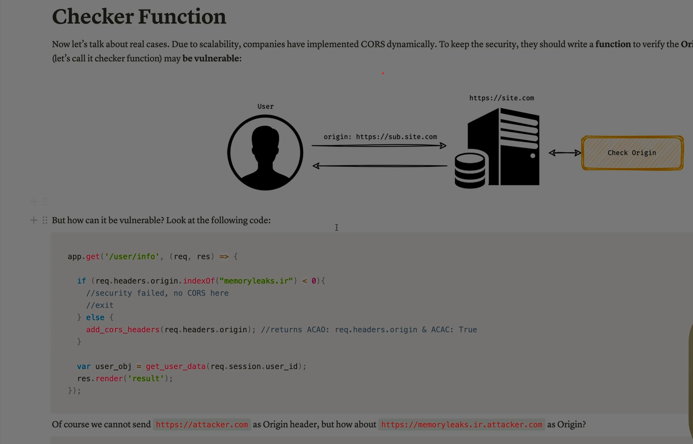
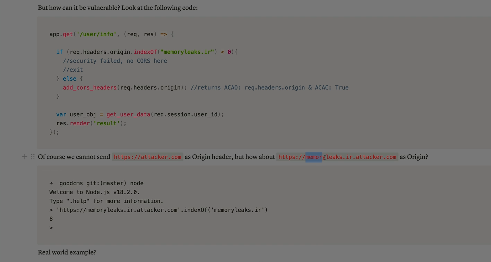

Absolutely Ali — let’s break down the **Checker functionality** from the ground up. Whether you're dealing with workflows, approvals, or security-critical systems, understanding the **Maker-Checker model** (also called  **4-Eyes principle** ) is essential.

---

## 🧠 What Is Checker Functionality?

The **Checker** is part of a **dual-control system** where tasks are split between two roles:

* **Maker** : Initiates or drafts a task (e.g., creates a transaction, writes a document, configures a campaign).
* **Checker** : Reviews, validates, and approves the task before it’s finalized or executed.

> Think of it as a built-in quality control layer — the Checker ensures nothing goes live without a second set of eyes.

---

## 🔁 How It Works

### Typical Workflow:

1. **Maker creates** a task (e.g., financial transaction, email campaign, data entry).
2. The task is  **submitted for review** .
3. **Checker receives a notification** and reviews the task.
4. Checker can:
   * ✅ Approve it → task proceeds
   * ❌ Reject it → Maker gets feedback and revises

---

## 🛠 Where Is It Used?

### 🔐 Security & Compliance

* **Banking & Finance** : Approving high-value transactions or account changes.
* **Insurance & Healthcare** : Validating claims or sensitive data entries.
* **Legal & Regulatory** : Reviewing contracts, disclosures, or filings.

### 📊 Enterprise Workflows

* **Marketing Platforms** : Approving email/SMS campaigns before sending.
* **Procurement Systems** : Validating purchase orders or vendor onboarding.
* **HR Systems** : Reviewing employee data changes or payroll actions.

### 💻 Software Development

* **Code Review** : Maker writes code, Checker reviews for bugs/security.
* **DevOps** : Maker configures deployment, Checker approves release.

---

## 📦 Key Features of Checker Functionality

| Feature                      | Description                                  |
| ---------------------------- | -------------------------------------------- |
| **Role Segregation**   | Maker and Checker have distinct permissions  |
| **Audit Trail**        | Every action is logged for accountability    |
| **Notifications**      | Checkers are alerted when tasks need review  |
| **Feedback Loop**      | Rejected tasks return to Maker with comments |
| **Compliance Support** | Ensures regulatory standards are met         |

---

## ✅ Benefits

* **Reduces errors** and oversight
* **Prevents fraud** and unauthorized actions
* **Improves accountability**
* **Supports audit and compliance**
* **Enhances data integrity**

---

## 🔐 Example: Financial Transaction Approval

```plaintext
Maker: Initiates a $10,000 wire transfer
Checker: Reviews transaction details, confirms legitimacy
→ Approves → Funds are transferred
→ Rejects → Transaction is halted, flagged for review
```

---

Ali — if you’re building or auditing a system and want to implement a Maker-Checker model, I can help you design the logic, role permissions, and even simulate workflows. Just say the word!
