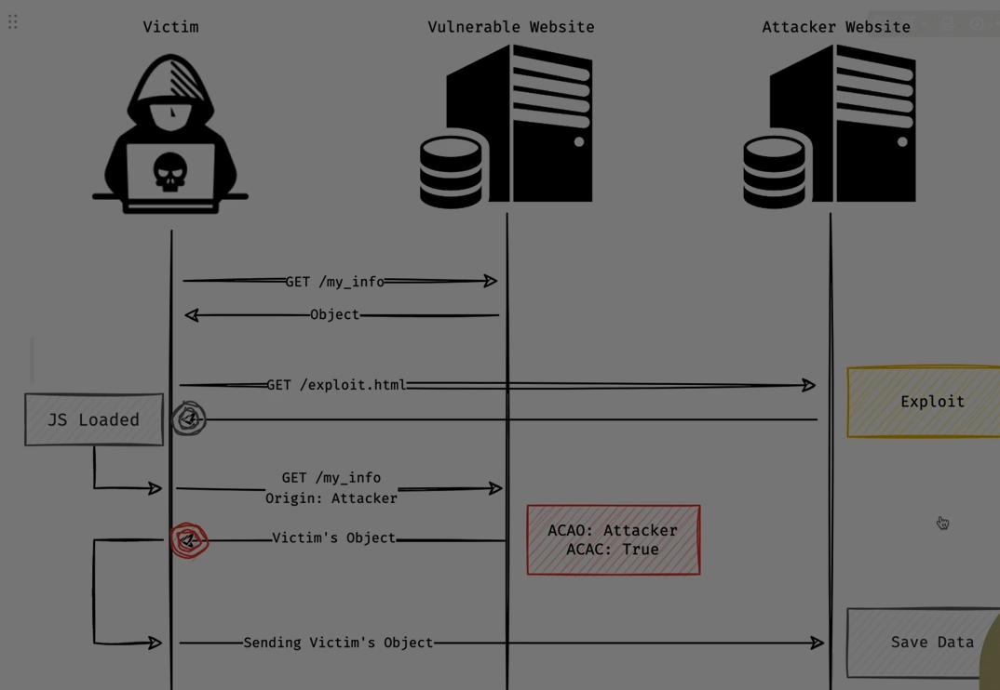
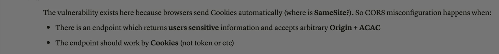

Absolutely Ali — let’s go **zero to hero** on **CORS misconfiguration** , so you understand how it works, how it breaks, and how attackers exploit it. This is a full-spectrum guide: from basics to real-world exploitation and secure configuration.

---

## 🧠 1. What Is CORS?

**CORS (Cross-Origin Resource Sharing)** is a browser security feature that allows servers to **opt-in** to sharing resources with other origins.

It’s a way to **relax the Same-Origin Policy (SOP)** — but only when the server explicitly allows it.

### 🔍 Example:

```http
Access-Control-Allow-Origin: https://trusted.com
```

This tells the browser: “It’s okay for `trusted.com` to access this resource.”

---

## ⚠️ 2. What Is CORS Misconfiguration?

A **CORS misconfiguration** happens when a server **incorrectly sets CORS headers** , allowing **unauthorized origins** to access sensitive resources.

> It’s like giving a stranger the keys to your house just because they asked nicely.

---

## 🧨 3. Common Misconfigurations (with Examples)

### 1️⃣ **Wildcard Origin with Credentials**

```http
Access-Control-Allow-Origin: *
Access-Control-Allow-Credentials: true
```

❌ This is **invalid** and dangerous.

Browsers block it, but some servers still respond with it — allowing attackers to steal cookies or tokens.

---

### 2️⃣ **Reflecting Origin Without Validation**

```http
Access-Control-Allow-Origin: <origin-from-request>
```

If the server blindly reflects the `Origin` header:

```http
Access-Control-Allow-Origin: https://evil.com
```

✅ Attacker-controlled site gets access to sensitive data.

---

### 3️⃣ **Allowing Null Origin**

```http
Access-Control-Allow-Origin: null
```

Used in sandboxed iframes or file:// URLs.

Attackers can exploit this by embedding your site in a sandboxed iframe.

---

### 4️⃣ **Overly Permissive Subdomain Policies**

```http
Access-Control-Allow-Origin: *.example.com
```

If an attacker controls `evil.example.com`, they can access APIs meant for `secure.example.com`.

---

### 5️⃣ **Allowing All Methods and Headers**

```http
Access-Control-Allow-Methods: GET, POST, PUT, DELETE
Access-Control-Allow-Headers: *
```

This opens the door to **unexpected behavior** , especially if sensitive operations are exposed via non-GET methods.

---

## 🧪 4. Exploitation Flow

### Step-by-Step Attack:

1. Attacker hosts a malicious site (`evil.com`)
2. Victim visits `evil.com` while logged into `target.com`
3. JavaScript on `evil.com` sends a cross-origin request:
   ```js
   fetch("https://target.com/api/user", { credentials: "include" });
   ```
4. If `target.com` has a misconfigured CORS policy, the browser allows the response.
5. Attacker reads sensitive data (e.g., user profile, tokens)

---

## 🔍 5. Real-World Case Studies

- **Stripe (2016)** : Reflected `Origin` header without validation — allowed attackers to read private data using `null` origin.
- **PayPal (2018)** : Misconfigured CORS allowed credentialed access from untrusted origins.
- **Subdomain Takeover** : Attacker registers a forgotten subdomain and uses it to bypass CORS restrictions.

Sources: [Undercode Testing](https://undercodetesting.com/understanding-and-exploiting-cors-misconfiguration-vulnerabilities/), [Expert Beacon](https://expertbeacon.com/exploiting-cors-a-comprehensive-guide-to-pentesting-cross-origin-resource-sharing/)

---

## 🛡️ 6. How to Secure CORS Properly

### ✅ Best Practices:

- **Never use `*` with credentials**
- **Whitelist exact origins** — not wildcards
- **Validate the `Origin` header** before reflecting it
- **Restrict allowed methods and headers**
- **Use HTTPS and secure cookies**
- **Log and monitor CORS activity**
- **Test with tools like Burp Suite, OWASP ZAP, or custom scripts**

---

## 🧰 7. Developer Checklist

| Item                                     | Secure? | Notes                                         |
| ---------------------------------------- | ------- | --------------------------------------------- |
| `Access-Control-Allow-Origin: *`         | ❌      | Only safe for public APIs without credentials |
| Reflecting `Origin`header                | ⚠️      | Must validate against a trusted list          |
| `Access-Control-Allow-Credentials: true` | ✅      | Only with specific origin                     |
| Allowing all methods                     | ❌      | Limit to what's needed                        |
| Allowing all headers                     | ❌      | Define only required headers                  |
| Using `null`origin                       | ❌      | Avoid unless explicitly needed                |

---

## ✅ Final Summary

CORS misconfigurations are **silent killers** — they don’t crash your app, but they **expose sensitive data** to attackers.

Understanding how CORS works and **how it can be abused** is essential for building secure web applications.

> From zero to hero: CORS is your friend when configured right — and your worst enemy when left wide open.

---





Absolutely Ali — this snippet goes straight to the heart of why **CORS misconfigurations are so dangerous** . Let’s break it down completely:

---

## 🔓 🎭 The Perfect Storm for CORS Exploitation

Imagine you have a web app that stores **sensitive user information** — like account details, emails, or messages. The user is authenticated with **cookies** , because **same-origin requests are common** (like viewing your dashboard).

### 🗝 Key Factors for Vulnerability:

1. The browser automatically **sends cookies with every request** to the app’s domain.
   - **SameSite** cookie attribute can mitigate this by restricting cross-origin cookie inclusion — but it’s missing or not set properly.
2. The app has an endpoint (API) that **returns sensitive data** , like `/api/getUserProfile`.
   - Without CORS, **Same-Origin Policy (SOP)** prevents cross-origin access to this data.
3. The CORS policy **misconfigures** two headers:
   - `Access-Control-Allow-Origin`: Accepts **any origin**
   - `Access-Control-Allow-Credentials`: Set to **true** to allow using **cookies**

If an attacker’s origin (`<evil.com>`) can access this endpoint with credentials, **game over** (hacked).

---

### 🧨 How This Gets Exploited:

```javascript
// Evil.com sends this
fetch("https://yourapp.com/api/getUserProfile", {
  credentials: "include"
})
// CORS headers on your server:
Access-Control-Allow-Origin: *
Access-Control-Allow-Credentials: true
```

Boom, the attacker gets the user’s sensitive data in response.

---

## 🔐 How to Fix This ASAP

1. **Set Proper SameSite Cookies**
   ```http
   Set-Cookie: session=abc123; Secure; HttpOnly; SameSite=Lax
   ```
2. **Whitelist Origins in CORS**
   ```http
   Access-Control-Allow-Origin: https://trusted.com
   ```
3. **Audit and Monitor Sensitive Endpoints** for cross-origin requests
4. **Use Tokens** / Don't Rely Only on Cookies (less exploitable)

---

> In summary: **CORS misconfigurations** are dangerous when

- **Browsers automatically send cookies**
- **Endpoints expose sensitive data like user information**
- **Arbitrary origins are allowed** with `ACAC` set to **true**

Is this explanation of the image helpful?
