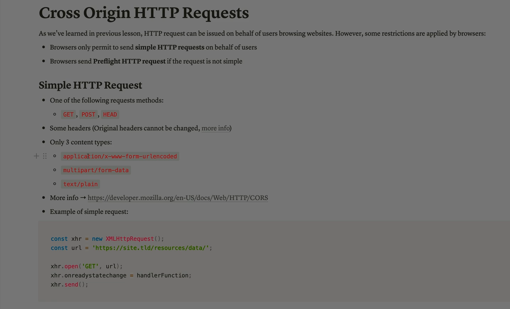
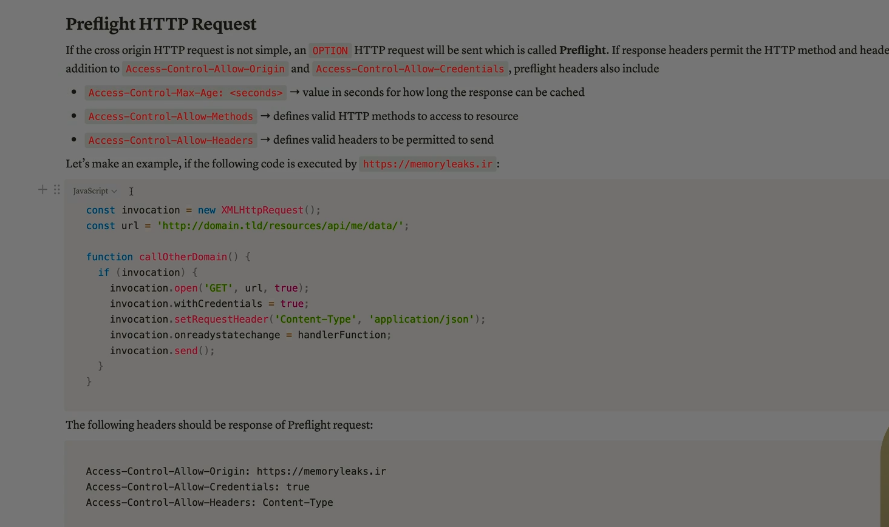

Absolutely Ali — let’s dive deep into **Cross-Origin HTTP Requests** , covering everything from the **core concept** to **how browsers handle them** , **how servers respond** , and **how developers implement them securely** .

---

## 🌐 What Is a Cross-Origin HTTP Request?

A **cross-origin HTTP request** happens when a web page tries to access a resource (like an API, image, or script) from a **different origin** than the one that served the page.

### 🔍 What defines an “origin”?

An origin is made up of:

- **Scheme** : `http` or `https`
- **Host** : domain name (e.g., `example.com`)
- **Port** : e.g., `:80`, `:443`, `:3000`

Two URLs are **cross-origin** if any of these differ.

**Example:**

- Page served from `https://site-a.com`
- Requests data from `https://site-b.com/api/data`
  → This is a **cross-origin request**

---

## 🔒 Why Browsers Restrict Cross-Origin Requests

Browsers enforce the **Same-Origin Policy (SOP)** to protect users:

- Prevents malicious sites from reading sensitive data from other sites.
- Blocks JavaScript from accessing responses unless explicitly allowed.

Without SOP, a malicious site could:

- Read your emails from `mail.com`
- Access your bank account data from `bank.com`
- Steal session cookies or tokens

---

## 🛠 How Cross-Origin Requests Work

### ✅ Step 1: Browser Sends Request

When JavaScript (e.g., `fetch()` or `XMLHttpRequest`) makes a cross-origin request, the browser automatically adds:

```http
Origin: https://site-a.com
```

### ✅ Step 2: Server Responds with CORS Headers

If the server allows the request, it responds with:

```http
Access-Control-Allow-Origin: https://site-a.com
```

If the header is missing or incorrect, the browser **blocks access to the response** .

---

## 🔁 Simple vs Preflight Requests

### ✅ Simple Requests

- Use `GET`, `POST`, or `HEAD`
- No custom headers
- No credentials (cookies, auth headers)
- Browser sends request directly

### 🔄 Preflight Requests

- Triggered when:
  - Using methods like `PUT`, `DELETE`
  - Sending custom headers (e.g., `Authorization`)
  - Including credentials

Browser sends an **OPTIONS** request first:

```http
OPTIONS /api/data
Origin: https://site-a.com
Access-Control-Request-Method: PUT
Access-Control-Request-Headers: Authorization
```

Server must respond with:

```http
Access-Control-Allow-Origin: https://site-a.com
Access-Control-Allow-Methods: PUT
Access-Control-Allow-Headers: Authorization
```

Only then will the browser send the actual request.

---

## 🔐 Credentials in Cross-Origin Requests

If the request includes cookies or HTTP auth:

- Client must set:
  ```js
  fetch(url, { credentials: "include" });
  ```
- Server must respond with:
  ```http
  Access-Control-Allow-Credentials: true
  Access-Control-Allow-Origin: https://site-a.com
  ```

⚠️ You **cannot** use `Access-Control-Allow-Origin: *` with credentials.

---

## 📦 Common CORS Headers

| Header                             | Purpose                      |
| ---------------------------------- | ---------------------------- |
| `Access-Control-Allow-Origin`      | Specifies allowed origin(s)  |
| `Access-Control-Allow-Methods`     | Lists allowed HTTP methods   |
| `Access-Control-Allow-Headers`     | Lists allowed custom headers |
| `Access-Control-Allow-Credentials` | Allows cookies/auth headers  |
| `Access-Control-Max-Age`           | Caches preflight response    |

---

## 🧪 Real-World Example

### Client-side JavaScript:

```js
fetch("https://api.example.com/data", {
  method: "GET",
  credentials: "include",
  headers: { Authorization: "Bearer token" },
});
```

### Server-side response:

```http
Access-Control-Allow-Origin: https://yourfrontend.com
Access-Control-Allow-Methods: GET, POST
Access-Control-Allow-Headers: Authorization
Access-Control-Allow-Credentials: true
```

---

## 🛡 Security Considerations

- Always **whitelist trusted origins** — don’t use `*` unless the resource is truly public.
- Avoid exposing sensitive data via CORS unless absolutely necessary.
- Use **HTTPS** to prevent man-in-the-middle attacks.
- Combine CORS with other headers like:
  - `Strict-Transport-Security`
  - `X-Content-Type-Options`
  - `Content-Security-Policy`

---

## ✅ Final Summary

**Cross-Origin HTTP Requests** are essential for modern web apps — but they’re tightly controlled by browsers to protect users.

**CORS (Cross-Origin Resource Sharing)** is the protocol that lets servers **safely opt-in** to sharing data across origins.

> Think of CORS as a **passport system** — the browser asks the server, “Can this foreign site access your data?” and the server must reply with permission.

---



Sure Ali — based on the image you shared, here’s a complete explanation of the **Cross-Origin HTTP Requests** section as presented:

---

## 🧠 Overview: Cross-Origin HTTP Requests

The image explains how **browsers handle HTTP requests** made on behalf of users when the request targets a **different origin** than the page itself. This is governed by the **Same-Origin Policy (SOP)** .

- Browsers **only allow simple HTTP requests** to be sent directly across origins.
- If the request is **not simple** , the browser sends a **preflight request** first — an `OPTIONS` request to check if the server allows it.

---

## ✅ What Is a “Simple HTTP Request”?

The image defines a **simple request** as one that meets **three conditions** :

### 1️⃣ Allowed HTTP Methods:

- `GET`
- `POST`
- `HEAD`

These are considered safe and do **not trigger preflight** .

---

### 2️⃣ Restricted Headers:

- The browser **limits which headers can be sent** .
- Custom headers like `Authorization` or `X-Requested-With` are **not allowed** in simple requests.
- Only standard headers like `Accept`, `Content-Type` (with restrictions), and `User-Agent` are permitted.

---

### 3️⃣ Permitted Content Types:

Only these three `Content-Type` values are allowed:

- `application/x-www-form-urlencoded`
- `multipart/form-data`
- `text/plain`

If you use something like `application/json`, the browser will send a **preflight OPTIONS request** first.

---

## 🧪 Code Example from the Image

```javascript
var xhr = new XMLHttpRequest();
xhr.open("GET", "http://site.com/data");
xhr.send();
xhr.onreadystatechange = handlerFunction;
```

This is a **simple GET request** :

- Uses an allowed method (`GET`)
- No custom headers
- No credentials
- No disallowed content type

✅ So the browser sends it **directly** , without a preflight.

---

## 📎 Reference

The image also links to the official documentation for deeper reading:

**MDN Web Docs on CORS**

[https://developer.mozilla.org/en-US/docs/Web/HTTP/CORS](https://developer.mozilla.org/en-US/docs/Web/HTTP/CORS)

---



Absolutely Ali — based on the image you shared, here’s a complete explanation of **Preflight HTTP Requests** in the context of **Cross-Origin Resource Sharing (CORS)** :

---

## 🔍 What Is a Preflight Request?

When a **cross-origin HTTP request is not simple** , the browser sends a special **OPTIONS request** before the actual request. This is called a **preflight request** .

> The goal: to ask the server, “Are you okay with me sending this kind of request?”

---

## 🧪 When Is a Preflight Triggered?

A preflight request is sent when:

- The method is **not** `GET`, `POST`, or `HEAD` (e.g., `PUT`, `DELETE`)
- The request includes **custom headers** (like `Authorization`, `X-Requested-With`, or `Content-Type: application/json`)
- The request includes **credentials** (cookies or HTTP auth)

---

## 📦 Required Response Headers

The server must respond to the preflight with specific headers that **explicitly allow** the request:

| Header                             | Purpose                                                           |
| ---------------------------------- | ----------------------------------------------------------------- |
| `Access-Control-Allow-Origin`      | Specifies which origin is allowed (e.g.,`https://memoryleaks.ir`) |
| `Access-Control-Allow-Credentials` | Allows cookies/auth headers to be sent (`true`)                   |
| `Access-Control-Allow-Headers`     | Lists allowed custom headers (e.g.,`Content-Type`)                |
| `Access-Control-Allow-Methods`     | Lists allowed HTTP methods (e.g.,`GET`,`POST`,`OPTIONS`)          |
| `Access-Control-Max-Age`           | Caches the preflight response for a set time (in seconds)         |

---

## 🧑‍💻 Code Example from the Image

```javascript
const invocation = new XMLHttpRequest();
const url = "http://memoryleaks.ir/resources/api/no/meta/";

function handlerFunction() {
  if (invocation.readyState === 4 && invocation.status === 200) {
    console.log(invocation.responseText);
  }
}

invocation.open("GET", url, true);
invocation.withCredentials = true;
invocation.setRequestHeader("Content-Type", "application/json");
invocation.onreadystatechange = handlerFunction;
invocation.send();
```

### 🔍 Why This Triggers a Preflight:

- Uses `Content-Type: application/json` → not a simple content type
- Uses `withCredentials: true` → includes cookies
  → Browser sends a **preflight OPTIONS request** before the actual `GET`

---

## ✅ Summary

The image teaches that:

- **Preflight requests** are a browser safety check for complex cross-origin requests.
- The server must respond with **specific CORS headers** to allow the actual request.
- Without these headers, the browser will **block the request** — even if the server responds with data.

> Preflight is like asking permission before knocking on the door — if the server doesn’t say “come in,” the browser won’t proceed.

---

Ali — if you want, I can now show you how to **configure these headers** on your own server (Node.js, Flask, Nginx, etc.) or simulate preflight behavior in a test environment. Just say the word!
