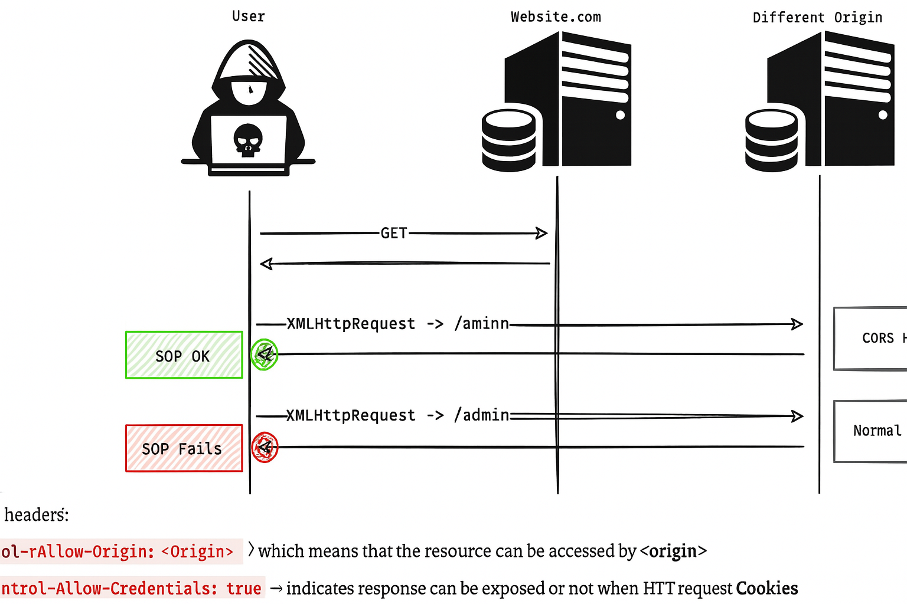

Absolutely Ali — let’s walk through the **full implementation of CORS (Cross-Origin Resource Sharing)** from both the **client-side** and **server-side** , across different platforms. This will be a complete guide so you can confidently configure and test CORS in real-world applications.

---

## 🧠 CORS Implementation Overview

CORS is enforced by **browsers** , but it’s **controlled by servers** .

The browser sends a request with an `Origin` header, and the server decides whether to allow it by responding with specific **CORS headers** .

---

## 🧪 1. Client-Side Setup

### ✅ Basic JavaScript (Fetch API)

```js
fetch("https://api.example.com/data", {
  method: "GET",
  credentials: "include", // if you want to send cookies
  headers: {
    "Content-Type": "application/json",
    Authorization: "Bearer token",
  },
})
  .then((response) => response.json())
  .then((data) => console.log(data))
  .catch((error) => console.error(error));
```

### 🔍 What the browser sends:

```http
Origin: https://yourfrontend.com
```

If it’s a **simple request** , the browser sends it directly.

If it’s a **non-simple request** (e.g., uses `PUT`, `DELETE`, or custom headers), the browser sends a **preflight OPTIONS request** first.

---

## 🛠 2. Server-Side Configuration

Let’s go through how to implement CORS on popular platforms:

---

### 🧱 A. **Express.js (Node.js)**

Install the CORS middleware:

```bash
npm install cors
```

Basic setup:

```js
const cors = require("cors");
const express = require("express");
const app = express();

app.use(cors()); // allows all origins

// Custom CORS config
app.use(
  cors({
    origin: "https://yourfrontend.com",
    methods: ["GET", "POST", "PUT"],
    allowedHeaders: ["Content-Type", "Authorization"],
    credentials: true,
  })
);

app.get("/data", (req, res) => {
  res.json({ message: "CORS works!" });
});
```

---

### 🐍 B. **Flask (Python)**

Install Flask-CORS:

```bash
pip install flask-cors
```

Basic setup:

```python
from flask import Flask
from flask_cors import CORS

app = Flask(__name__)
CORS(app)  # allows all origins

# Custom config
CORS(app, resources={r"/api/*": {"origins": "https://yourfrontend.com"}}, supports_credentials=True)

@app.route('/api/data')
def data():
    return {"message": "CORS works!"}
```

---

### 🧰 C. **Nginx (Reverse Proxy)**

Add headers in your server block:

```nginx
location /api/ {
    add_header 'Access-Control-Allow-Origin' 'https://yourfrontend.com' always;
    add_header 'Access-Control-Allow-Methods' 'GET, POST, OPTIONS';
    add_header 'Access-Control-Allow-Headers' 'Authorization, Content-Type';
    add_header 'Access-Control-Allow-Credentials' 'true';
}
```

Handle preflight OPTIONS requests:

```nginx
if ($request_method = OPTIONS) {
    add_header 'Access-Control-Allow-Origin' 'https://yourfrontend.com';
    add_header 'Access-Control-Allow-Methods' 'GET, POST, OPTIONS';
    add_header 'Access-Control-Allow-Headers' 'Authorization, Content-Type';
    add_header 'Access-Control-Allow-Credentials' 'true';
    return 204;
}
```

---

### 🧱 D. **Spring Boot (Java)**

Using annotations:

```java
@CrossOrigin(origins = "https://yourfrontend.com", allowCredentials = "true")
@RestController
public class ApiController {
    @GetMapping("/data")
    public ResponseEntity<String> getData() {
        return ResponseEntity.ok("CORS works!");
    }
}
```

Or globally via configuration:

```java
@Configuration
public class CorsConfig {
    @Bean
    public WebMvcConfigurer corsConfigurer() {
        return new WebMvcConfigurer() {
            @Override
            public void addCorsMappings(CorsRegistry registry) {
                registry.addMapping("/**")
                    .allowedOrigins("https://yourfrontend.com")
                    .allowedMethods("GET", "POST", "PUT")
                    .allowedHeaders("Authorization", "Content-Type")
                    .allowCredentials(true);
            }
        };
    }
}
```

---

## 🧪 3. Testing CORS

### ✅ Tools:

- **Browser DevTools** → Check `Network` tab for CORS headers.
- **curl** :

```bash
curl -H "Origin: https://yourfrontend.com" --verbose https://api.example.com/data
```

- **Postman** → Doesn’t enforce CORS (useful for backend testing).

---

## 🛡️ 4. Common Pitfalls

| Issue                            | Cause                                                                 | Fix                                |
| -------------------------------- | --------------------------------------------------------------------- | ---------------------------------- |
| `CORS error`in browser           | Missing or incorrect `Access-Control-Allow-Origin`                    | Match origin exactly               |
| Cookies not sent                 | Missing `credentials: 'include'`or `Access-Control-Allow-Credentials` | Set both                           |
| Preflight fails                  | Server doesn’t handle `OPTIONS`method                                 | Add OPTIONS route or config        |
| Wildcard origin with credentials | Not allowed                                                           | Use specific origin instead of `*` |

---

## ✅ Final Summary

**CORS implementation** involves:

- Configuring the **server** to send the right headers
- Ensuring the **client** sends requests with proper credentials
- Handling **preflight requests** when needed

> CORS is like a **gatekeeper** — the browser asks the server, “Can this site access your data?” and the server must reply with permission.

Absolutely Ali — the image you shared outlines **three key techniques** used to **bypass the Same-Origin Policy (SOP)** in web browsers. Let’s break each one down completely so you understand how they work, when they’re used, and what their limitations are.

---

## 🧠 1. `postMessage` — Cross-Origin Messaging

### 📌 What It Is:

`postMessage` is a **JavaScript API** that allows **secure communication between windows, frames, or tabs** , even if they’re from **different origins** .

### 🔁 How It Works:

- A page on `site-a.com` embeds or opens a page from `site-b.com` (e.g., in an `<iframe>` or `window.open()`).
- `site-a.com` sends a message:
  ```js
  iframe.contentWindow.postMessage("Hello!", "https://site-b.com");
  ```
- `site-b.com` listens for it:
  ```js
  window.addEventListener("message", (event) => {
    if (event.origin === "https://site-a.com") {
      console.log(event.data); // "Hello!"
    }
  });
  ```

### ✅ Use Cases:

- OAuth login flows (e.g., Google Sign-In)
- Payment gateways
- Embedded widgets (chat, analytics)

### 🛡 Security Tip:

Always **validate `event.origin`** to prevent malicious messages.

---

## 📦 2. JSONP — Script-Based Data Transfer

### 📌 What It Is:

**JSONP (JSON with Padding)** is a legacy technique that uses `<script>` tags to **bypass SOP** and fetch data from another origin.

### 🔁 How It Works:

- Browsers allow `<script>` tags to load cross-origin JavaScript.
- The server wraps JSON data in a callback function:
  ```js
  callback({ user: "Ali" });
  ```
- Client sends a request like:
  ```html
  <script src="https://api.example.com/data?callback=callback"></script>
  ```

### ✅ Use Cases:

- Public APIs before CORS was widely supported
- Legacy systems

### ⚠️ Limitations:

- Only works for **GET requests**
- No error handling
- **Security risk** : executes arbitrary code from external sources

---

## 🌐 3. CORS — Cross-Origin Resource Sharing

### 📌 What It Is:

**CORS** is a **standardized protocol** that allows servers to **explicitly permit cross-origin requests** using HTTP headers.

### 🔁 How It Works:

- Browser sends a request with an `Origin` header:
  ```http
  Origin: https://site-a.com
  ```
- Server responds with:
  ```http
  Access-Control-Allow-Origin: https://site-a.com
  ```

### ✅ Use Cases:

- REST APIs
- Microservices
- Frontend-backend separation

### 🛡 Security Tip:

Always **whitelist trusted origins** and avoid using `Access-Control-Allow-Origin: *` with credentials.

---

## ✅ Final Summary

| Technique     | Purpose                             | Works Across Origins? | Secure?                    | Limitations                        |
| ------------- | ----------------------------------- | --------------------- | -------------------------- | ---------------------------------- |
| `postMessage` | Messaging between windows/frames    | ✅ Yes                | ✅ Yes (if validated)      | Requires window/frame relationship |
| JSONP         | Fetching data via `<script>`        | ✅ Yes                | ❌ Risky                   | Only GET, no error handling        |
| CORS          | Controlled cross-origin HTTP access | ✅ Yes                | ✅ Yes (server-controlled) | Requires server support            |

> These techniques don’t “break” SOP — they **work around it safely** when cross-origin communication is needed.

---



Got it, Ali — let’s break down the diagram and text to understand **how CORS works in practice** , how it interacts with **SOP (Same-Origin Policy)** , and what it means when CORS headers are **OK** or **Fail** .

---

## 🧑‍💻 User’s Interaction Flow

The diagram follows a user trying to access different resources across **origins** :

### 1️⃣ **GET Request to WebSite.com**

The user makes a **GET request** to `WebSite.com` — this gets **processed normally** because it’s a **same-origin request** .

### 2️⃣ **XMLHttpRequest to /info on Different Origin**

The user’s script (on `WebSite.com`) sends an **AJAX request** (`XMLHttpRequest`) to `/info` on **a different origin** .

- This **succeeds with CORS headers** .
- The green **“SOP OK”** shows that the CORS headers allow this cross-origin request.

### 3️⃣ **XMLHttpRequest to /admin on Different Origin**

The user’s script tries another **AJAX request** to `/admin` on the “Different Origin”.

- This **fails with normal headers** .
- The red **“SOP Fails”** shows that **Same-Origin Policy (SOP)** blocks this request.

The key takeaway: Even though SOP blocks cross-origin requests by default, **CORS headers** can modify this behavior to **explicitly allow or deny** access.

---

## 📜 Reviewing CORS Headers

The text below the diagram explains two critical CORS headers:

### ✅ `Access-Control-Allow-Origin`

- Controls **which origins** can access the resource.
- `<Origin>` → **Specific origin** (e.g., `https://example.com`)
- `*` → **Wildcard** (all origins, without credentials)
- This header tells the browser **who is allowed to bypass SOP** .

### 🛡️ `Access-Control-Allow-Credentials`

- Controls whether to **allow cookies** or HTTP authentication with the request.
- `true` → Allows credentials to be **sent and received** .
- This is essential when the request involves **cookies** or **authenticated sessions** .
- ⚠️ **Note:** You cannot use `*` as the `Access-Control-Allow-Origin` if you set `Access-Control-Allow-Credentials` to `true`.

---

## ✅ Final Summary

The picture illustrates:

- **SOP blocks cross-origin requests** by default.
- **CORS headers** give fine-grained control over **which origins** are allowed to **access a resource** .
- Proper **CORS configuration** can allow access for `/info` but block access for `/admin`, even when both are on the **same different origin** .

> With CORS, **site owners** decide when to **relax SOP** for safe cross-origin sharing.

---

Ali — if you want, I can create you a **“Browser CORS Enforcement Blueprint”** showing:

- When CORS gets enforced
- What preflight looks like
- Real server response/header examples for different configurations

Just let me know!
