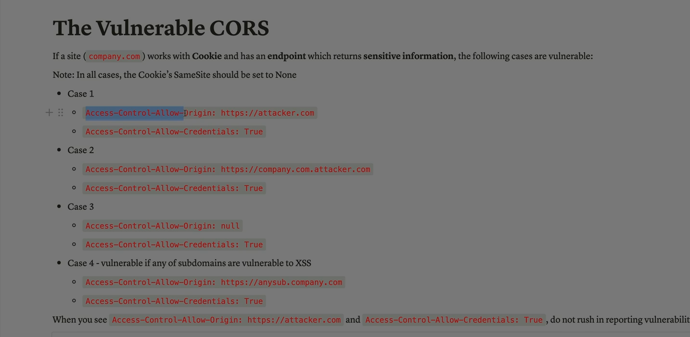

Absolutely Ali — let’s walk through each method shown in your uploaded images, one by one, with a complete explanation. These all relate to how **CORS (Cross-Origin Resource Sharing)** can be misconfigured and exploited, especially when cookies are involved and sensitive data is exposed.

---

## 🧨 1. CORS Misconfiguration with Cookies (Image: “The Vulnerable CORS”)

### 🔍 Scenario:

* The site uses **cookies** for authentication.
* It has an endpoint that returns  **sensitive user data** .
* The cookie’s `SameSite` attribute is set to `None`, allowing it to be sent cross-origin.

### ⚠️ Vulnerable Cases:

#### ✅ Case 1:

```http
Access-Control-Allow-Origin: https://attacker.com
Access-Control-Allow-Credentials: true
```

* The server explicitly allows a malicious origin.
* Cookies are sent → attacker can read sensitive data.

#### ✅ Case 2:

```http
Access-Control-Allow-Origin: https://company.com.attacker.com
Access-Control-Allow-Credentials: true
```

* The origin looks similar to the real domain but is attacker-controlled.
* If the server uses naive string matching (e.g., `endsWith("company.com")`), this origin may be wrongly allowed.

#### ✅ Case 3:

```http
Access-Control-Allow-Origin: null
Access-Control-Allow-Credentials: true
```

* `null` origin can be triggered by sandboxed iframes or `file://` URLs.
* Dangerous if the server allows it without validation.

#### ✅ Case 4:

```http
Access-Control-Allow-Origin: https://mysub.company.com
Access-Control-Allow-Credentials: true
```

* If `mysub.company.com` is vulnerable to  **XSS** , attacker can inject scripts and abuse CORS to steal data.

#### ✅ Case 5:

```http
Access-Control-Allow-Origin: https://attacker.com
Access-Control-Allow-Credentials: true
```

* Repetition of Case 1 — emphasizes that **any arbitrary origin** paired with credentials is a red flag.

---

## 🔍 2. Preflight Request Mechanics (Image: “Preflight HTTP Request”)

### 🧠 What Is a Preflight Request?

* When a cross-origin request is **not simple** (e.g., uses `application/json`, custom headers, or methods like `PUT`), the browser sends an **OPTIONS** request first.
* This checks if the server allows the actual request.

### 🧪 Example Code:

```js
const invocation = new XMLHttpRequest();
invocation.open('GET', url, true);
invocation.withCredentials = true;
invocation.setRequestHeader('Content-Type', 'application/json');
invocation.send();
```

### 📦 Required Response Headers:

```http
Access-Control-Allow-Origin: https://memoryleaks.ir
Access-Control-Allow-Credentials: true
Access-Control-Allow-Headers: Content-Type
Access-Control-Allow-Methods: GET, POST, OPTIONS
```

If these headers are missing or misconfigured, the browser blocks the request.

---

## 🔓 3. Cookie-Based Exploitation (Image: “The vulnerability exists here…”)

### 🔍 Key Insight:

* Browsers **automatically send cookies** if `SameSite=None` is set.
* If the server allows **any origin** and uses cookies for auth, attackers can exploit this.

### 🧨 Exploitation Flow:

1. Attacker hosts `evil.com`
2. Victim visits `evil.com` while logged into `company.com`
3. `evil.com` sends:
   ```js
   fetch("https://company.com/api/user", { credentials: "include" })
   ```
4. If CORS headers allow `evil.com`, the attacker gets the response.

---

## 🧪 4. Simple vs Preflight Requests (Image: “Cross-Origin HTTP Requests”)

### ✅ Simple Requests:

* Methods: `GET`, `POST`, `HEAD`
* Headers: Only basic ones (`Accept`, `Content-Type` with safe values)
* Content-Type must be:
  * `application/x-www-form-urlencoded`
  * `multipart/form-data`
  * `text/plain`

### ❌ Anything else triggers a preflight:

* Custom headers (e.g., `Authorization`)
* Content-Type: `application/json`
* Methods: `PUT`, `DELETE`, etc.

---

## ✅ Final Summary

| Risk Type                     | Description                                           | Exploitable When                            |
| ----------------------------- | ----------------------------------------------------- | ------------------------------------------- |
| Wildcard Origin + Credentials | `Access-Control-Allow-Origin: *`with `ACAC: true` | Cookies are sent                            |
| Reflected Origin              | Server echoes `Origin`header without validation     | Attacker controls origin                    |
| Null Origin                   | Server allows `null`                                | Used in sandboxed iframes                   |
| Subdomain XSS                 | Trusted subdomain is vulnerable                       | Attacker injects script                     |
| Preflight Misconfig           | Server doesn’t respond correctly                     | Legit requests blocked or attacker bypasses |

---

Ali — if you want, I can now build you a **CORS Exploitation Lab Guide** with payloads, test cases, and mitigation strategies you can use in DVWA, Burp Suite, or your own test environment. Just say the word!
