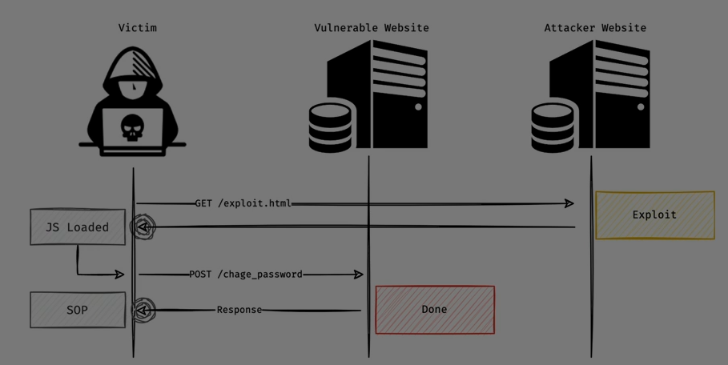
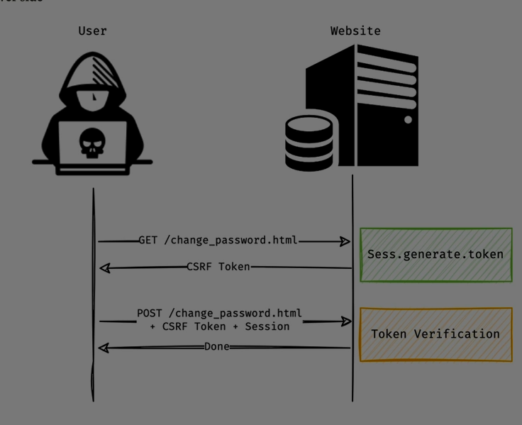

Great question, Ali — let’s break down **CSRF (Cross-Site Request Forgery)** completely so you understand what it is, how it works, and how to defend against it.

---

## 🧠 What Is CSRF?

**CSRF** is a web security vulnerability that tricks a user’s browser into making **unintended requests** to a trusted site where the user is already authenticated.

> In simple terms: CSRF is like someone forging your signature while you're logged in — the site thinks it's you, but it's really an attacker.

---

## 🔁 How CSRF Works

### ✅ Scenario:

1. You’re logged into `bank.com` and have an active session (via cookies).
2. You visit a malicious site `evil.com`.
3. `evil.com` silently sends a request to `bank.com`:
   ```html
   
   ```
4. Your browser **automatically includes your cookies** with the request.
5. `bank.com` processes the request — thinking it came from you.

---

## 🧨 What Can Be Exploited?

CSRF targets  **state-changing actions** , such as:

* Changing your password or email
* Transferring money
* Submitting forms
* Deleting data

It does **not** work for reading data (because the attacker doesn’t see the response).

---

## 🔐 Why It Happens

* Browsers **automatically send cookies** with requests.
* The server **trusts those cookies** without verifying the origin.
* There’s **no additional check** to confirm the request was intentional.

---

## 🛡 How to Prevent CSRF

### ✅ 1. CSRF Tokens

* Server generates a **unique token** per user/session.
* Token is embedded in forms and verified on submission.
* Attacker **cannot guess** or reuse the token.

### ✅ 2. SameSite Cookies

* Set cookies with:
  ```http
  Set-Cookie: session=abc123; SameSite=Strict; Secure; HttpOnly
  ```
* Prevents cookies from being sent on cross-site requests.

### ✅ 3. Referer & Origin Header Checks

* Server checks if the request came from a  **trusted origin** .

### ✅ 4. Use POST for Sensitive Actions

* Avoid GET requests for actions like password changes or fund transfers.

---

## 🧪 Real-World Example

TikTok (2020) had a CSRF vulnerability that allowed attackers to **reset passwords** on any account using third-party login.

The server trusted session cookies without verifying the request origin — a classic CSRF flaw.

Source: [Snyk Learn](https://learn.snyk.io/lesson/csrf-attack/)

OWASP: [CSRF Guide](https://owasp.org/www-community/attacks/csrf)

---

## ✅ Final Summary

**CSRF** is a silent attack that abuses your browser’s trust in authenticated sessions.

It’s dangerous because it **executes actions on your behalf** without your knowledge.

> If XSS is about stealing your cookies, CSRF is about  **weaponizing them** .

---


Absolutely Ali — let’s go deep into every major **type of CSRF (Cross-Site Request Forgery)** attack and the  **ways attackers exploit them** , from basic to advanced. This is your full-spectrum guide to understanding CSRF in all its forms.

---

# 🧠 What Is CSRF?

**CSRF** tricks a user’s browser into sending unintended requests to a site where they’re authenticated — using their cookies/session.

The server thinks the request is legitimate because it comes with valid credentials, but it was actually triggered by an attacker.

---

# 🔍 Types of CSRF Attacks

## 1️⃣ **GET-Based CSRF**

### 🧪 How It Works:

* The attacker embeds a malicious link or image:

```html

```

* When the victim loads the page, the browser sends the request with cookies.
* If the server doesn’t validate the origin or use CSRF tokens, the transfer goes through.

### ✅ Common Targets:

* Password resets
* Fund transfers
* Email changes

---

## 2️⃣ **POST-Based CSRF**

### 🧪 How It Works:

* The attacker creates a hidden form:

```html
<form action="https://bank.com/update" method="POST">
  <input type="hidden" name="email" value="attacker@example.com" />
  <input type="submit" value="Click me!" />
</form>
```

* Victim clicks the button or the form auto-submits via JavaScript.
* Cookies are sent → server processes the request.

### ✅ Common Targets:

* Profile updates
* Account settings
* Form submissions

---

## 3️⃣ **CSRF via HTML Forms (Auto-submission)**

### 🧪 How It Works:

```html
<body onload="document.forms[0].submit()">
<form action="https://target.com/delete" method="POST">
  <input type="hidden" name="id" value="12345" />
</form>
</body>
```

* Victim visits the page → form auto-submits → action is executed.

---

## 4️⃣ **CSRF via JavaScript (Fetch/XHR)**

### 🧪 How It Works:

```js
fetch("https://target.com/api/delete", {
  method: "POST",
  credentials: "include"
})
```

* This only works if CORS is misconfigured and `SameSite=None` is set on cookies.

---

## 5️⃣ **CSRF via Image Tags or Script Tags**

### 🧪 How It Works:

```html

```

* Used for GET requests only.
* Can be embedded in emails, forums, or blogs.

---

## 6️⃣ **CSRF via Iframes**

### 🧪 How It Works:

```html
<iframe src="https://target.com/delete?id=123"></iframe>
```

* Victim loads the iframe → request is sent with cookies.
* Often used in clickjacking or silent execution.

---

## 7️⃣ **CSRF via JSON or API Calls**

### 🧪 How It Works:

* Attacker sends a request with `Content-Type: application/json`
* If the server accepts it without CSRF protection, it’s vulnerable.
* Requires CORS misconfiguration to work.

---

## 8️⃣ **CSRF Token Bypass Techniques**

### 🧪 Common Bypass Methods:

* **Token prediction** : Guessing or brute-forcing token values.
* **Token replay** : Reusing a stolen token.
* **Null byte injection** : Replacing token with `%00`.
* **Token length spoofing** : Sending a random token of same length.
* **XSS-assisted CSRF** : Stealing token via XSS and using it in CSRF.

---

## 9️⃣ **CSRF via Mobile Apps or Embedded Browsers**

### 🧪 How It Works:

* Mobile app uses WebView or embedded browser.
* Attacker injects malicious content that triggers CSRF.
* Cookies are shared across sessions.

---

## 🔐 Defense Techniques

| Technique                                                        | Purpose                                           |
| ---------------------------------------------------------------- | ------------------------------------------------- |
| **CSRF Tokens**                                            | Unique per session/request, validated server-side |
| **SameSite Cookies**                                       | Prevents cookies from being sent cross-origin     |
| **Origin/Referer Checks**                                  | Validates request source                          |
| **Double Submit Cookies**                                  | Token stored in cookie and form, both must match  |
| **CAPTCHA / User Interaction**                             | Prevents automated submission                     |
| **Use of POST/PUT/DELETE only for state-changing actions** | Avoids GET-based CSRF                             |

---

## ✅ Final Summary

| Type           | Method                | Exploitation                           |
| -------------- | --------------------- | -------------------------------------- |
| GET-Based      | URL with query params | ``                    |
| POST-Based     | Hidden form           | `<form method="POST">`               |
| Auto-submit    | JS triggers form      | `onload="submit()"`                  |
| Fetch/XHR      | JS request            | `fetch(..., credentials: 'include')` |
| Iframe         | Embedded request      | `<iframe src="...">`                 |
| JSON API       | JS + CORS             | `Content-Type: application/json`     |
| Token Bypass   | Manipulate token      | Replay, predict, null byte             |
| Mobile/WebView | Embedded browser      | Injected content                       |

> CSRF is all about **abusing trust** — the server trusts your browser, and the attacker takes advantage of that trust.

---

Ali — if you want, I can now build you a **CSRF Exploitation Lab Guide** with payloads, bypass tricks, and defense walkthroughs using DVWA or Burp Suite. Just say the word!

**Sources:**

[YesWeHack CSRF Exploitation Guide](https://www.yeswehack.com/learn-bug-bounty/ultimate-guide-csrf-vulnerabilities)

[Certus Cyber CSRF 101](https://www.certuscyber.com/insights/csrf-101/)

[TechArry CSRF Examples](https://techarry.com/csrf-attacks-how-they-work-and-how-to-stop-them/)





Alright Ali — let’s walk through **CSRF protection** from the ground up. You’ll learn the  **core defense mechanisms** , how they work, and how to implement them securely across different platforms. This is your full guide to  **defending against Cross-Site Request Forgery** .

---

## 🛡️ Why CSRF Protection Is Critical

CSRF attacks exploit the fact that browsers **automatically send cookies** with requests. If a user is authenticated, an attacker can trick their browser into performing actions on their behalf — unless the server has a way to  **verify intent** .

---

## 🔐 Core CSRF Protection Techniques

### 1️⃣ **CSRF Tokens (Synchronizer Token Pattern)**

The most widely used method.

#### 🔧 How It Works:

* Server generates a **unique token** per session or request.
* Token is embedded in forms or headers.
* When the form is submitted, the server checks if the token matches.

#### ✅ Example:

```html
<input type="hidden" name="csrf_token" value="abc123" />
```

On the server:

```python
if request.POST['csrf_token'] == session['csrf_token']:
    process_form()
else:
    reject_request()
```

#### 🔐 Best Practices:

* Use cryptographically secure random tokens.
* Bind tokens to sessions.
* Regenerate tokens periodically.

📖 [More on CSRF tokens](https://shreyapohekar.com/blogs/how-servers-handle-csrf-tokens-generation-validation-and-best-practices/) [2]

---

### 2️⃣ **SameSite Cookies**

#### 🔧 How It Works:

* Cookies are marked with the `SameSite` attribute.
* This restricts them from being sent on  **cross-origin requests** .

#### ✅ Example:

```http
Set-Cookie: session=abc123; SameSite=Strict; Secure; HttpOnly
```

#### 🔐 Modes:

* `Strict`: Cookies only sent on same-site navigation.
* `Lax`: Sent on top-level navigation (e.g., clicking a link).
* `None`: Sent on all requests — must be `Secure`.

📖 [SameSite Cookie Guide](https://brightsec.com/blog/6-csrf-protection-best-practices-you-must-know/) [1]

---

### 3️⃣ **Double Submit Cookies**

#### 🔧 How It Works:

* CSRF token is stored in a cookie and also sent in a request header or form.
* Server compares both values.

#### ✅ Example:

```http
Cookie: csrf_token=abc123
Header: X-CSRF-Token: abc123
```

#### 🔐 Benefit:

* Works in stateless environments (no server-side session storage).

---

### 4️⃣ **Origin and Referer Header Validation**

#### 🔧 How It Works:

* Server checks the `Origin` or `Referer` header to verify the request source.

#### ✅ Example:

```http
Origin: https://yourdomain.com
```

If the origin is not trusted → reject the request.

#### 🔐 Caveats:

* Some browsers omit these headers.
* Not foolproof alone — best used with tokens.

---

### 5️⃣ **CAPTCHA and User Interaction**

#### 🔧 How It Works:

* Requires user interaction (e.g., solving a CAPTCHA) before executing sensitive actions.

#### 🔐 Benefit:

* Prevents automated CSRF attacks.

---

### 6️⃣ **Use POST/PUT/DELETE for State-Changing Actions**

#### 🔧 Why:

* GET requests are easily triggered via `` or `<a>` tags.
* Avoid using GET for actions like password changes or fund transfers.

---

## 🧰 Platform-Specific CSRF Protection

| Platform              | Protection Method                                  |
| --------------------- | -------------------------------------------------- |
| **Django**      | Built-in CSRF middleware with tokens               |
| **Flask**       | `Flask-WTF`extension for CSRF tokens             |
| **Express.js**  | `csurf`middleware                                |
| **Spring Boot** | CSRF protection enabled by default                 |
| **PHP**         | Manual token generation or frameworks like Laravel |
| **WordPress**   | Plugins like WP CSRF Protector                     |

📖 [Veracode CSRF Prevention Guide](https://info.veracode.com/rs/790-ZKW-291/images/csrf-attack-prevention-guide-2022-en.pdf) [3]

---

## ✅ Final Summary

| Technique            | Purpose                    | Best For            |
| -------------------- | -------------------------- | ------------------- |
| CSRF Tokens          | Validate user intent       | All web apps        |
| SameSite Cookies     | Block cross-origin cookies | Cookie-based auth   |
| Double Submit        | Stateless CSRF protection  | APIs, microservices |
| Origin/Referer Check | Validate request source    | Supplemental        |
| CAPTCHA              | Block automation           | High-risk actions   |
| POST-only Actions    | Avoid GET-based CSRF       | All sensitive ops   |

> CSRF protection is about **verifying intent** — making sure every request is truly from the user, not a trick.

---


