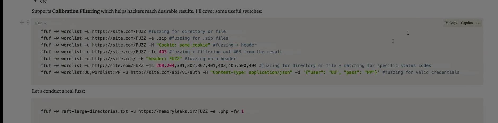

Absolutely Ali — let’s break down the **ffuf tool** completely. It’s one of the most powerful and efficient tools for  **web fuzzing** , used by penetration testers and bug bounty hunters to discover hidden paths, parameters, and vulnerabilities in web applications.

---

## 🧠 What Is ffuf?

**ffuf** stands for  **Fuzz Faster U Fool** . It’s a fast, flexible, and modern **web fuzzer** written in Go.

It’s designed to brute-force:

* URLs and directories
* Parameters
* Subdomains
* File names
* HTTP headers

> Think of ffuf as a high-speed scanner that throws thousands of payloads at a target to uncover hidden or vulnerable endpoints.

---

## ⚙️ What Can ffuf Do?

| Use Case                        | Description                                                         |
| ------------------------------- | ------------------------------------------------------------------- |
| **Directory discovery**   | Find hidden folders like `/admin`,`/backup`,`/config`         |
| **File brute-forcing**    | Discover files like `.env`,`login.php`,`db.sql`               |
| **Parameter fuzzing**     | Test for vulnerable GET/POST parameters                             |
| **Subdomain enumeration** | Discover subdomains like `dev.example.com`                        |
| **Header fuzzing**        | Test for header-based vulnerabilities (e.g., Host header injection) |

---

## 🧪 Basic Syntax

```bash
ffuf -u https://example.com/FUZZ -w wordlist.txt
```

* `-u`: Target URL (use `FUZZ` as the placeholder)
* `-w`: Wordlist file (e.g., SecLists)

### 🔍 Example: Directory Discovery

```bash
ffuf -u https://target.com/FUZZ -w /usr/share/wordlists/dirbuster/directory-list-2.3-medium.txt
```

### 🔍 Example: Parameter Fuzzing

```bash
ffuf -u https://target.com/page?FUZZ=test -w params.txt
```

### 🔍 Example: Subdomain Fuzzing

```bash
ffuf -u https://FUZZ.example.com -w subdomains.txt -H "Host: FUZZ.example.com"
```

---

## ⚡ Features That Make ffuf Powerful

* **Speed** : Extremely fast thanks to Go’s concurrency
* **Flexible matching** : Filter by status code, size, words, lines
* **Recursive fuzzing** : Automatically fuzz discovered directories
* **Color-coded output** : Easy to read results
* **JSON export** : Save results for later analysis

---

## 🔐 Security Testing Use Cases

* Discover  **admin panels** ,  **login pages** , **debug endpoints**
* Find **unlinked resources** or **forgotten backups**
* Test for **authentication bypass** via hidden paths
* Identify **parameter-based vulnerabilities** (e.g., XSS, SQLi)
* Map out **attack surface** before deeper testing

---

## ✅ Final Summary

| Feature          | Benefit                         |
| ---------------- | ------------------------------- |
| Fast fuzzing     | Saves time during recon         |
| Flexible syntax  | Works for URLs, params, headers |
| Filter options   | Focus on meaningful results     |
| Easy integration | Works with Burp, Nmap, etc.     |
| Open source      | Free and actively maintained    |

> ffuf is like a flashlight in a dark web app — it reveals what’s hidden, what’s forgotten, and what’s vulnerable.

---


Absolutely Ali — here’s a complete breakdown of **all major parameters and options in `ffuf` (Fuzz Faster U Fool)** so you can master its usage for web fuzzing, directory discovery, parameter testing, and more.

---

## 🧰 Core Syntax

```bash
ffuf -u [URL] -w [wordlist] [options]
```

* `-u`: Target URL, with `FUZZ` as the placeholder
* `-w`: Wordlist file to use for fuzzing

---

## 🔍 Input and Target Options

| Option            | Description                                                 |
| ----------------- | ----------------------------------------------------------- |
| `-u`            | Target URL (use `FUZZ`as placeholder)                     |
| `-w`            | Wordlist file path                                          |
| `-X`            | HTTP method (e.g., GET, POST, PUT)                          |
| `-d`            | POST data (e.g.,`username=FUZZ&password=test`)            |
| `-H`            | Custom header (e.g.,`-H "Authorization: Bearer token"`)   |
| `-b`            | Cookie string (e.g.,`-b "session=abc123"`)                |
| `-r`            | Follow redirects                                            |
| `-timeout`      | Request timeout in seconds                                  |
| `-replay-proxy` | Send requests through a proxy for replay (e.g., Burp Suite) |

---

## 🎯 Matching and Filtering Options

| Option  | Description                                    |
| ------- | ---------------------------------------------- |
| `-mc` | Match HTTP status codes (e.g.,`-mc 200,301`) |
| `-fc` | Filter out status codes                        |
| `-ml` | Match by line count                            |
| `-fl` | Filter by line count                           |
| `-ms` | Match by response size                         |
| `-fs` | Filter by response size                        |
| `-mw` | Match by word count                            |
| `-fw` | Filter by word count                           |
| `-mr` | Match regex in response                        |
| `-fr` | Filter regex in response                       |

---

## 📦 Output Options

| Option         | Description                                        |
| -------------- | -------------------------------------------------- |
| `-o`         | Output file path                                   |
| `-of`        | Output format (`json`,`csv`,`html`,`ecsv`) |
| `-or`        | Show full response                                 |
| `-debug-log` | Save debug logs to file                            |

---

## 🔁 Advanced Fuzzing Options

| Option               | Description                                                      |
| -------------------- | ---------------------------------------------------------------- |
| `-input-cmd`       | Use command output as input (e.g.,`-input-cmd "cat list.txt"`) |
| `-input-num`       | Generate numeric input (e.g.,`-input-num 1-100`)               |
| `-input-wrapped`   | Wrap input in a string (e.g.,`-input-wrapped "<FUZZ>"`)        |
| `-match-all`       | Show all matches regardless of filters                           |
| `-recursion`       | Enable recursive fuzzing                                         |
| `-recursion-depth` | Set recursion depth                                              |
| `-max-time`        | Max time to run in seconds                                       |
| `-maxtime-job`     | Max time per job                                                 |

---

## 🧪 Multiple Wordlists and Placeholders

| Option             | Description                                             |
| ------------------ | ------------------------------------------------------- |
| `-w`             | Can be used multiple times for multiple wordlists       |
| `-u`             | Use multiple placeholders like `FUZZ`,`FUZ2Z`, etc. |
| `-request`       | Use raw HTTP request file with placeholders             |
| `-request-proto` | Set protocol for raw request (`http`,`https`)       |

---

## 🧠 Useful Examples

### 🔍 Directory Discovery

```bash
ffuf -u https://target.com/FUZZ -w /path/to/wordlist.txt -mc 200
```

### 🔍 Parameter Fuzzing

```bash
ffuf -u https://target.com/page?FUZZ=test -w params.txt -mc 200
```

### 🔍 POST Data Fuzzing

```bash
ffuf -u https://target.com/login -X POST -d "username=FUZZ&password=123" -w users.txt -mc 200
```

### 🔍 Subdomain Fuzzing

```bash
ffuf -u https://FUZZ.target.com -w subdomains.txt -H "Host: FUZZ.target.com" -mc 200
```

---

## ✅ Final Tips

* Use **SecLists** for high-quality wordlists: [https://github.com/danielmiessler/SecLists](https://github.com/danielmiessler/SecLists)
* Combine with **Burp Suite** using `-replay-proxy`
* Use filters (`-fs`, `-fl`, `-fw`) to reduce noise
* Export results with `-of json` for automation

> ffuf is like a Swiss Army knife for web fuzzing — fast, flexible, and battle-tested.

---


