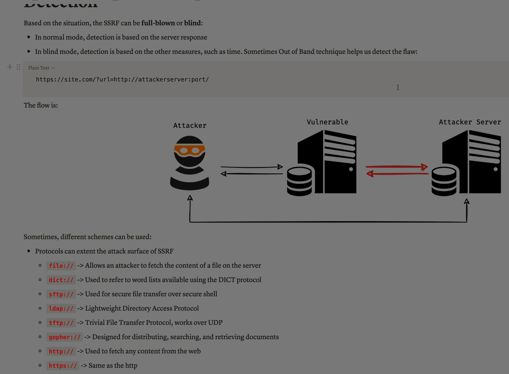

Absolutely Ali — let’s break down **SSRF (Server-Side Request Forgery)** completely. This is one of the most powerful and dangerous web vulnerabilities, often used to pivot inside networks, access internal services, and exfiltrate sensitive data.

---

## 🧠 What Is SSRF?

**Server-Side Request Forgery (SSRF)** is a vulnerability that allows an attacker to make the server **send HTTP requests on its behalf** — often to internal systems that the attacker cannot access directly.

> In simple terms: the attacker tricks the server into becoming a proxy, sending requests to internal or external targets.

---

## 🔍 Why It Happens

SSRF occurs when:

* A web application **fetches remote resources** (e.g., images, URLs, APIs) based on **user input**
* The server **does not validate or restrict** the destination
* The attacker controls the input and redirects the request to a **target of their choice**

---

## 🧪 Real-World Example

### Vulnerable Code:

```php
$url = $_GET['url'];
$response = file_get_contents($url);
```

### Attacker Input:

```
https://vulnerable.com/fetch?url=http://localhost:8080/admin
```

✅ The server sends a request to its own internal admin panel — attacker gets the response.

---

## 🧨 What Can Be Exploited with SSRF?

### 1️⃣ Internal Services

* Access internal APIs, dashboards, or metadata endpoints
* Example: AWS EC2 metadata service at `http://169.254.169.254`

### 2️⃣ Port Scanning

* Use SSRF to scan internal IP ranges and ports
* Identify open services (e.g., Redis, MongoDB)

### 3️⃣ Credential Theft

* Read secrets from cloud metadata endpoints
* Example: AWS IAM credentials

### 4️⃣ Bypass Firewalls

* Reach services that are only accessible from inside the network

### 5️⃣ Trigger Side Effects

* POST requests to internal services
* Delete data, trigger jobs, or escalate privileges

---

## 🔐 SSRF in Cloud Environments

### ☁️ AWS Example:

```http
http://169.254.169.254/latest/meta-data/iam/security-credentials/
```

* If SSRF reaches this endpoint, attacker can steal IAM credentials

### ☁️ Kubernetes:

```http
http://localhost:8001/api/v1/namespaces/kube-system/secrets
```

* SSRF can expose cluster secrets

---

## 🧰 SSRF Variants

| Type                       | Description                                                     |
| -------------------------- | --------------------------------------------------------------- |
| **Basic SSRF**       | Direct request to internal/external URL                         |
| **Blind SSRF**       | No response shown — attacker uses timing, DNS, or side effects |
| **Recursive SSRF**   | SSRF leads to another SSRF-capable endpoint                     |
| **Out-of-Band SSRF** | Uses DNS or external callbacks to confirm exploitation          |

---

## 🛠 Tools for SSRF Testing

* **Burp Suite** (with Collaborator)
* **ffuf** or **curl** for manual testing
* **dnslog.cn** or **requestbin.net** for blind SSRF
* **Param Miner** to find hidden parameters

---

## 🔐 How to Prevent SSRF

### ✅ 1. Whitelist URLs

* Only allow trusted domains or IPs
* Block access to internal IP ranges (`127.0.0.1`, `169.254.169.254`, etc.)

### ✅ 2. Validate and Sanitize Input

* Reject user-supplied URLs or restrict to safe formats

### ✅ 3. Use Network-Level Controls

* Firewall rules to block outbound requests to sensitive services

### ✅ 4. Disable Unnecessary Features

* Avoid fetching remote resources based on user input

### ✅ 5. Monitor and Alert

* Log outbound requests
* Alert on suspicious destinations or patterns

---

## ✅ Final Summary

| Risk              | Description                     |
| ----------------- | ------------------------------- |
| Internal access   | Reach services behind firewalls |
| Credential theft  | Steal cloud secrets             |
| Port scanning     | Map internal network            |
| Data exfiltration | Leak sensitive info             |
| Side effects      | Trigger internal actions        |

> SSRF turns your server into a weapon — attackers use it to reach places they shouldn’t, often deep inside your infrastructure.

---




Great question, Ali — let’s walk through  **how SSRF (Server-Side Request Forgery) is exploited** , step by step, in a way that’s practical, safe, and educational. I’ll show you how attackers think, what they look for, and how you can simulate or test SSRF vulnerabilities in a controlled environment.

---

## 🧨 SSRF Exploitation Workflow

### 1️⃣ **Identify a Request-Sending Feature**

Look for any functionality that fetches external resources based on user input:

* Image preview (`?url=`)
* PDF generation from a URL
* Webhooks or callbacks
* URL fetchers or importers
* Metadata fetchers

### 🔍 Example:

```http
GET /fetch?url=https://example.com/image.jpg
```

If the server fetches this URL and returns the content, it’s a candidate for SSRF.

---

### 2️⃣ **Test External URLs**

Start with a benign external URL to confirm the server is making the request:

```http
https://yourdomain.com/fetch?url=https://google.com
```

If you get Google’s content back, the server is fetching it — SSRF is likely.

---

### 3️⃣ **Probe Internal Resources**

Try accessing internal IPs or services:

```http
http://127.0.0.1/
http://localhost/
http://169.254.169.254/  ← AWS metadata
http://10.0.0.1/
```

If the server responds with internal data, you’ve confirmed SSRF.

---

### 4️⃣ **Blind SSRF Techniques**

If you don’t get a response, use **out-of-band (OOB)** methods:

* Send requests to a domain you control (e.g., `http://ssrf.yourdomain.com`)
* Monitor DNS or HTTP logs to confirm the server made the request

Tools:

* [Burp Collaborator](https://portswigger.net/burp/documentation/collaborator)
* [Interactsh](https://github.com/projectdiscovery/interactsh)

---

### 5️⃣ **Target Cloud Metadata Services**

If the server is in AWS, GCP, or Azure, SSRF can expose credentials:

#### AWS:

```http
http://169.254.169.254/latest/meta-data/iam/security-credentials/
```

#### GCP:

```http
http://metadata.google.internal/computeMetadata/v1/instance/service-accounts/default/token
```

#### Azure:

```http
http://169.254.169.254/metadata/instance?api-version=2021-01-01
```

Use proper headers if required (e.g., `Metadata-Flavor: Google`).

---

### 6️⃣ **Scan Internal Network**

Use SSRF to perform internal port scanning:

```http
http://127.0.0.1:22
http://127.0.0.1:3306
http://10.0.0.5:8080
```

Measure response time or status codes to infer open ports.

---

### 7️⃣ **Trigger Internal Actions**

If SSRF allows POST requests, you can:

* Trigger jobs
* Delete data
* Modify configurations

Example:

```http
POST /internal/deleteUser?id=123
```

---

## 🧰 Tools for SSRF Testing

* **curl** : Manual testing
* **Burp Suite** : Intercept and modify requests
* **ffuf** : Fuzzing parameters
* **Param Miner** : Discover hidden SSRF vectors
* **Interactsh / dnslog.cn** : Blind SSRF detection

---

## 🔐 Safe Testing Tips

* Use **test environments** like DVWA, Juice Shop, or bWAPP
* Never test SSRF on production systems without permission
* Log all requests and responses for analysis
* Use your own domain for OOB testing

---

Ali — if you want, I can now help you craft  **SSRF payloads for a lab** , build a  **custom ffuf scan** , or simulate a full SSRF attack chain in a safe environment. Just say the word!
