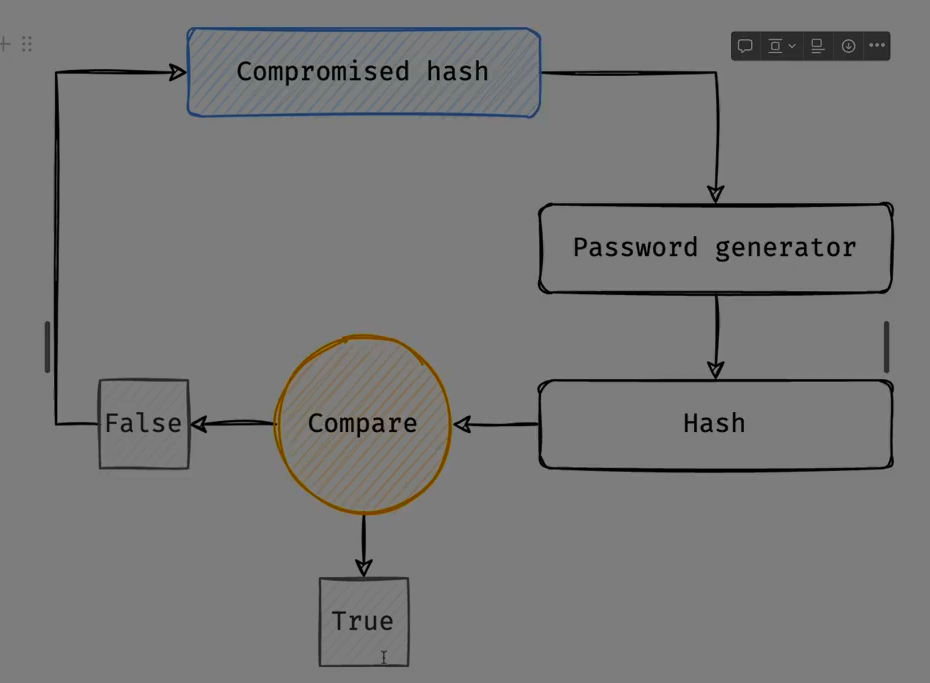

Absolutely Ali — let’s break down **crypto** completely. Depending on context, “crypto” can refer to **cryptography** (the science of securing information) or **cryptocurrency** (digital money built on cryptographic principles). I’ll explain both so you get the full picture.

---

## 🔐 Part 1: Cryptography (Crypto as Security)

### 🧠 What Is Cryptography?

Cryptography is the science of **protecting data** by transforming it so that only authorized parties can read or use it.

It’s used in:

* Secure communication (HTTPS, messaging apps)
* Authentication (passwords, digital signatures)
* Data integrity (checksums, hashes)

---

### 🔍 Core Concepts

| Concept                      | Description                                               |
| ---------------------------- | --------------------------------------------------------- |
| **Encryption**         | Converts plaintext into unreadable ciphertext             |
| **Decryption**         | Converts ciphertext back to plaintext                     |
| **Hashing**            | One-way transformation used for integrity (e.g., SHA-256) |
| **Digital Signatures** | Proves authenticity of data                               |
| **Key Exchange**       | Securely shares encryption keys (e.g., Diffie-Hellman)    |

---

### 🔐 Types of Cryptography

| Type                     | Description                                        |
| ------------------------ | -------------------------------------------------- |
| **Symmetric**      | Same key for encryption and decryption (e.g., AES) |
| **Asymmetric**     | Public/private key pair (e.g., RSA, ECC)           |
| **Hash Functions** | One-way fingerprint of data (e.g., SHA, MD5)       |

---

## 🪙 Part 2: Cryptocurrency (Crypto as Digital Money)

### 🧠 What Is Cryptocurrency?

Cryptocurrency is a **digital asset** that uses cryptography to secure transactions, control creation, and verify transfers — all on a **decentralized network** (usually a blockchain).

> Think of it as programmable money that doesn’t rely on banks or governments.

---

### 🔍 Key Features

| Feature                    | Description                                    |
| -------------------------- | ---------------------------------------------- |
| **Decentralization** | No central authority — run by nodes           |
| **Blockchain**       | Immutable ledger of transactions               |
| **Mining/Staking**   | Validates transactions and secures the network |
| **Wallets**          | Store private keys to access your crypto       |
| **Smart Contracts**  | Self-executing code on the blockchain          |

---

### 🪙 Popular Cryptocurrencies

| Name                     | Purpose                      |
| ------------------------ | ---------------------------- |
| **Bitcoin (BTC)**  | Digital gold, store of value |
| **Ethereum (ETH)** | Smart contracts and dApps    |
| **Solana (SOL)**   | Fast, low-cost transactions  |
| **Ripple (XRP)**   | Cross-border payments        |
| **USDT/USDC**      | Stablecoins pegged to USD    |

---

### ⚠️ Risks and Challenges

* **Volatility** : Prices can swing wildly
* **Security** : Wallets and exchanges can be hacked
* **Regulation** : Legal status varies by country
* **Scams** : Fake coins, rug pulls, phishing

---

## ✅ Final Summary

| Crypto Type              | Purpose                               |
| ------------------------ | ------------------------------------- |
| **Cryptography**   | Secures data and communication        |
| **Cryptocurrency** | Enables decentralized digital finance |

> Crypto is both the **lock and the key** — it protects your secrets and powers the future of money.

---


Absolutely Ali — based on the image you shared, here’s a **complete breakdown of cryptography** as explained in the document. This covers its purpose, key concepts, types, and practical applications. Let’s go step by step:

---

## 🔐 What Is Cryptography?

Cryptography is the science of  **secure communication** . Its goal is to allow a sender to transmit a **private message** to a recipient in a way that **prevents third parties** from intercepting or understanding it.

> Imagine whispering a secret in a crowded room — cryptography ensures only the intended listener can hear and understand it.

---

## 🧩 Key Concepts

### 1️⃣ **Plaintext (Cleartext)**

* The original, readable message or data.
* Example: `"Ali's password is 1234"`

### 2️⃣ **Encryption**

* The process of converting plaintext into **ciphertext** using a mathematical algorithm.
* Ciphertext is unreadable without the correct key.

### 3️⃣ **Key**

* A unique value used by the encryption algorithm.
* Must be known by both sender and receiver (in symmetric systems) or matched as a public/private pair (in asymmetric systems).

### 4️⃣ **Decryption**

* The reverse of encryption: converting ciphertext back into plaintext using the correct key and algorithm.

---

## 🎯 Objectives of Cryptography

Cryptography isn’t just about secrecy — it ensures  **four critical security goals** :

| Objective                           | Description                                                  |
| ----------------------------------- | ------------------------------------------------------------ |
| **Secrecy (Confidentiality)** | Only the intended recipient can read the message             |
| **Authentication**            | Confirms the identity of sender and receiver                 |
| **Non-repudiation**           | Sender cannot deny sending the message                       |
| **Integrity**                 | Ensures the message hasn’t been altered during transmission |

---

## 🔐 Types of Cryptography

### 1️⃣ **Symmetric-Key Encryption**

* Uses **one shared key** for both encryption and decryption.
* Example: **AES (Advanced Encryption Standard)**
* Fast and efficient, but key exchange must be secure.

### 2️⃣ **Asymmetric-Key Encryption**

* Uses a  **pair of keys** : one public, one private.
* Example: **RSA**
* Public key encrypts, private key decrypts.
* Even if the public key is known to everyone, only the private key holder can read the message.

---

## 🔁 Hashing Functions

Hashing is a **one-way transformation** of data — it’s not meant to be decrypted.

| Function                    | Purpose                                            |
| --------------------------- | -------------------------------------------------- |
| **MD5**               | Legacy hash, fast but weak                         |
| **SHA-256 / SHA-512** | Stronger hashes used in modern systems             |
| **bcrypt**            | Slow, secure hash for passwords (includes salting) |

> Hashing is used for  **data integrity** ,  **password storage** , and  **digital signatures** .

---

## 🧠 Encoding vs Encryption

* **Encoding** : Converts data into a format for **efficient transmission or storage** (e.g., Base64).
* **Encryption** : Secures data so only authorized parties can read it.

Encoding is **not secure** — it’s reversible and not meant for protection.

---

## 🧪 Practical Example: Using Bash to Create MD5 Hash

The document hints at using command-line tools to generate hashes:

```bash
echo -n "Ali1234" | md5sum
```

This would output the MD5 hash of the string `"Ali1234"`.

---

## ✅ Final Summary

| Concept    | Role in Cryptography                                |
| ---------- | --------------------------------------------------- |
| Plaintext  | Original readable data                              |
| Encryption | Secures data using algorithms                       |
| Key        | Required to encrypt/decrypt                         |
| Decryption | Restores original data                              |
| Hashing    | One-way fingerprint of data                         |
| Encoding   | Format data for transmission                        |
| Symmetric  | One key for both sides                              |
| Asymmetric | Public/private key pair                             |
| Objectives | Secrecy, Integrity, Authentication, Non-repudiation |

> Cryptography is the backbone of digital security — from messaging apps to banking systems, it ensures that  **what’s private stays private** .

---


Absolutely Ali — here’s a **complete breakdown** of each of these cryptographic technologies and algorithms. They all play vital roles in securing data, communications, and identities in the digital world.

---

## 🔐 SSL (Secure Sockets Layer)

### 📌 What It Is:

SSL is a **protocol** used to secure communication between a client (like a browser) and a server (like a website). It encrypts data in transit to prevent eavesdropping or tampering.

### 🔍 Key Features:

* Encrypts HTTP traffic → becomes HTTPS
* Uses **asymmetric encryption** (RSA) for key exchange
* Uses **symmetric encryption** (AES) for bulk data transfer
* Replaced by **TLS (Transport Layer Security)** — but “SSL” is still commonly used

### ✅ Use Case:

* Securing websites, emails, VPNs, and APIs

---

## 🧠 AES (Advanced Encryption Standard)

### 📌 What It Is:

AES is a **symmetric encryption algorithm** — meaning the same key is used to encrypt and decrypt data.

### 🔍 Key Features:

* Block cipher with 128-bit blocks
* Key sizes: 128, 192, or 256 bits
* Fast and secure — used globally for sensitive data

### ✅ Use Case:

* Encrypting files, databases, VPN traffic, and TLS sessions

---

## 🔐 RSA (Rivest–Shamir–Adleman)

### 📌 What It Is:

RSA is an **asymmetric encryption algorithm** — it uses a **public key** to encrypt and a **private key** to decrypt.

### 🔍 Key Features:

* Based on the difficulty of factoring large prime numbers
* Enables secure key exchange and digital signatures
* Slower than AES, but ideal for small data and authentication

### ✅ Use Case:

* SSL/TLS handshakes, secure email, digital certificates

---

## 🧪 MD5 (Message Digest 5)

### 📌 What It Is:

MD5 is a **hash function** — it converts data into a fixed-size 128-bit hash.

### 🔍 Key Features:

* Fast and simple
* Not secure for cryptographic use (vulnerable to collisions)
* Still used for checksums and file integrity

### ✅ Use Case:

* Verifying file integrity (non-security-critical)

---

## 🔐 SHA-256 and SHA-512 (Secure Hash Algorithm)

### 📌 What They Are:

SHA-256 and SHA-512 are part of the **SHA-2 family** of hash functions.

### 🔍 Key Features:

* SHA-256 → 256-bit hash
* SHA-512 → 512-bit hash
* Stronger than MD5, widely used in security

### ✅ Use Case:

* Password hashing, blockchain (Bitcoin uses SHA-256), digital signatures

---

## 🔐 bcrypt

### 📌 What It Is:

bcrypt is a **password hashing algorithm** designed to be slow and resistant to brute-force attacks.

### 🔍 Key Features:

* Includes **salting** (adds randomness)
* Adjustable **cost factor** (controls computation time)
* One-way function — cannot be reversed

### ✅ Use Case:

* Secure password storage in databases

---

## 🧠 Summary Table

| Algorithm             | Type                  | Purpose                  | Security                       |
| --------------------- | --------------------- | ------------------------ | ------------------------------ |
| **SSL/TLS**     | Protocol              | Secure communication     | Strong (TLS 1.2+)              |
| **AES**         | Symmetric encryption  | Fast data encryption     | Very strong                    |
| **RSA**         | Asymmetric encryption | Key exchange, signatures | Strong (2048+ bits)            |
| **MD5**         | Hash                  | File integrity           | Weak (not collision-resistant) |
| **SHA-256/512** | Hash                  | Secure fingerprinting    | Strong                         |
| **bcrypt**      | Hash                  | Password protection      | Very strong (slow + salted)    |

---

Ali — if you want, I can now help you  **implement any of these in code** , simulate a  **TLS handshake** , or walk you through  **real-world encryption scenarios** . Just say the word!

**Sources:**

* [Encryption Standards Overview – dev.to](https://dev.to/hardy_mervana/encryption-standards-aes-rsa-ecc-sha-and-other-protocols-460c)
* [Notes on Cryptography – rakhesh.com](https://rakhesh.com/infrastructure/notes-on-cryptography-ciphers-rsa-dsa-aes-rc4-ecc-ecdsa-sha-and-so-on/)



