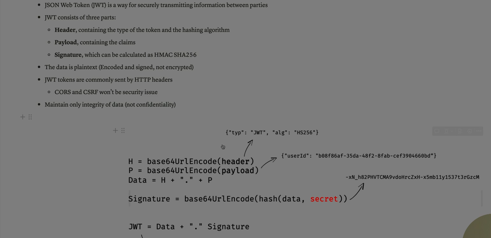

Absolutely Ali — here’s a  **complete breakdown of JWT (JSON Web Token)** , one of the most widely used technologies for secure authentication and authorization in modern web applications and APIs.

---

## 🧠 What Is JWT?

**JWT (JSON Web Token)** is a compact, self-contained token format used to **securely transmit information** between parties.

It’s digitally signed, so the recipient can verify its authenticity and integrity — and optionally encrypted for confidentiality.

> Think of JWT as a  **digital passport** : it carries identity and permissions, and the server can trust it without storing session data.

---

## 🔍 Structure of a JWT

A JWT consists of  **three parts** , separated by dots (`.`):

```
Header.Payload.Signature
```

### 1️⃣ Header

* Contains metadata about the token:

```json
{
  "alg": "HS256",
  "typ": "JWT"
}
```

* `alg`: Signing algorithm (e.g., HS256, RS256)
* `typ`: Token type (always "JWT")

### 2️⃣ Payload

* Contains **claims** — statements about the user and token:

```json
{
  "sub": "1234567890",
  "name": "Ali",
  "admin": true,
  "exp": 1672531199
}
```

* Common claims:
  * `iss`: Issuer
  * `sub`: Subject (user ID)
  * `aud`: Audience
  * `exp`: Expiration time
  * `iat`: Issued at
  * `nbf`: Not before

### 3️⃣ Signature

* Ensures the token hasn’t been tampered with:

```
HMACSHA256(
  base64UrlEncode(header) + "." + base64UrlEncode(payload),
  secret
)
```

---

## 🔐 How JWT Works

### 🔁 Authentication Flow:

1. **User logs in** → server verifies credentials
2. **Server generates JWT** → signs it with a secret or private key
3. **JWT sent to client** → stored in browser (localStorage or cookie)
4. **Client sends JWT** with each request (usually in `Authorization: Bearer <token>`)
5. **Server verifies JWT** → grants access if valid

✅ No need to store session data on the server — JWT is  **stateless** .

---

## 🧰 Types of JWT

| Type                                | Description                                           |
| ----------------------------------- | ----------------------------------------------------- |
| **JWS (JSON Web Signature)**  | Signed but not encrypted — readable but tamper-proof |
| **JWE (JSON Web Encryption)** | Encrypted — ensures confidentiality and integrity    |

---

## 🧪 Real-World Use Cases

* **Authentication** : Login systems, Single Sign-On (SSO)
* **Authorization** : Role-based access control
* **API Security** : Token-based access to endpoints
* **Session Management** : Stateless sessions across distributed systems

---

## ⚠️ Security Considerations

| Risk                      | Mitigation                                 |
| ------------------------- | ------------------------------------------ |
| **Token theft**     | Use HTTPS, HttpOnly cookies                |
| **Replay attacks**  | Include `exp`,`iat`, and `nbf`claims |
| **Weak signing**    | Use strong algorithms (e.g., RS256)        |
| **Token tampering** | Always verify signature on server          |
| **Overexposure**    | Avoid storing sensitive data in payload    |

---

## ✅ Final Summary

| Component           | Role                                |
| ------------------- | ----------------------------------- |
| **Header**    | Metadata (algorithm, type)          |
| **Payload**   | Claims (user info, permissions)     |
| **Signature** | Verifies integrity and authenticity |

> JWTs are powerful because they’re **portable, verifiable, and stateless** — perfect for modern apps and APIs.

---

Ali — if you want, I can now help you  **generate a JWT** ,  **decode one** , or build a **secure authentication flow** using JWT in Node.js, Python, or any other stack. Just say the word!

**Sources:**

[Security Boulevard – Complete Guide to JWT](https://securityboulevard.com/2025/04/complete-guide-to-jwt-and-how-it-works/)

[jwt.io – JWT Introduction](https://www.jwt.io/introduction)

[GeeksforGeeks – JWT Overview](https://www.geeksforgeeks.org/web-tech/json-web-token-jwt/)



