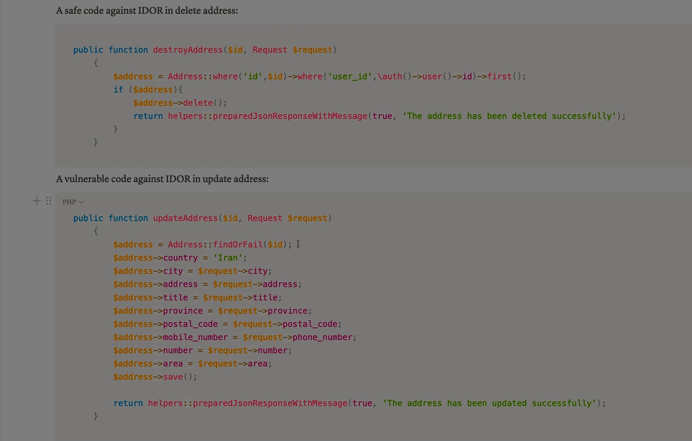
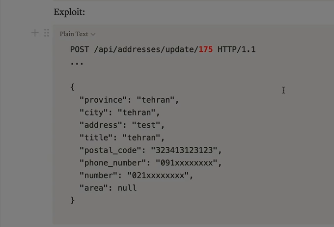
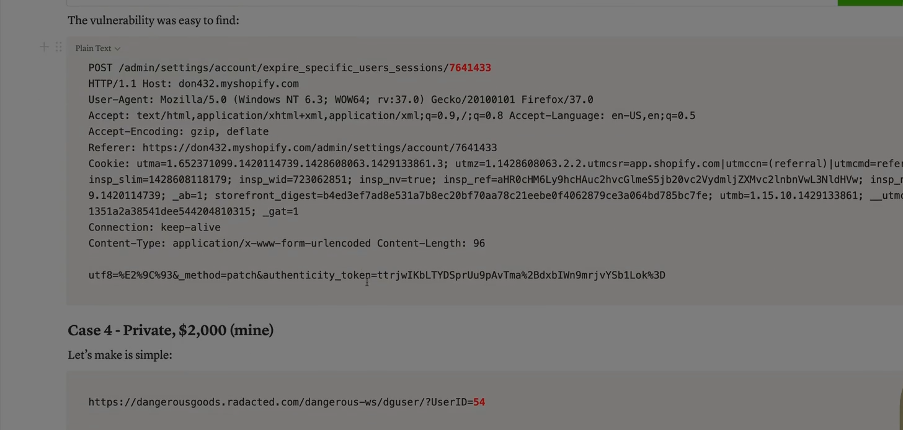

Absolutely Ali — let’s break down **IDOR (Insecure Direct Object Reference)** completely. This is one of the most common and dangerous access control vulnerabilities in web applications, and it’s often overlooked by developers.

---

## 🧠 What Is IDOR?

**Insecure Direct Object Reference (IDOR)** occurs when an application exposes internal object identifiers (like user IDs, document IDs, or filenames) and **fails to properly enforce access control** on them.

> In simple terms: the app lets you access things just by changing an ID in the URL or request — even if you’re not authorized to see them.

---

## 🔍 Why It Happens

* Developers assume users will only access their own data.
* The backend trusts the client-side input without verifying ownership.
* Object references (like `user_id=123`) are predictable or sequential.
* There’s no authorization check to confirm the user’s permission.

---

## 🧪 Real-World Example

### Vulnerable URL:

```http
https://bank.com/account?user_id=123
```

You’re logged in as user 123. But if you change the URL to:

```http
https://bank.com/account?user_id=124
```

✅ You now see someone else’s account — because the server didn’t check if you’re allowed to access it.

---

## 🔓 What Can Be Exploited with IDOR?

| Target                          | Impact                          |
| ------------------------------- | ------------------------------- |
| **User profiles**         | View or edit other users’ data |
| **Invoices or documents** | Download confidential files     |
| **Messages or chats**     | Read private conversations      |
| **Admin functions**       | Escalate privileges             |
| **API endpoints**         | Manipulate backend data         |

---

## 🧰 Common IDOR Vectors

### 1️⃣ URL Parameters

```http
/profile?id=123
```

### 2️⃣ Form Fields

```html
<input type="hidden" name="user_id" value="123">
```

### 3️⃣ JSON Payloads

```json
{ "user_id": 123 }
```

### 4️⃣ Cookies

```http
Cookie: user_id=123
```

---

## 🧨 Real-World Breaches

* **Facebook (2015)** : IDOR allowed access to private photos
* **Instagram (2019)** : IDOR exposed user contact info via GraphQL
* **Snapchat (2014)** : IDOR leaked 4.6 million usernames and phone numbers

---

## 🔐 How to Prevent IDOR

### ✅ 1. Enforce Server-Side Authorization

* Always check if the user is allowed to access the object
* Don’t rely on client-side logic

### ✅ 2. Use Indirect References

* Replace raw IDs with opaque tokens or UUIDs:
  ```
  /profile?ref=abc123xyz
  ```

### ✅ 3. Implement Role-Based Access Control (RBAC)

* Define clear roles and restrict access accordingly

### ✅ 4. Log and Monitor Access

* Alert on unusual access patterns or ID tampering

### ✅ 5. Test with Broken Access Control Tools

* Use Burp Suite, OWASP ZAP, or manual fuzzing

---

## ✅ Final Summary

| Risk                 | Description                       |
| -------------------- | --------------------------------- |
| Unauthorized access  | View or modify other users’ data |
| Data leakage         | Expose sensitive files or records |
| Privilege escalation | Perform admin actions             |
| Business logic abuse | Bypass workflows or restrictions  |

> IDOR is dangerous because it’s silent — users don’t need to hack anything, they just change a number and the system gives them access.

---


Absolutely Ali — let’s dive into **tricky security scenarios** that often slip past developers and even seasoned testers. These are subtle, creative, or layered situations where vulnerabilities hide in plain sight. I’ll break them down by category, explain how they work, and show how attackers exploit them.

---

## 🧨 1. **IDOR Hidden in JSON or Headers**

### Scenario:

The frontend uses a clean UI, but the backend accepts JSON payloads like:

```json
{ "user_id": 123 }
```

Changing `user_id` to another value (`124`) gives access to another user’s data — even though the UI doesn’t expose that option.

### Why It’s Tricky:

* No visible URL manipulation
* Hidden in API calls or mobile app traffic
* Often missed in black-box testing

---

## 🧨 2. **SSRF via Image Upload or PDF Generator**

### Scenario:

A file upload feature fetches remote images to embed in a PDF:

```json
{ "image_url": "http://example.com/image.jpg" }
```

Attacker changes it to:

```json
{ "image_url": "http://169.254.169.254/latest/meta-data/" }
```

### Why It’s Tricky:

* SSRF is buried inside a secondary feature
* Response may not be shown (blind SSRF)
* Requires chaining with DNS or timing-based detection

---

## 🧨 3. **Open Redirect in OAuth Flow**

### Scenario:

OAuth login redirects users after authentication:

```
https://site.com/oauth/callback?redirect=https://trusted.com/dashboard
```

Attacker changes it to:

```
https://site.com/oauth/callback?redirect=https://evil.com/phish

```

### Why It’s Tricky:

* The redirect looks legitimate
* Happens after login — users trust it
* Can be used to steal tokens or credentials

---

## 🧨 4. **Verb Tampering to Bypass Access Control**

### Scenario:

`GET /admin` returns 403 Forbidden

But `POST /admin` returns 200 OK

### Why It’s Tricky:

* Security checks only apply to certain HTTP methods
* WAFs and logs may ignore non-standard verbs
* Requires manual or tool-assisted probing

---

## 🧨 5. **CSRF via JSON or CORS Misconfig**

### Scenario:

An API accepts JSON payloads and has CORS misconfigured:

```http
Access-Control-Allow-Origin: *
Access-Control-Allow-Credentials: true
```

Attacker sends:

```js
fetch("https://bank.com/api/transfer", {
  method: "POST",
  credentials: "include",
  body: JSON.stringify({ amount: 1000, to: "attacker" })
})
```

### Why It’s Tricky:

* CSRF protection assumes form-based attacks
* JSON bypasses traditional CSRF tokens
* CORS misconfig opens the door

---

## 🧨 6. **Stack Trace Exposure via 404 or Debug Mode**

### Scenario:

Accessing a broken endpoint like `/admin/config` returns:

```
NullPointerException at AuthService.java:42
```

### Why It’s Tricky:

* Looks like a harmless error
* Reveals internal file paths, class names, and logic
* Can be used to craft targeted exploits

---

## 🧨 7. **Force Browsing with Hidden Parameters**

### Scenario:

User dashboard shows:

```
https://site.com/dashboard
```

But manually visiting:

```
https://site.com/dashboard?admin=true
```

unlocks admin features.

### Why It’s Tricky:

* No visible link or button
* Hidden logic triggered by query parameters
* Often missed in automated scans

---

## 🧨 8. **Default Credentials in Dev Tools**

### Scenario:

Jenkins, phpMyAdmin, or Redis exposed on public IP with:

```
admin:admin
```

### Why It’s Tricky:

* Dev tools often overlooked in scope
* Default creds rarely changed
* Can lead to full system compromise

---

## ✅ Final Summary

| Scenario        | Hidden Risk                |
| --------------- | -------------------------- |
| JSON IDOR       | API-level access bypass    |
| SSRF in uploads | Internal service access    |
| OAuth redirect  | Phishing/token theft       |
| Verb tampering  | Authorization bypass       |
| CSRF via JSON   | Silent fund transfers      |
| Stack trace     | Recon and exploit crafting |
| Force browsing  | Privilege escalation       |
| Default creds   | Full admin takeover        |

> Tricky scenarios are about **what’s not obvious** — attackers look beyond the UI, beyond the expected flow, and into the cracks where logic fails.






