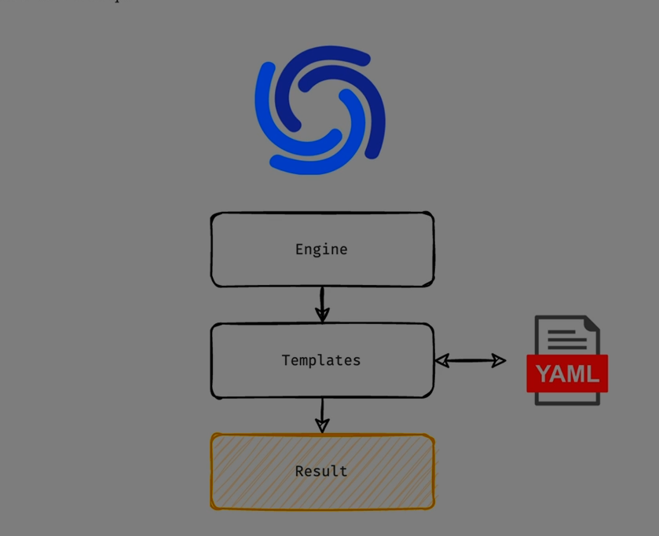

Absolutely Ali — let’s break down **Vulnerable and Outdated Components** completely. This is a critical security issue that affects nearly every modern application, and it’s ranked #6 on the [OWASP Top 10](https://owasp.org/Top10/) because of how easily it can be exploited.

---

## 🧠 What Are Vulnerable and Outdated Components?

These are **software libraries, frameworks, plugins, or modules** that your application depends on — but which contain  **known security flaws** , or are  **no longer maintained or updated** .

> Think of them as rusty bolts in a high-speed machine — they might hold everything together, but they’re the first thing to break under pressure.

---

## 🔍 Why It Happens

* Developers use third-party packages for speed and convenience
* Updates are skipped due to fear of breaking functionality
* No automated dependency scanning
* Legacy systems rely on unsupported components
* Security patches are ignored or delayed

---

## 🧨 Real-World Examples

### 1️⃣ **Log4Shell (2021)**

* Apache Log4j vulnerability allowed remote code execution
* Millions of apps were affected due to widespread use

### 2️⃣ **Struts2 Exploit (Equifax breach)**

* Outdated Apache Struts2 led to a massive data breach
* Attackers exploited a known vulnerability that had a patch available

### 3️⃣ **jQuery File Upload**

* Popular plugin allowed arbitrary file uploads due to outdated code

### 4️⃣ **OpenSSL Heartbleed**

* A flaw in OpenSSL exposed sensitive memory contents

---

## 🧰 How Attackers Exploit These Components

* Scan for known vulnerable versions using tools like Shodan, Nmap, or Burp Suite
* Use public CVEs (Common Vulnerabilities and Exposures) to craft exploits
* Target outdated CMS plugins, JavaScript libraries, or backend modules
* Chain multiple vulnerabilities for deeper access

---

## 🔐 Why It’s Dangerous

| Risk                  | Impact                          |
| --------------------- | ------------------------------- |
| Remote Code Execution | Full control over server        |
| Data Breach           | Access to sensitive user data   |
| Privilege Escalation  | Gain admin-level access         |
| Denial of Service     | Crash or freeze the system      |
| Supply Chain Attacks  | Compromise through dependencies |

---

## 🛡 How to Prevent Vulnerable Component Risks

### ✅ 1. Use Dependency Scanners

* Tools like Snyk, OWASP Dependency-Check, npm audit, or GitHub Dependabot

### ✅ 2. Track CVEs and Patch Regularly

* Subscribe to security advisories
* Apply updates as soon as they’re released

### ✅ 3. Use Minimal Dependencies

* Avoid bloated packages or unused modules

### ✅ 4. Lock Versions and Audit Before Upgrading

* Use version control and test updates in staging

### ✅ 5. Remove Unsupported Components

* Replace legacy libraries with modern, maintained alternatives

### ✅ 6. Monitor Runtime Behavior

* Use intrusion detection and logging to catch exploit attempts

---

## ✅ Final Summary

| Component Type       | Risk                    |
| -------------------- | ----------------------- |
| Outdated libraries   | Known vulnerabilities   |
| Unpatched frameworks | Remote exploits         |
| Legacy plugins       | No support or fixes     |
| Third-party modules  | Supply chain compromise |

> Vulnerable components are like expired medicine — they might still work, but they can be deadly if left unchecked.

---


Absolutely Ali — let’s break down **Nuclei** completely. It’s one of the most powerful tools in modern cybersecurity, especially for **automated vulnerability scanning** and  **custom reconnaissance** . Whether you’re a penetration tester, bug bounty hunter, or security engineer, Nuclei is a must-have in your arsenal.

---

## 🧠 What Is Nuclei?

**Nuclei** is a fast, flexible, and extensible **vulnerability scanner** built by ProjectDiscovery. It uses **YAML-based templates** to scan for known vulnerabilities, misconfigurations, exposures, and even business logic flaws across web applications, APIs, and infrastructure.

> Think of it as a customizable engine that runs thousands of targeted security checks — all defined by human-readable templates.

---

## ⚙️ How Nuclei Works

### 🔁 Workflow:

1. You provide a **target** (domain, IP, URL).
2. Nuclei runs **templates** against the target.
3. Each template defines:
   * What to send (HTTP request, DNS query, etc.)
   * What to look for (status code, regex, headers, body)
4. Results are returned in real-time or saved to a file.

---

## 📦 Template System

Nuclei’s power lies in its  **template-driven architecture** .

### 🔹 Template Types:

* **HTTP** : Web-based vulnerabilities (XSS, SQLi, RCE)
* **DNS** : Subdomain enumeration, zone transfers
* **SSL** : Certificate issues, weak ciphers
* **File** : Sensitive files, backups, config leaks
* **Network** : Port scans, protocol checks
* **Headless** : Browser-based checks (e.g., JavaScript rendering)

### 🔹 Template Format (YAML):

```yaml
id: xss-check
info:
  name: Basic XSS Test
  severity: medium
requests:
  - method: GET
    path:
      - "{{BaseURL}}/?q=<script>alert(1)</script>"
    matchers:
      - type: word
        words:
          - "<script>alert(1)</script>"
```

You can write your own templates or use thousands from the [Nuclei Template Repository](https://github.com/projectdiscovery/nuclei-templates).

---

## 🚀 Key Features

| Feature                     | Benefit                                                  |
| --------------------------- | -------------------------------------------------------- |
| **Speed**             | Scans thousands of targets quickly                       |
| **Customizable**      | Write your own templates                                 |
| **Modular**           | Supports multiple protocols                              |
| **Community-driven**  | Constantly updated templates                             |
| **Integration-ready** | Works with tools like ffuf, subfinder, httpx, Burp Suite |

---

## 🧪 What Nuclei Can Detect

* **Common CVEs** (e.g., Log4Shell, Spring4Shell)
* **Misconfigurations** (e.g., open directories, exposed panels)
* **Sensitive files** (`.env`, `.git`, `config.php`)
* **Security headers** (missing CSP, HSTS)
* **Third-party software issues** (WordPress, Joomla, etc.)
* **Cloud exposures** (AWS keys, S3 buckets)

---

## 🔐 Why It’s Powerful for Security Testing

* **Automates repetitive tasks**
* **Scales easily** across large environments
* **Reduces human error**
* **Enables early detection** in CI/CD pipelines
* **Supports stealth scanning** with rate limits and custom headers

---

## 🛡 Best Practices

### ✅ 1. Keep Templates Updated

* Use `nuclei -update-templates` regularly

### ✅ 2. Use Rate Limiting

* Avoid overwhelming targets or triggering WAFs

### ✅ 3. Combine with Recon Tools

* Use with `subfinder`, `httpx`, `dnsx` for full coverage

### ✅ 4. Customize for Your Environment

* Write templates for internal apps and APIs

### ✅ 5. Integrate with CI/CD

* Add Nuclei to your DevSecOps pipeline for early detection

---

## ✅ Final Summary

| Component               | Role                       |
| ----------------------- | -------------------------- |
| **Nuclei Engine** | Executes scans             |
| **Templates**     | Define what to test        |
| **Matchers**      | Identify vulnerabilities   |
| **Targets**       | Domains, IPs, URLs         |
| **Output**        | Real-time or saved results |

> Nuclei is like a **Swiss Army knife for vulnerability scanning** — fast, flexible, and endlessly customizable.

---



