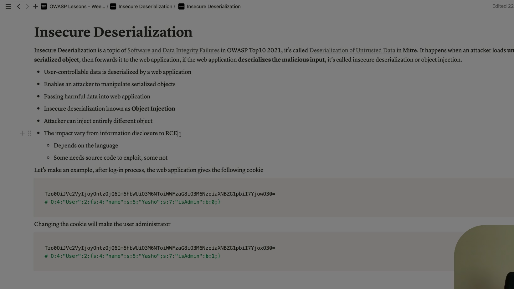

Absolutely Ali — let’s break down **Insecure Serialization** completely. This is a critical vulnerability that often leads to  **remote code execution** ,  **privilege escalation** , and **data tampering** — and it’s frequently misunderstood because it doesn’t look like a traditional bug.

---

## 🧠 What Is Serialization?

**Serialization** is the process of converting an object or data structure into a format that can be:

* Stored (e.g., in a file or database)
* Transmitted (e.g., over a network)
* Reconstructed later via **deserialization**

Common formats include:

* Binary (e.g., Java’s `Serializable`, Python’s `pickle`)
* Text-based (e.g., JSON, XML, YAML)
* Language-specific (e.g., PHP’s `serialize()`)

---

## 🔓 What Is Insecure Serialization?

**Insecure Serialization** occurs when:

* An application **deserializes untrusted data**
* The deserialization process  **automatically instantiates objects** , executes code, or modifies internal state
* Attackers craft malicious payloads to  **inject objects** ,  **trigger logic** , or **execute arbitrary code**

> It’s like accepting a gift box from a stranger — and opening it without checking what’s inside.

---

## 🧨 Real-World Exploitation Scenarios

### 1️⃣ **PHP Object Injection**

```php
$input = $_POST['data'];
$obj = unserialize($input);
```

If `$input` contains a serialized object with a malicious `__wakeup()` or `__destruct()` method, it can execute code.

### 2️⃣ **Java Deserialization RCE**

* Java apps using `ObjectInputStream` can be tricked into loading gadget chains from libraries like Apache Commons Collections.

### 3️⃣ **Python Pickle Exploits**

```python
import pickle
data = pickle.loads(user_input)
```

Pickle can execute arbitrary Python code if the input is malicious.

### 4️⃣ **.NET BinaryFormatter Attacks**

* Deserializing attacker-controlled binary data can lead to full compromise.

---

## 🧰 Common Attack Techniques

| Technique                     | Description                                                                |
| ----------------------------- | -------------------------------------------------------------------------- |
| **Gadget Chains**       | Use existing classes to build a chain that leads to code execution         |
| **Magic Methods Abuse** | Trigger `__wakeup()`,`__destruct()`,`__call()`during deserialization |
| **Property Injection**  | Modify internal object state (e.g., change user role to admin)             |
| **File Inclusion**      | Inject paths or file references into serialized objects                    |
| **Function Injection**  | Inject callbacks or function names that get executed                       |

---

## 🔐 Why It’s Dangerous

| Risk                            | Impact                                               |
| ------------------------------- | ---------------------------------------------------- |
| **Remote Code Execution** | Full control over server                             |
| **Privilege Escalation**  | Become admin or bypass auth                          |
| **Data Tampering**        | Modify internal variables or logic                   |
| **Denial of Service**     | Crash app with malformed payloads                    |
| **Supply Chain Attacks**  | Exploit third-party libraries during deserialization |

---

## 🛡 How to Prevent Insecure Serialization

### ✅ 1. **Avoid Deserializing Untrusted Data**

* Never deserialize user input directly

### ✅ 2. **Use Safer Formats**

* Prefer JSON or XML over binary formats like `pickle`, `serialize()`, or `BinaryFormatter`

### ✅ 3. **Implement Strict Validation**

* Use schemas to validate structure and types
* Reject unexpected fields or values

### ✅ 4. **Disable Dangerous Features**

* In Java, restrict deserialization to whitelisted classes
* In PHP, avoid magic methods in serializable classes

### ✅ 5. **Use Signed or Encrypted Tokens**

* Protect serialized data with HMAC or encryption
* Example: JWT with signature verification

### ✅ 6. **Monitor and Log Deserialization**

* Detect anomalies or repeated deserialization attempts
* Alert on known exploit patterns

---

## 🧠 Summary Table

| Concept                          | Description                                                         |
| -------------------------------- | ------------------------------------------------------------------- |
| **Serialization**          | Convert object → string/stream                                     |
| **Deserialization**        | Convert string/stream → object                                     |
| **Insecure Serialization** | Deserializing untrusted data leads to code execution or logic abuse |
| **Attack Vectors**         | Gadget chains, magic methods, property injection                    |
| **Prevention**             | Validate input, use safe formats, avoid automatic object creation   |

> Insecure serialization is like letting strangers write code inside your app — if you deserialize blindly, you’re handing them the keys.

---


