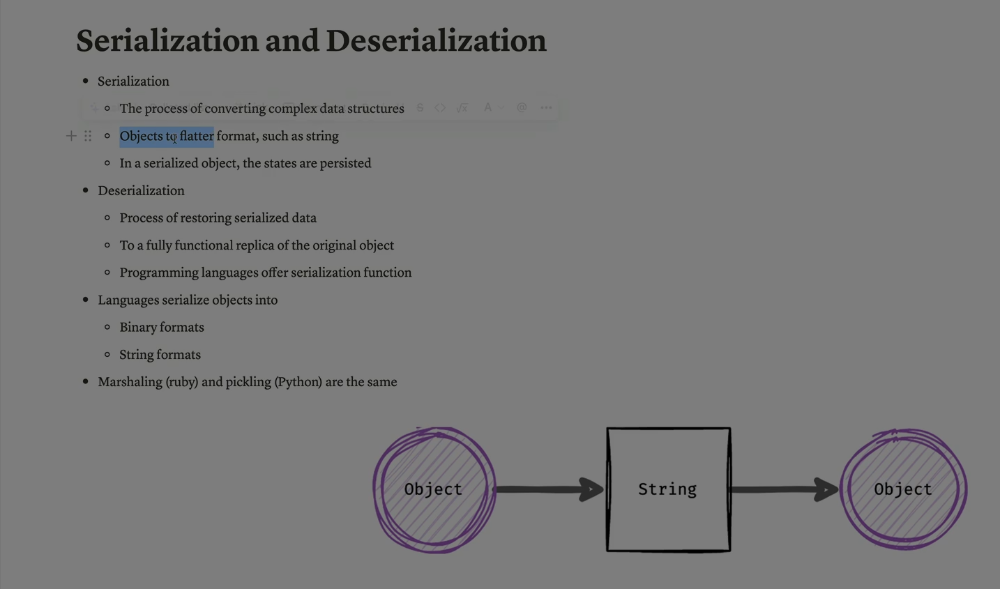

Absolutely Ali — let’s break down **Serialization and Deserialization** completely. These are fundamental concepts in programming, data exchange, and security — and they’re often misunderstood or misused, which can lead to serious vulnerabilities.

---

## 🧠 What Is Serialization?

**Serialization** is the process of converting a **data structure or object** into a format that can be:

* Stored (e.g., in a file or database)
* Transmitted (e.g., over a network)
* Reconstructed later

> Think of it as flattening an object into a string or byte stream so it can travel or be saved.

---

## 🔁 What Is Deserialization?

**Deserialization** is the reverse process — it takes the serialized data and **reconstructs the original object** in memory.

> Like unpacking a suitcase: you take the flattened contents and restore them to their original form.

---

## 🔍 Why Use Serialization?

| Use Case                        | Description                                     |
| ------------------------------- | ----------------------------------------------- |
| **Data storage**          | Save objects in files or databases              |
| **Network communication** | Send objects between systems or services        |
| **Session management**    | Store user sessions in cookies or server memory |
| **Caching**               | Save computed objects for reuse                 |
| **APIs**                  | Exchange structured data (e.g., JSON, XML)      |

---

## 📦 Common Serialization Formats

| Format                      | Language   | Description                           |
| --------------------------- | ---------- | ------------------------------------- |
| **JSON**              | All        | Human-readable, widely used           |
| **XML**               | All        | Verbose but structured                |
| **YAML**              | Python, JS | Lightweight and readable              |
| **Pickle**            | Python     | Binary format, not secure             |
| **PHP serialize()**   | PHP        | Native PHP object serialization       |
| **Java Serializable** | Java       | Built-in object serialization         |
| **Protocol Buffers**  | All        | Compact, fast binary format by Google |

---

## 🧨 Security Risks: Insecure Deserialization

Deserialization can be **dangerous** if:

* The data comes from an **untrusted source**
* The system **automatically executes** code during deserialization
* The format allows **object injection** or **method calls**

### 🔓 Example Attack:

In PHP:

```php
$input = $_POST['data'];
$obj = unserialize($input);
```

If `$input` contains a malicious payload, it can trigger arbitrary code execution.

### 🔥 Real-World Exploits:

* **PHP Object Injection**
* **Java Deserialization RCE**
* **Python Pickle Exploits**
* **.NET BinaryFormatter attacks**

---

## 🔐 How to Prevent Deserialization Vulnerabilities

### ✅ 1. Avoid Deserializing Untrusted Data

* Never deserialize user input directly

### ✅ 2. Use Safer Formats

* Prefer JSON or XML over binary formats like Pickle or PHP’s `serialize()`

### ✅ 3. Validate and Sanitize Input

* Use strict schemas and type checks

### ✅ 4. Disable Dangerous Features

* In Java, disable object creation during deserialization
* In PHP, avoid magic methods like `__wakeup()` or `__destruct()` in serialized classes

### ✅ 5. Use Signed or Encrypted Tokens

* Protect serialized data with HMAC or encryption

### ✅ 6. Monitor and Log

* Detect unusual deserialization behavior or exceptions

---

## 🧠 Summary Table

| Concept                   | Description                                               |
| ------------------------- | --------------------------------------------------------- |
| **Serialization**   | Convert object → string/stream                           |
| **Deserialization** | Convert string/stream → object                           |
| **Use Cases**       | Storage, transmission, caching                            |
| **Risks**           | Code execution, object injection                          |
| **Prevention**      | Validate input, use safe formats, avoid untrusted sources |

> Serialization is powerful — but deserialization is where attackers strike. Treat it like handling explosives: safe if controlled, catastrophic if mishandled.

---


